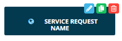

# Stylizing Service Request Buttons

**Theme:** Configure  
**Who Is It For?** System Administrator, Automation Engineer

## What Is It?

You can stylize the Service Request button using custom HTML.

#### To customize the button

To customize the button, complete the following steps:

1. Select the **Edit** button at the top-right corner of the Service Request button. The **Edit Service Request** page displays
2. Toggle the **Custom Html** switch on. A text field displays for entering custom HTML code
3. Enter the following template HTML code:
   ```html
   <div style="background-color: #043A4F;height: 12px;width:200px;border-radius: 3px;border: 2px solid #043A4F;color: white;font-size: 14px;font-weight: bold;padding: 25px">
   <span class="v-icon FontAwesome" style="color: #93D7FA">&#xf0ac</span>
   <span>SERVICE REQUEST NAME</span>
   </div>
   ```
4. Modify the code as needed

#### To modify the font icon that appears on the button

* Change the icon color by entering a new HEX color code in the `style="color: #93D7FA"` attribute
* Change the icon appearance by entering a new Unicode value in place of `&#xf0ac`:
   ```html
   <span class="v-icon FontAwesome" style="color: #93D7FA">&#xf0ac</span>
   ```
* To find a Unicode value:
  1. Go to <https://fontawesome.com/v4.7.0/icons/>.
  2. Select the desired icon
  3. Copy the Unicode from the icon's details page
* Remove the icon by commenting out the span line:
   ```html
   <!--<span class="v-icon FontAwesome" style="color: #93D7FA">&#xf0ac</span>-->
   ```

#### To modify the text that appears on the button

* Update the `<span>` text to match the Service Request Name:
   ```html
   <span>SERVICE REQUEST NAME</span>
   ```
:::note
When submitting a Service Request via URL, the URL uses the Service Request Name, not the custom HTML text. To avoid confusion, copy the Service Request Name into the `<span>` text so both match.
:::

#### The result using the template code



## When Would You Use It?

- You can stylize the Service Request button using custom HTML

## Why Would You Use It?

- **Stylizing Service**: You can stylize the Service Request button using custom HTML

## FAQs

**Q: How many steps does the Stylizing Service Request Buttons procedure involve?**

The Stylizing Service Request Buttons procedure involves 4 steps. Complete all steps in order and save your changes.

## Glossary

**Service Request**: A Solution Manager feature that lets operators trigger predefined automation workflows using a simple form. Service Requests encapsulate schedule builds, job submissions, or events without requiring direct access to schedule definitions.

**Resource**: A numeric variable in OpCon representing a finite pool. Jobs can be configured to require a set number of resource units to run, limiting concurrent executions and preventing resource contention.
