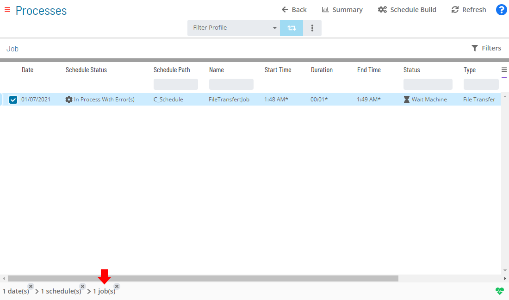

# Updating File Transfer Job Details

**Theme:** Configure  
**Who Is It For?** System Administrator, Automation Engineer

## What Is It?

In **Admin** mode, file transfer job properties can be updated or defined. For conceptual information, refer to [File Transfer Job Details](../../../job-types/file-transfer.md) in the **Concepts** online help.

:::note
Only users with appropriate permissions can access the **Lock** button and update job properties. For details, refer to [Required Privileges](Accessing-Daily-Job-Definition.md#Required) in the **Accessing Daily Job Definition** topic.
:::

:::note
Without the Machine Privilege, you cannot edit the daily job definition.
:::

:::note
Changes to job properties in the **Daily Job Definition** take effect immediately. If the job has already run, changes apply the next time it runs.
:::

## Updating File Transfer Job Details

To perform this procedure:

1. Select the **Processes** button at the top-right of the **Operations Summary** page
2. Enable both the **Date** and **Schedule** toggle switches. Each switch appears green when enabled

   

To update File Transfer Job Details, complete the following steps:

3. Select the desired **date(s)** to display associated schedules
4. Select one or more **schedule(s)** in the list
5. Select one **job** in the list. Your selection appears in the [status bar](SM-UI-Layout.md#Status) at the bottom of the page as a breadcrumb trail

   

6. Select the job record (e.g., 1 job(s)) in the status bar to display the **Selection** panel

   :::note
   Alternatively, right-click the job in the list to display the **Selection** panel.
   :::

   .png "Job Summary Tab in Operations")

7. Select the **Daily Job Definition** button  at the top-left corner of the panel. The page opens in **Read-only** mode by default
8. Select the **Lock** button  at the top-right corner to enter **Admin** mode. The button displays a white unlocked lock on a green background  when enabled

   :::note
   The **Lock** button is not visible to users without appropriate permissions.
   :::

9. Expand the **Task Details** panel

   :::note
   All required fields are marked with a red asterisk.
   :::

**In the Source frame:**

Define the source file information:

- Select the **machine** with the source file. Must be Windows or UNIX
- Select the **user** with access to the file on the source machine
- Enter the *full path and file name* for the **file** to transfer
- Select the **data type**:

  :::note
  If anything other than Binary is selected, file integrity is maintained but the file structure may be altered to suit the target platform.
  :::

  - **Text**: Uses the platform's default text data type
  - **ASCII**: Treats the file as a simple ASCII text file
  - **Binary**: Preserves the file's structure during transfer

**In the Destination frame:**

Define the destination file information:

- Select the **machine** that will receive the file. Must be Windows or UNIX
- Select the **user** with access to the destination location
- Enter the *full path and file name* for the destination **file**
- Select the **data type**:
  - **Text**: Uses the platform's default text data type
  - **ASCII**: Writes the file as a simple ASCII text file
  - **Binary**: Preserves the file's structure during transfer

**In the Options frame:**

- **If File Exists**: Determines SMAFT Agent behavior when a target file already exists:
  - **Do Not Overwrite**: Checks for the file before starting transfer; does not overwrite
  - **Overwrite**: Transfers and overwrites any existing file
  - **Backup Then Overwrite**: Backs up the existing file, then overwrites
  - **Append**: Appends the source file to the destination file
  - **Backup Then Append**: Backs up the existing file, then appends

- **Delete Source File**: Determines deletion behavior after transfer (Windows agent only):
  - **No**: Source file is not deleted
  - **Required**: Job fails if source file is not deleted
  - **Preferred**: Deletion is attempted but does not fail the job

- **Start Transfer On**: Determines where the job initiates:
  - **Source**: Starts on the source machine
  - **Destination**: Starts on the destination machine

- **Maximum Transfer Rate (kbits/s)**: Valid values are 64, 128, 256, 512, 1024, 2048, and >2048 kbits/second

- **Compression**: Supported types are tar, gzip, and zip:
  - **None**: No compression
  - **Required**: Job fails if compression does not occur
  - **Preferred**: Compression is attempted

  :::caution
  Both the agent and server must support the same compression type for compression to succeed.
  :::

- **Encryption**: Supported types are 3DES, AES, and DES:
  - **None**: No encryption
  - **Required**: Job fails if encryption does not occur
  - **Preferred**: Encryption is attempted

  :::caution
  Both the agent and server must support the same encryption type for encryption to succeed.
  :::

- **TLS Security Override**: Determines TLS Security usage for file transfers:
  - **None**: TLS Security is not used by the SMAFT Agent
  - **Required**: SMAFT Agent must use TLS Security; otherwise the job fails
  - **Preferred** (Default): The OpCon job request assembly routine uses SMAFT Server Port numbers and TLS Capability flags to determine the TLS Security Mode value

**In the Failure Criteria frame:**

Select **Fails if preferred settings not satisfied** to fail the job when the transfer succeeds but preferred settings for Delete Source File, Compression, or Encryption were not met.

Select the **Save** button.

## Configuration Options

| Setting | What It Does | Default | Notes |
|---|---|---|---|
| Delete Source File | Determines deletion behavior after transfer (Windows agent only): | — | — |
| Start Transfer On | Determines where the job initiates: | — | Valid values are 64, 128, 256, 512, 1024, 2048, and >2048 kbits/second.  - **Compression**: Supported types are t |
| Maximum Transfer Rate (kbits/s) | Valid values are 64, 128, 256, 512, 1024, 2048, and >2048 kbits/second | — | Valid values are 64, 128, 256, 512, 1024, 2048, and >2048 kbits/second.  - **Compression**: Supported types are t |
| Compression | Supported types are tar, gzip, and zip: | — | — |
| Encryption | Supported types are 3DES, AES, and DES: | — | — |
| TLS Security Override | Determines TLS Security usage for file transfers: | — | — |

## FAQs

**Q: How many steps does the Updating File Transfer Job Details procedure involve?**

The Updating File Transfer Job Details procedure involves 9 steps. Complete all steps in order and save your changes.

**Q: What does Updating File Transfer Job Details cover?**

This page covers Updating File Transfer Job Details.

## Glossary

**TLS (Transport Layer Security)**: An encryption protocol used to secure TCP/IP communications between SMANetCom and agents, ensuring that job start and status data is transmitted safely.

**Resource**: A numeric variable in OpCon representing a finite pool. Jobs can be configured to require a set number of resource units to run, limiting concurrent executions and preventing resource contention.

**Privilege**: A specific permission granted through an OpCon role that controls access to a feature, function, or object type. Privileges are organized into categories such as Function Privileges, Machine Privileges, Schedule Privileges, and Access Codes.

**Machine**: A platform defined in the OpCon database that has an agent installed. OpCon routes job execution requests to machines via SMANetCom, and machines report job completion status back to SAM.

**Schedule**: A named container for jobs in OpCon, built for a specific date to create that day's automation. Schedules define build settings, frequencies, and the jobs that run within them.

**Job**: The fundamental unit of work in OpCon. A job defines what to run, on which machine, when to start, and what conditions must be met. Job results are tracked and can trigger events and notifications.

**OpCon**: Continuous' workflow automation platform. The OpCon server includes the database, SAM and Supporting Services (SAM-SS), and graphical user interfaces. agents installed on target platforms run jobs and report results.
