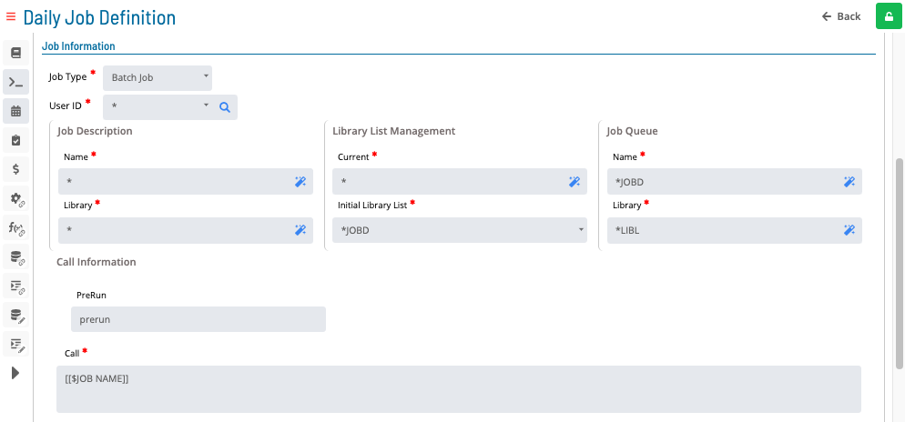
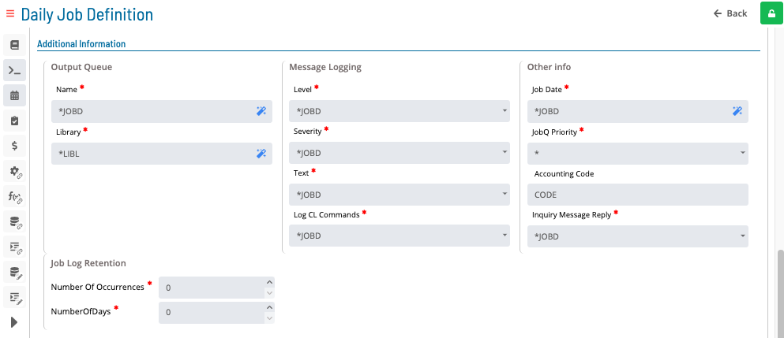
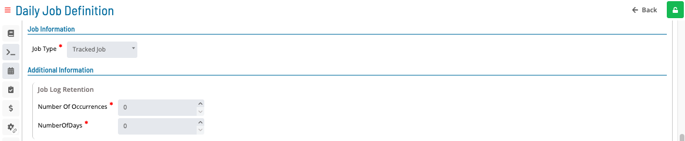
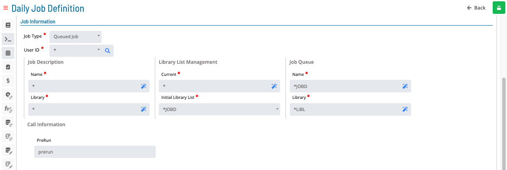
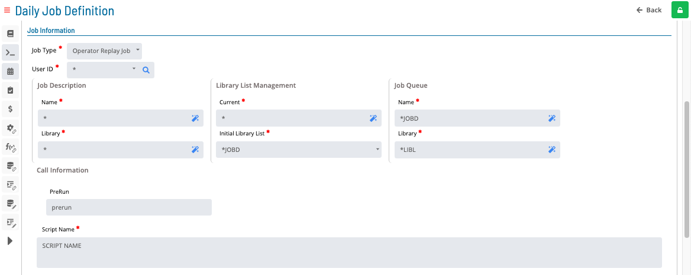
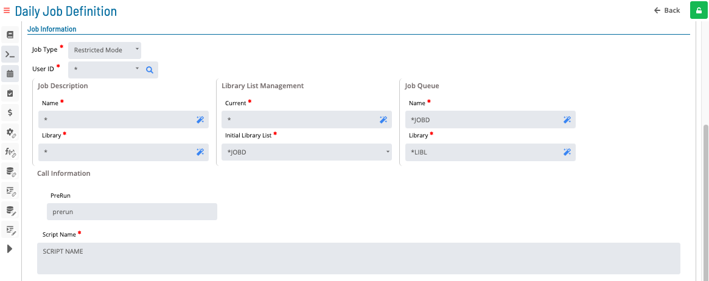
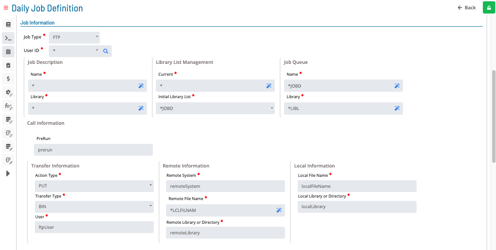
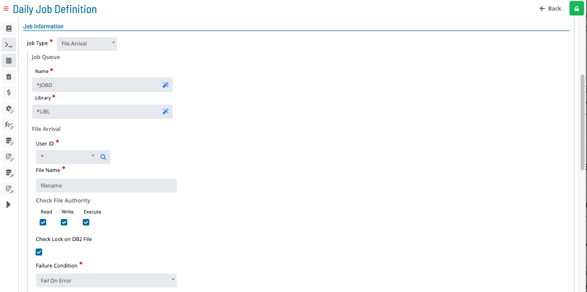
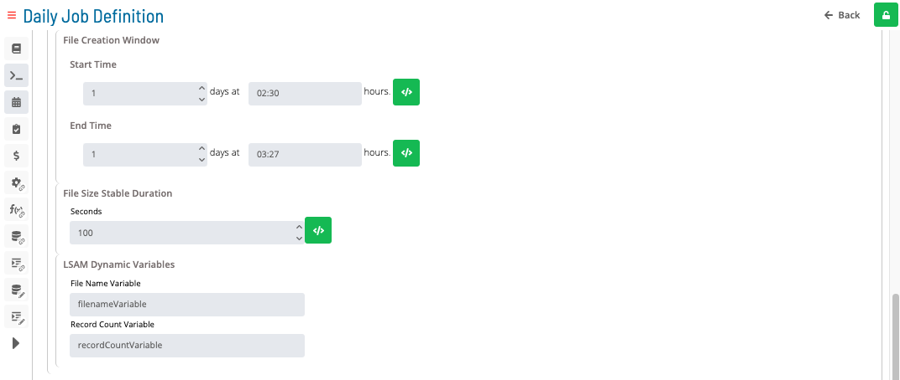

# Updating IBM i Job Details

In **Admin** mode, IBM i job type properties can be updated or defined.
For an IBM i job, you can update the following job types:

- [Batch Job](#updating-job-type-batch-job)
- [Tracked Job](#updating-job-type-tracked-job)
- [Queued Job](#updating-job-type-queued-job)
- [Operator Replay Job](#updating-job-type-operator-replay-job)
- [Restricted Mode](#updating-job-type-restricted-mode)
- [FTP](#updating-job-type-ftp)
- [File Arrival](#updating-job-type-file-arrival)

You can also [update tables](#updating-tables) (Messages, Spool Files, and Variables).

For conceptual information, refer to [IBM i Job Details](../../../job-types/ibm-i.md) in the **Concepts** online help.

:::note
Only users with the appropriate permissions can access the **Lock** button and update job properties. For details, refer to [Required Privileges](Accessing-Daily-Job-Definition.md#Required) in the **Accessing Daily Job Definition** topic.
:::

:::note
Without the Machine Privilege, you cannot edit the daily job definition.
:::

:::note
Changes made in **Daily Job Definition** take effect immediately. If the job has already run, changes apply the next time the job runs.
:::

## Updating IBM i Job Task Details

To update IBM i job task details, complete the following steps:

1. Select the **Processes** button at the top-right of the **Operations Summary** page.

   The **Processes** page displays.

2. Ensure the **Date** and **Schedule** toggle switches are enabled (green) to make date and schedule selections.

   

3. Select the desired **date(s)** to display the associated schedule(s).

4. Select one or more **schedule(s)** in the list.

5. Select one **job** in the list. Your selection appears in the [status bar](SM-UI-Layout.md#Status) at the bottom of the page as a breadcrumb trail.

   

6. Select the job record (e.g., **1 job(s)**) in the status bar to display the **Selection** panel.

   :::note
   As an alternative, right-click the job in the list to display the **Selection** panel.
   :::

   .png> "Job Summary Tab in Operations")

7. Select the **Daily Job Definition** button  at the top-left of the panel.

   The page opens in **Read-only** mode by default.

8. Select the **Lock** button  at the top-right to switch to **Admin** mode.

   The button displays a white unlocked lock on a green background  when enabled.

   :::note
   The **Lock** button is not visible to users without the appropriate permissions.
   :::

9. Expand the **Task Details** panel to expose its content.

   :::note
   All required fields are marked with a red asterisk.
   :::

10. Select a **User Id** for running the job. Use the default value of `0/0` or assign an available batch user. User information must be defined as a Batch User ID in OpCon Administration.

11. Select the machine where the Agent is installed from the **Machines or Machine Group** list. To specify a machine group instead, toggle **Machines** to _Machine Group_ and select from the list. The toggle appears green  when enabled.

12. Select a **Job Type** to define the type of job to schedule on the IBM i Agent:

    - Batch Job (default)
    - Tracked Job
    - Queued Job
    - Operator Replay Job
    - Restricted Mode
    - FTP
    - File Arrival

13. Complete the fields for the selected job type. Refer to the sections below for field details.

14. Select **Save** to save changes.

**Result:** The IBM i job task details are updated. Changes take effect immediately for the daily job.

---

### Updating Job Type: Batch Job

**In the Job Information frame:**

- **User ID**: IBM i user profile under which the job is submitted.

**In the Job Description sub-frame:**

- **Name**: Simple name of the job description. Accepts OpCon tokens.
- **Library**: Library associated with the job description name. Accepts OpCon tokens.

**In the Library List Management sub-frame:**

- **Current**: Current library associated with the running job. Accepts OpCon tokens.
- **Initial Library List**: Initial user part of the library list used to search for objects without a library.

**In the Job Queue sub-frame:**

- **Name**: Name of the job queue in which the job is placed.
- **Library**: Library associated with the batch queue name.

**In the Call Information sub-frame:**

- **Prerun**: IBM i job to run immediately before the job specified in Call/Script Name.
- **Call**: Program name using the CALL command, or a command name.

**In the Additional Information frame:**

**In the Output Queue sub-frame:**

- **Name**: Output queue used for spooled files.
- **Library**: Library associated with the Output Queue name.

**In the Message Logging sub-frame:**

- **Level**: Number of messages for logging.
- **Severity**: Lowest severity level that causes an error message to be logged.
- **Text**: Detail of the text logged.
- **Log CL Commands**: Whether commands run in a CL program are logged to the job log via the CL program's message queue.

**In the Other Info sub-frame:**

- **Job Date**: Calendar date associated with the job.
- **JobQ Priority**: Job queue scheduling priority.
- **Accounting Code**: Accounting code used when logging system resource use.
- **Inquiry Message Reply**: How predefined messages are answered when sent during the job.

**In the Job Log Retention sub-frame:**

- **Number of Occurrences**: Number of occurrences to save when the same job name runs more than once. Valid range: 0–999.
- **Number of Days**: Number of days to retain job logs. Valid range: 0–999.

---

### Updating Job Type: Tracked Job

**In the Job Information frame:**

- **Job Type**: Type of job to schedule on the IBM i Agent.

**In the Job Log Retention sub-frame:**

- **Number of Occurrences**: Number of occurrences to save when the same job name runs more than once. Valid range: 0–999.
- **Number of Days**: Number of days to retain job logs. Valid range: 0–999.

---

### Updating Job Type: Queued Job

**In the Job Information frame:**

- **User ID**: IBM i user profile under which the job is submitted.

**In the Job Description sub-frame:**

- **Name**: Simple name of the job description. Accepts OpCon tokens.
- **Library**: Library associated with the job description name. Accepts OpCon tokens.

**In the Library List Management sub-frame:**

- **Current**: Current library associated with the running job. Accepts OpCon tokens.
- **Initial Library List**: Initial user part of the library list used to search for objects without a library.

**In the Job Queue sub-frame:**

- **Name**: Name of the job queue in which the job is placed.
- **Library**: Library associated with the batch queue name.

**In the Call Information sub-frame:**

- **Prerun**: IBM i job to run immediately before the job specified in Call/Script Name.

**In the Additional Information frame:**

**In the Output Queue sub-frame:**

- **Name**: Output queue used for spooled files.
- **Library**: Library associated with the Output Queue name.

**In the Message Logging sub-frame:**

- **Level**: Number of messages for logging.
- **Severity**: Lowest severity level that causes an error message to be logged.
- **Text**: Detail of the text logged.
- **Log CL Commands**: Whether commands run in a CL program are logged to the job log via the CL program's message queue.

**In the Other Info sub-frame:**

- **Job Date**: Calendar date associated with the job.
- **JobQ Priority**: Job queue scheduling priority.
- **Accounting Code**: Accounting code used when logging system resource use.
- **Inquiry Message Reply**: How predefined messages are answered when sent during the job.

**In the Job Log Retention sub-frame:**

- **Number of Occurrences**: Number of occurrences to save when the same job name runs more than once. Valid range: 0–999.
- **Number of Days**: Number of days to retain job logs. Valid range: 0–999.

---

### Updating Job Type: Operator Replay Job

**In the Job Information frame:**

- **User ID**: IBM i user profile under which the job is submitted.

**In the Job Description sub-frame:**

- **Name**: Simple name of the job description. Accepts OpCon tokens.
- **Library**: Library associated with the job description name. Accepts OpCon tokens.

**In the Library List Management sub-frame:**

- **Current**: Current library associated with the running job. Accepts OpCon tokens.
- **Initial Library List**: Initial user part of the library list used to search for objects without a library.

**In the Job Queue sub-frame:**

- **Name**: Name of the job queue in which the job is placed.
- **Library**: Library associated with the batch queue name.

**In the Call Information sub-frame:**

- **Prerun**: IBM i job to run immediately before the job specified in Call/Script Name.
- **Script Name**: Script name for an Operator Replay Job. Must not exceed 2000 characters.

**In the Additional Information frame:**

**In the Output Queue sub-frame:**

- **Name**: Output queue used for spooled files.
- **Library**: Library associated with the Output Queue name.

**In the Message Logging sub-frame:**

- **Level**: Number of messages for logging.
- **Severity**: Lowest severity level that causes an error message to be logged.
- **Text**: Detail of the text logged.
- **Log CL Commands**: Whether commands run in a CL program are logged to the job log via the CL program's message queue.

**In the Other Info sub-frame:**

- **Job Date**: Calendar date associated with the job.
- **JobQ Priority**: Job queue scheduling priority.
- **Accounting Code**: Accounting code used when logging system resource use.
- **Inquiry Message Reply**: How predefined messages are answered when sent during the job.

**In the Job Log Retention sub-frame:**

- **Number of Occurrences**: Number of occurrences to save when the same job name runs more than once. Valid range: 0–999.
- **Number of Days**: Number of days to retain job logs. Valid range: 0–999.

---

### Updating Job Type: Restricted Mode

**In the Job Information frame:**

- **User ID**: IBM i user profile under which the job is submitted.

**In the Job Description sub-frame:**

- **Name**: Simple name of the job description. Accepts OpCon tokens.
- **Library**: Library associated with the job description name. Accepts OpCon tokens.

**In the Library List Management sub-frame:**

- **Current**: Current library associated with the running job. Accepts OpCon tokens.
- **Initial Library List**: Initial user part of the library list used to search for objects without a library.

**In the Job Queue sub-frame:**

- **Name**: Name of the job queue in which the job is placed.
- **Library**: Library associated with the batch queue name.

**In the Call Information sub-frame:**

- **Prerun**: IBM i job to run immediately before the job specified in Call/Script Name.
- **Script Name**: Script name for a Restricted Mode Job. Must not exceed 2000 characters.

**In the Additional Information frame:**

**In the Output Queue sub-frame:**

- **Name**: Output queue used for spooled files.
- **Library**: Library associated with the Output Queue name.

**In the Message Logging sub-frame:**

- **Level**: Number of messages for logging.
- **Severity**: Lowest severity level that causes an error message to be logged.
- **Text**: Detail of the text logged.
- **Log CL Commands**: Whether commands run in a CL program are logged to the job log via the CL program's message queue.

**In the Other Info sub-frame:**

- **Job Date**: Calendar date associated with the job.
- **JobQ Priority**: Job queue scheduling priority.
- **Accounting Code**: Accounting code used when logging system resource use.
- **Inquiry Message Reply**: How predefined messages are answered when sent during the job.

**In the Job Log Retention sub-frame:**

- **Number of Occurrences**: Number of occurrences to save when the same job name runs more than once. Valid range: 0–999.
- **Number of Days**: Number of days to retain job logs. Valid range: 0–999.

:::note
This job type does not have access to **Messages** or **Spool Files**.
:::

---

### Updating Job Type: FTP

**In the Job Information frame:**

- **User ID**: IBM i user profile under which the job is submitted.

**In the Job Description sub-frame:**

- **Name**: Simple name of the job description. Accepts OpCon tokens.
- **Library**: Library associated with the job description name. Accepts OpCon tokens.

**In the Library List Management sub-frame:**

- **Current**: Current library associated with the running job. Accepts OpCon tokens.
- **Initial Library List**: Initial user part of the library list used to search for objects without a library.

**In the Job Queue sub-frame:**

- **Name**: Name of the job queue in which the job is placed.
- **Library**: Library associated with the batch queue name.

**In the Call Information sub-frame:**

- **Prerun**: IBM i job to run immediately before the job specified in Call/Script Name.

**In the Transfer Information sub-frame:**

- **Action Type** (Required): FTP command to use.
- **Transfer Type** (Required): Type of transfer — binary or ASCII.
- **User** (Required): FTP user for connecting to the remote system.

**In the Remote Information sub-frame:**

- **Remote System** (Required): Name of the remote system. Must not exceed 255 characters.
- **Remote File Name**: Name for the file on the remote machine.
- **Remote Library or Directory** (Required): Library or directory to receive the file on the remote machine.

**In the Local Information sub-frame:**

- **Local File Name**: File name on the IBM i machine to transfer.
- **Local Library or Directory**: Library or directory containing the file on the IBM i machine.

**In the Additional Information frame:**

**In the Output Queue sub-frame:**

- **Name**: Output queue used for spooled files.
- **Library**: Library associated with the Output Queue name.

**In the Message Logging sub-frame:**

- **Level**: Number of messages for logging.
- **Severity**: Lowest severity level that causes an error message to be logged.
- **Text**: Detail of the text logged.
- **Log CL Commands**: Whether commands run in a CL program are logged to the job log via the CL program's message queue.

**In the Other Info sub-frame:**

- **Job Date**: Calendar date associated with the job.
- **JobQ Priority**: Job queue scheduling priority.
- **Accounting Code**: Accounting code used when logging system resource use.
- **Inquiry Message Reply**: How predefined messages are answered when sent during the job.

**In the Job Log Retention sub-frame:**

- **Number of Occurrences**: Number of occurrences to save when the same job name runs more than once. Valid range: 0–999.
- **Number of Days**: Number of days to retain job logs. Valid range: 0–999.

---

### Updating Job Type: File Arrival

**In the Job Queue sub-frame:**

- **Name**: Name of the job queue in which the job is placed.
- **Library**: Library associated with the batch queue name.

**In the File Arrival sub-frame:**

- **User ID**: IBM i user profile under which the job is submitted.
- **File Name** (Required): File path and name of the file to detect.

**In the Check File Authority sub-frame:**

- **Read/Write/run**: Object authority type to verify for the named User ID.
- **Check Lock on DB2 File**: Whether to verify that no in-use locks exist on any DB2 database files.
- **Failure Condition** (Required): Action to take based on job failure or success status.

**In the File Creation Window sub-frame:**

**In the Start Time sub-frame:**

- **Start Days/Start Time**: The File Arrival job waits until Start Time before looking for a file. If already active, the job sleeps until Start Time occurs.

:::note
A token can be used instead of the Start Day/Start Time input field.
:::

**In the End Time sub-frame:**

- **End Days/End Time**: When a Job End Time is specified, the File Creation End time is used only to validate when the file was created, not to determine job end time.

:::note
A token can be used instead of the End Day/End Time input field.
:::

**In the File Stable Duration sub-frame:**

- **Seconds**: Time the file size must remain stable to indicate the file has finished arriving.

:::note
A token can be used instead of the seconds input field.
:::

:::note
The following fields (Job End Time) are available for machines with `fileWatcher.v3` capability.
:::

**In the Job End Time sub-frame:**

- **Re Check Frequency**: Enables a continuous loop of checking until a matching file is found, typically used with Job End Time. When set to zero, a one-time check is performed and Job End Time is ignored. Valid range: 0–999.
- **Time**: Job's end time for looped file arrival checks in a directory.

**In the Agent Dynamic Variables sub-frame:**

- **File Variable Name**: Root name of the file (including extension for IFS stream files) stored similarly to the OpCon system property `$ARRIVED FILE SHORT NAME`.
- **Record Count Variable**: Number of records (DB2 files/tables) or data bytes (IFS non-DB2 file systems) stored when a file is found.

:::note
The following fields (Failure Code to Agent Dynamic Variable and OpCon Properties) are available for machines with `fileWatcher.v3` capability.
:::

- **Failure Code to Agent Dynamic Variable**: Stores a job failure code to the Agent local Dynamic Variables table when a variable name is provided. The Agent also sends this code and interim status information to the OpCon Detailed Job Messages table and sends Agent Feedback codes that can enable optional Event processing for the File Arrival job.

**In the OpCon Properties sub-frame:**

- **File Size to Property**: Sends the number of records (DB2 tables) or total bytes (IBM i file systems outside DB2) to OpCon for storage in an OpCon property. Defaults to zero for file not found or empty file.
- **Failure Code to Property**: Sends a failure code to OpCon for File Arrival job failures — either an expected exception condition or unexpected program failure. The code can be stored in an OpCon property for end-of-job Event processing. See [Job Completion Codes](https://help.smatechnologies.com/opcon/agents/ibm-i/commands-utilities/file-arrival#command-feedback-methods) for a summary of failure codes.

**In the Additional Information frame:**

**In the Output Queue sub-frame:**

- **Name**: Output queue used for spooled files.
- **Library**: Library associated with the Output Queue name.

**In the Message Logging sub-frame:**

- **Level**: Number of messages for logging.
- **Severity**: Lowest severity level that causes an error message to be logged.
- **Text**: Detail of the text logged.
- **Log CL Commands**: Whether commands run in a CL program are logged to the job log via the CL program's message queue.

**In the Other Info sub-frame:**

- **Job Date**: Calendar date associated with the job.
- **JobQ Priority**: Job queue scheduling priority.
- **Accounting Code**: Accounting code used when logging system resource use.
- **Inquiry Message Reply**: How predefined messages are answered when sent during the job.

**In the Job Log Retention sub-frame:**

- **Number of Occurrences**: Number of occurrences to save when the same job name runs more than once. Valid range: 0–999.
- **Number of Days**: Number of days to retain job logs. Valid range: 0–999.

---

## Updating Tables

:::note
The following sections are available for most job types:

- **Messages**
- **Spool Files**
- **Variables**
:::

### Messages

To add, edit, or remove a message, complete the following steps:

- To edit a row, select the edit button next to it.
- To add a message, select the **green plus** button at the bottom of the grid.
- To delete a message, select the **red trash** button next to the row.

**Inside the Message dialog:**

- **Message ID**: 7-character Message ID displayed at the beginning of the message. Required if Severity is set to `00`.
- **Compare Data**: Characters to find in the message (defined by the message ID). Must not exceed 30 characters.
- **Position**: Position in the message (defined by Msg ID) at which to start looking for the Compare Data word. Valid range: 0–999.
- **Severity**: Messages to look for based on severity.
- **Action**: What the Agent does when a message meets the defined criteria.
- **Reply**: Response the Agent sends when **Action** is set to **Reply** or **Both** and the message meets the search criteria. Must not exceed 6 characters.
- **End Job**: Whether to end the OpCon job after the message meets the criteria or allow it to continue running.
- **Event**: OpCon event to send to SAM-SS when the message meets the search criteria.

:::note
Messages can be defined for all job types except Restricted Mode.
:::

### Spool Files

To add, edit, or remove a spool file, complete the following steps:

- To edit a row, select the edit button next to it.
- To add a spool file, select the **green plus** button at the bottom of the grid.
- To delete a spool file, select the **red trash** button next to the row.

- **File Name**: Name of the file containing the job output.
- **User**: User name.
- **OutQ Name**: Output queue name.
- **OutQ Library**: Library containing the output queue.
- **Total Copies**: Number of spool file copies to create. Valid range: 0–999.
- **Hold**: Whether to print the spool file.
- **Save**: Whether to save the spool file after printing.

:::note
Spool Files can be defined for all job types except Restricted Mode and File Arrival.
:::

### Variables

To add, edit, or remove a variable, complete the following steps:

- To edit a value, select inside the cell to edit.
- To add a variable, select the **green plus** button at the bottom of the grid.
- To delete a variable, select the **red trash** button next to the row.

- **Variable Name**: Name of the IBM i Agent Dynamic Variable that stores the value. Maximum length: 500 characters. Valid characters: `$`, `@`, `#`, digits 0–9, uppercase letters A–Z.
- **Value**: Character string to store in the IBM i Agent Dynamic Variables table. Maximum length: 4000 characters.

:::note
Select the **Undo** button to revert any unsaved changes.
:::
