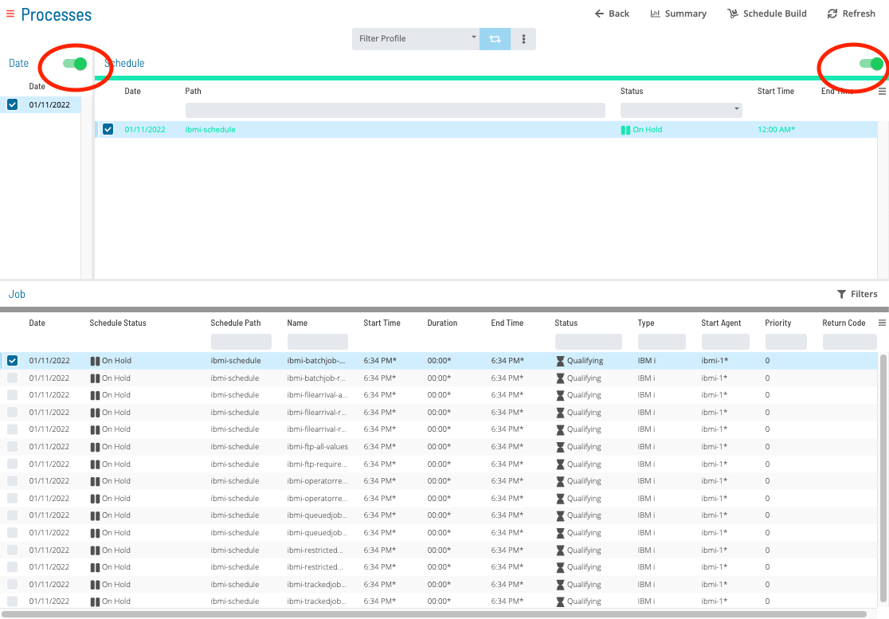
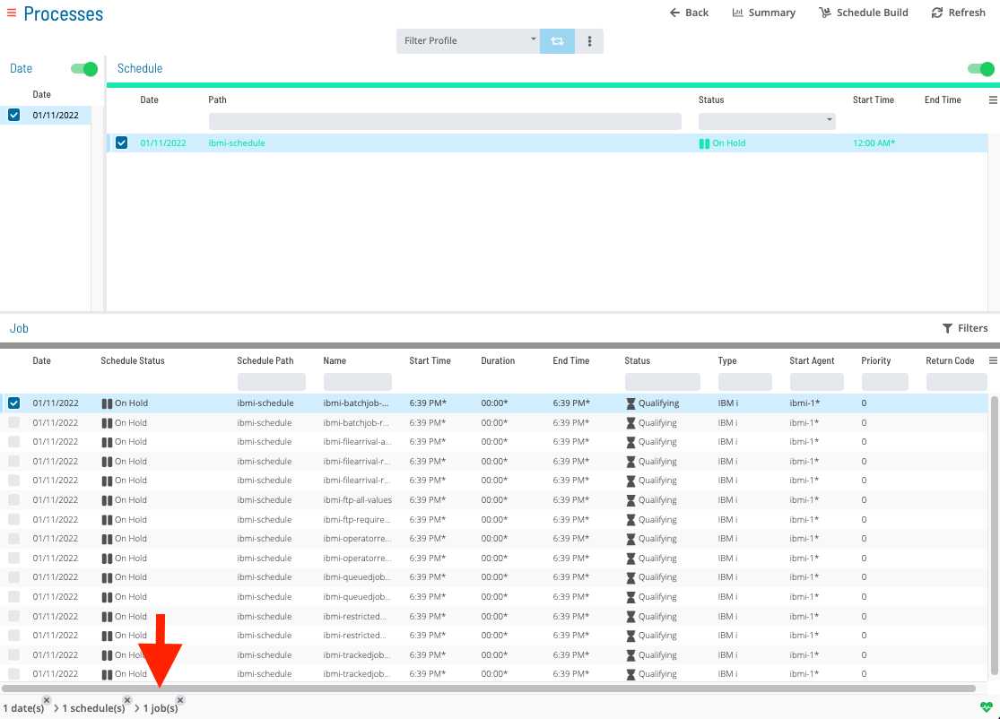
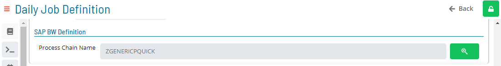
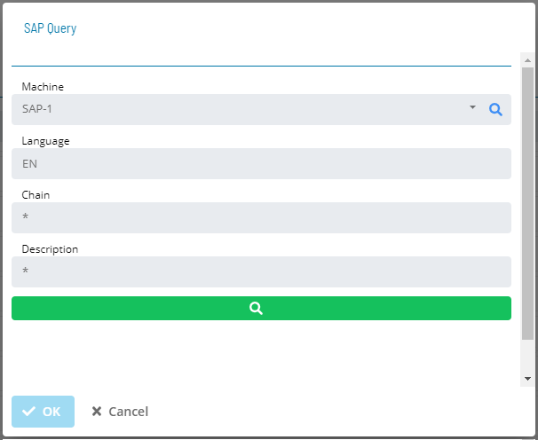
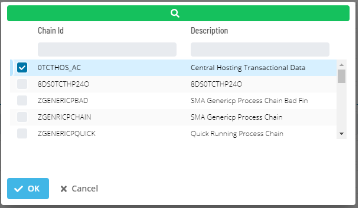
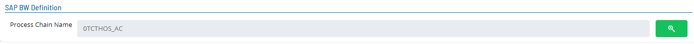

# Updating SAP BW Job Details

**Theme:** Configure  
**Who Is It For?** System Administrator, Automation Engineer

## What Is It?

In **Admin** mode, SAP BW job type properties can be updated or defined.

For conceptual information, refer to [SAP BW Job Details](../../../job-types/sap-bw.md) in the **Concepts** online help.

:::note
Only those with the appropriate permissions will have access to the **Lock** button and can update job properties. For details about privileges, refer to [Required Privileges](Accessing-Daily-Job-Definition.md#Required) in the **Accessing Daily Job Definition** topic.
:::

:::note
If you do not have the Machine Privilege, you will not be able to edit the daily job definition.
:::

:::note
Changes made to job properties in the **Daily Job Definition** take place immediately. If the job has already run, changes take effect the next time the job runs.
:::

## When Would You Use It?

- An existing SAP BW Job Details in Solution Manager requires changes
- A process change or system update makes the current SAP BW Job Details definition outdated

## Why Would You Use It?

- **Keep definitions current**: Updating SAP BW Job Details in Solution Manager ensures changes apply to future builds without disrupting currently running schedules

## Updating SAP BW Job Task Details

To perform this procedure:

1. Select the **Processes** button at the top-right of the **Operations Summary** page. The **Processes** page will display
2. Ensure that both the **Date** and **Schedule** toggle switches are enabled. Each switch will appear green when enabled

   

To update SAP BW Job Task Details, complete the following steps:

3. Select the desired **date(s)** to display the associated schedule(s)
4. Select one or more **schedule(s)** in the list
5. Select one **job** in the list. A record of your selection will display in the [status bar](SM-UI-Layout.md#Status) at the bottom of the page as a breadcrumb trail

   

6. Select the job record (e.g., 1 job(s)) in the status bar to display the **Selection** panel

   :::note
   As an alternative, you can right-click on the job selected in the list to display the **Selection** panel.
   :::

   .png "Job Summary Tab in Operations")

7. Select the **Daily Job Definition** button  at the top-left corner of the panel. By default, this page will be in **Read-only** mode
8. Select the **Lock** button  at the top-right corner to place the page in **Admin** mode. The button will switch to a white lock on a green background  when enabled

   :::note
   The **Lock** button will not be visible to users who do not have the appropriate permissions.
   :::

9. Expand the **Task Details** panel to expose its content
10. From the **Machines or Machine Group** list, select the **machine** where the agent is installed. To specify a machine group instead, toggle the **Machines** switch to *Machine Group* and select the **machine group** from the list. When toggled to Machine Group, the button will appear green 

**In the SAP BW Definition frame:**

- **Process Chain Name**: The name of the Business Warehouse job as defined in the SAP Business Warehouse system
- Select the search button  to open the SAP Query dialog

**In the SAP Query dialog:**

- **Machine**: The SAP BW agent Machine name
- **Language**: The two-character language abbreviation (e.g., EN for English)
- **Chain**: Text matching the name of the desired Process Chain. Use wildcards (\*) if the full process chain name is unknown
- **Description**: Text matching the description of the desired Process Chain. Use wildcards (\*) if the full description is unknown

- Select the search button  to retrieve all Process Chain names matching the search criteria from the SAP BW system
- Select a process chain from the list and select **Ok** to assign it to the process chain name in the SAP BW Daily Job Definition

:::note
Select the **Undo** button to undo any changes.
:::

Select the **Save** button to save your changes.

## Configuration Options

| Setting | What It Does | Default | Notes |
|---|---|---|---|
| Process Chain Name | The name of the Business Warehouse job as defined in the SAP Business Warehouse system | — | — |
| Language | The two-character language abbreviation (e.g., EN for English) | — | — |
| Chain | Text matching the name of the desired Process Chain. | — | — |
| Description | Text matching the description of the desired Process Chain. | — | — |

## FAQs

**Q: How many steps does the Updating SAP BW Job Details procedure involve?**

The Updating SAP BW Job Details procedure involves 10 steps. Complete all steps in order and save your changes.

**Q: What does Updating SAP BW Job Details cover?**

This page covers Updating SAP BW Job Task Details.

## Glossary

**LSAM (Local Schedule Activity Monitor)**: An agent installed on a target platform that runs jobs in the native language of that platform and communicates results back to SAM via SMANetCom over TCP/IP.

**Resource**: A numeric variable in OpCon representing a finite pool. Jobs can be configured to require a set number of resource units to run, limiting concurrent executions and preventing resource contention.

**Privilege**: A specific permission granted through an OpCon role that controls access to a feature, function, or object type. Privileges are organized into categories such as Function Privileges, Machine Privileges, Schedule Privileges, and Access Codes.

**Machine**: A platform defined in the OpCon database that has an agent installed. OpCon routes job execution requests to machines via SMANetCom, and machines report job completion status back to SAM.

**Schedule**: A named container for jobs in OpCon, built for a specific date to create that day's automation. Schedules define build settings, frequencies, and the jobs that run within them.

**Job**: The fundamental unit of work in OpCon. A job defines what to run, on which machine, when to start, and what conditions must be met. Job results are tracked and can trigger events and notifications.
