# Updating SAP R3 Job Details

In **Admin** mode, SAP R/3 and CRM job type properties can be updated or defined in the **Daily Job Definition**.

For conceptual information, refer to [SAP R3 Job Details](../../../job-types/sap.md) in the **Concepts** online help.

:::note
Only users with the appropriate permissions can access the **Lock** button and update job properties. For details about privileges, refer to [Required Privileges](Accessing-Daily-Job-Definition.md#Required) in the **Accessing Daily Job Definition** topic.
:::

:::note
Without the Machine Privilege, you cannot edit the daily job definition.
:::

:::note
Changes made in the **Daily Job Definition** take effect immediately. If the job has already run, changes apply the next time the job runs.
:::

:::note
All required fields are designated by a red asterisk.
:::

:::note

A loading animation appears when waiting for results from the SAP system.
:::

## Updating SAP R3 Job Task Details

To update SAP R3 job task details, complete the following steps:

1. Select the **Processes** button at the top-right of the **Operations Summary** page.
2. Enable both the **Date** and **Schedule** toggle switches. Each switch appears green when enabled.

   

3. Select the desired **date(s)** to display the associated schedules.
4. Select one or more **schedules** in the list.
5. Select one **job** in the list. Your selection appears in the [status bar](SM-UI-Layout.md#Status) as a breadcrumb trail.

   

6. Select the job record (for example, **1 job(s)**) in the status bar to display the **Selection** panel.

   :::note
   Alternatively, right-click the job in the list to display the **Selection** panel.
   :::

   .png> "Job Summary Tab in Operations")

7. Select the **Daily Job Definition** button  at the top-left corner of the panel. The page opens in **Read-only** mode by default.
8. Select the **Lock** button  at the top-right corner to enter **Admin** mode. The button displays a white unlocked lock on a green background  when enabled.

   :::note
   The **Lock** button is not visible to users without the appropriate permissions.
   :::

9. Expand the **Task Details** panel.
10. From the **Machines or Machine Group** list, select the **machine** where the Agent is installed. To specify a machine group, toggle the **Machines** switch to **Machine Group** and select a group from the list. The toggle appears green  when enabled.

**Result:** The **SAP R3 Definition** frame is now available for editing.

---

## SAP R/3 and CRM Job Details

:::note
All required fields are designated by a red asterisk.
:::

**In the SAP R/3 and CRM Definition frame:**

- **Job Name**: Name of the job as defined in the SAP R/3 and SAP CRM system.
- **Job Number**: SAP R/3 and SAP CRM job number (Job ID).
- **Start SAP Job**: Configures SAP start criteria:
  - **A.S.A.P.**: Starts the job as soon as a background process is available.
  - **Immediately**: Starts the job as soon as it qualifies to run in OpCon, without waiting for an available SAP background process. If all background processes are in use, the job fails.
- **Exec. Target**: Name of the SAP Application Server on which the job runs.

### Select SAP Job

Select the search button next to **Job Name** to open the SAP Query dialog.
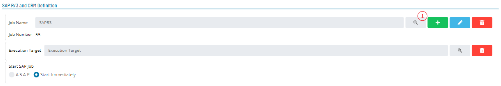

#### In the SAP Query dialog:

- **Machine**: SAP R3 Agent machine name.
- **Language**: Two-character language abbreviation (for example, `EN` for English).
- **Job Name**: Text matching the desired job name. Use wildcards (`*`) to broaden the search.
- **User ID**: Username for SAP credentials.
- **Password**: Password for SAP credentials.

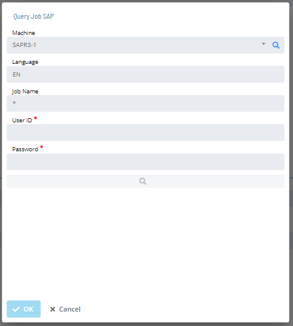

Enter SAP credentials and select the search button to retrieve matching job names.

Select a job from the list and select **OK** to assign it to the daily job.

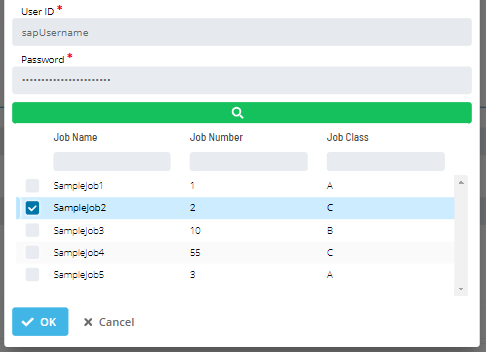

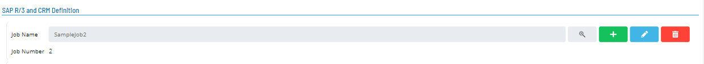

### Create SAP Job

Select the add button next to **Job Name** to open the Create SAP Job dialog.

#### In the Create SAP Job dialog:

- **Job Name**: Name of the job being created.
- **Job Class**: SAP job class: A, B, or C.
- **Spool Recipient**: Spool recipient for the SAP job.
- **Credentials**: Opens the SAP Login dialog.

  :::note
  Enter credentials before creating an SAP job. Credentials apply to all SAP queries.
  :::

- **List of Steps**: Add, edit, or delete steps (Abap Program, External Command, or External Program) after entering credentials.
- **Step Details**: Select an item from **List of Steps** to define its details.

#### Enter Credentials

Select **Credentials** under **Credentials Definition** to open the SAP Login dialog.
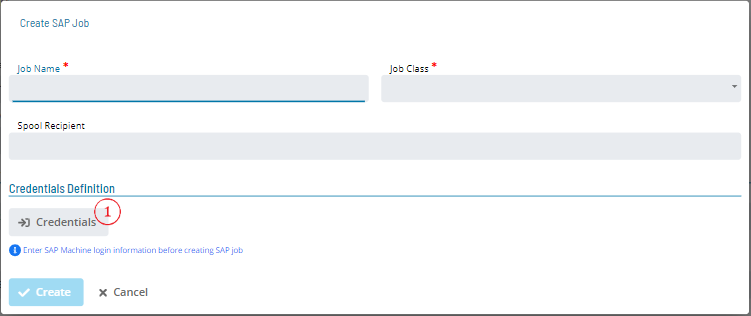

#### In the SAP Login dialog:

- **Machine**: SAP R3 Agent machine name.
- **User ID**: Username for SAP credentials.
- **Password**: Password for SAP credentials.
- **Language**: Two-character language abbreviation (for example, `EN` for English).

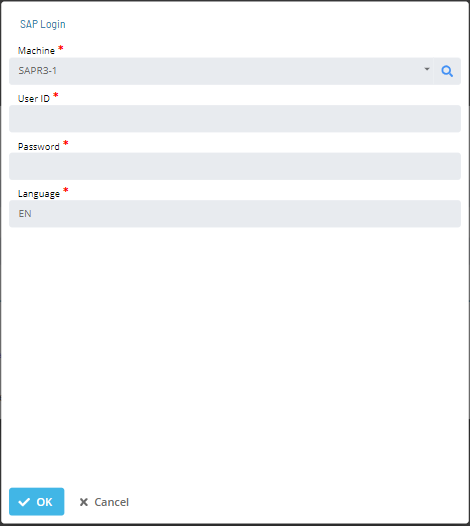

**Create SAP Job Dialog** after entering credentials.
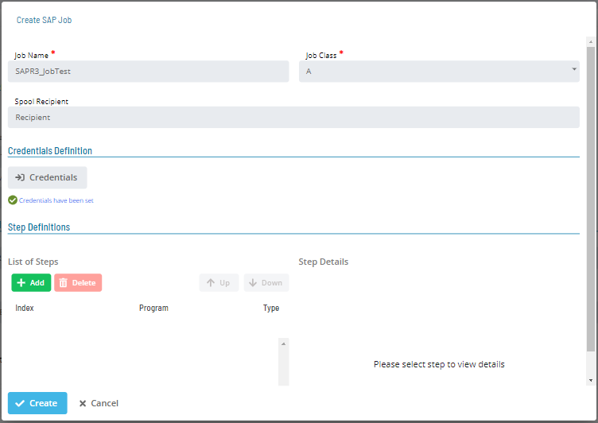

### Edit SAP Job

Select the edit button to open the Edit SAP Job dialog.
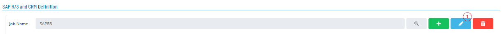

Open the credentials dialog and enter credentials.

:::note
Credentials are required to enable the **Query** button.
:::

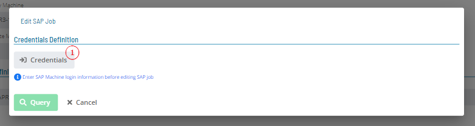

#### In the SAP Login dialog:

- **Machine**: SAP R3 Agent machine name.
- **User ID**: Username for SAP credentials.
- **Password**: Password for SAP credentials.
- **Language**: Two-character language abbreviation (for example, `EN` for English).

After entering credentials, select the query button to search for the job. When results appear, make any changes and select **Save**.

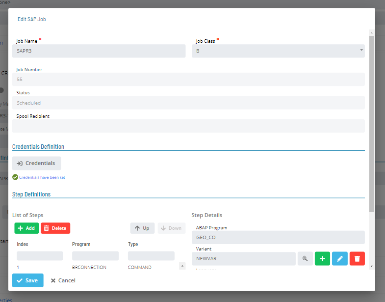

### Delete SAP Job

Select the delete button to open the Delete SAP Job dialog.
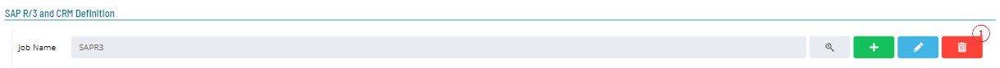

- **Machine**: SAP R3 Agent machine name.
- **Language**: Two-character language abbreviation (for example, `EN` for English).
- **User ID**: Username for SAP credentials.
- **Password**: Password for SAP credentials.

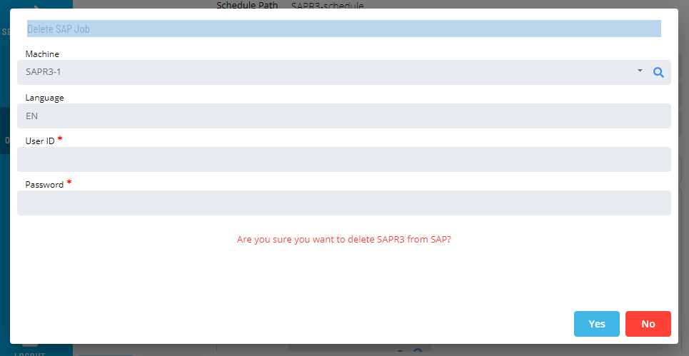

Enter credentials and select **Yes** to delete the job.

### Add Steps to SAP Job

Select the add button under **List of Steps** to open the Add SAP Step dialog.
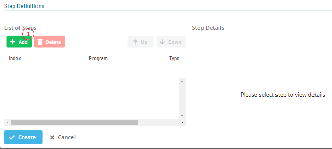

#### Add SAP Step Dialog

- **Abap Program**
  - **ABAP Program Selector**: Text matching the desired ABAP program name. Use wildcards (`*`) to broaden the search.
    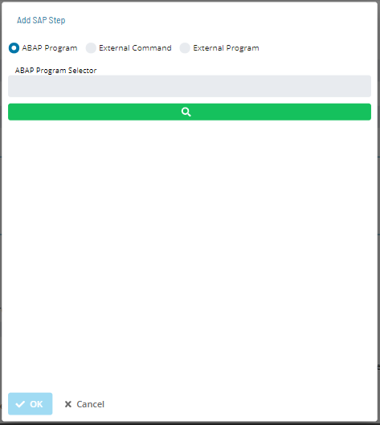
  - Select the search button to retrieve matching ABAP programs.
    
  - Select an **Abap Program** and select **OK** to add it to the SAP job step.
    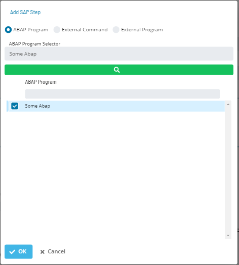
    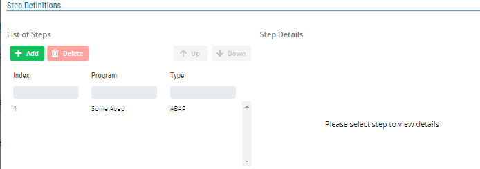
- **External Command**
  - **External Command Selector**: Text matching the desired external command name. Use wildcards (`*`) to broaden the search.
    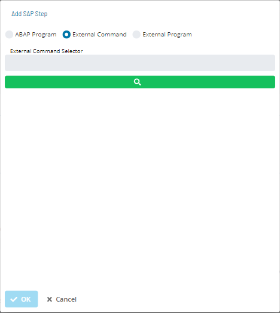
  - Enter the external command name or select the search button to retrieve matching commands.
    
  - Select an **External Command** and select **OK** to add it to the SAP job step.
    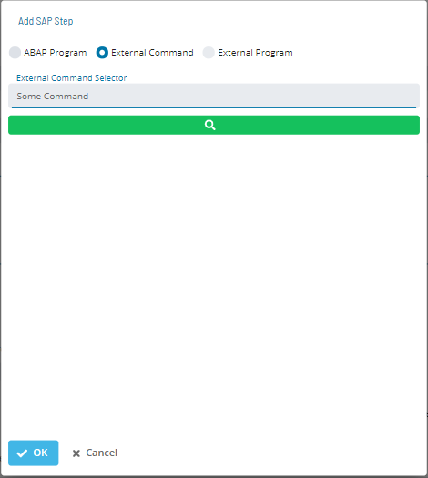
    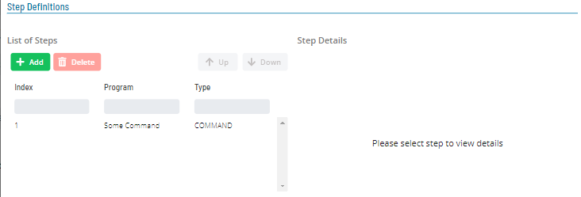
- **External Program**
  - **External Program Name**: Text matching the desired external program name.
    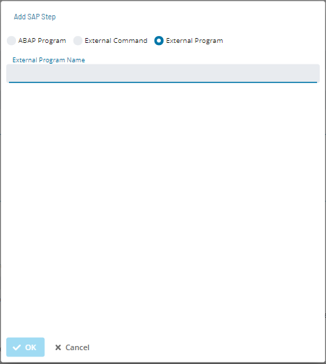
  - Enter the **External Program Name** and select **OK** to add it to the SAP job step.
    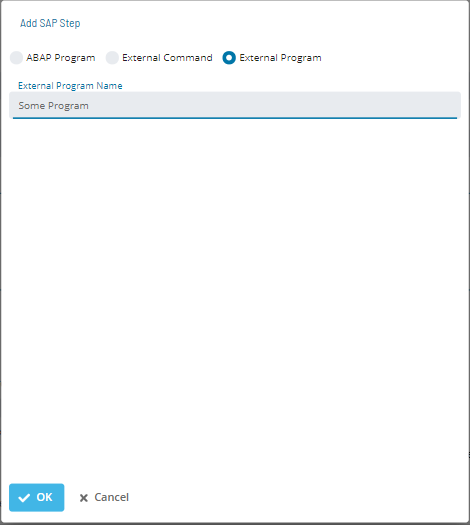
    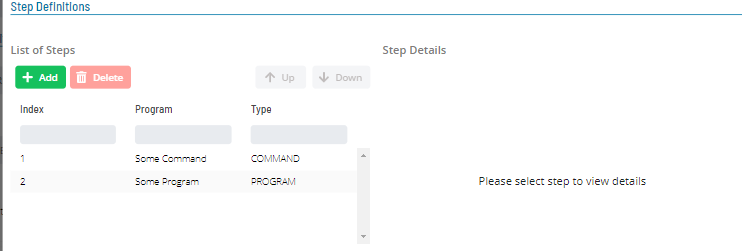

:::note

Use the up and down buttons to reorder steps.
:::

### Abap Program Details

- Select **Abap Program** from the list of steps.
  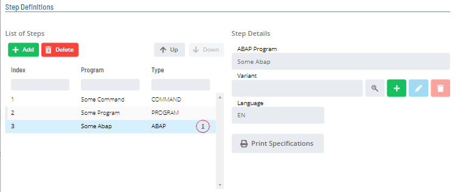
- **ABAP Program**: Name of the ABAP program.
- **Variant**: Variant for the ABAP step.
  - **Search Variant**: Retrieves all variants for the selected ABAP step from the SAP R3 system.
    
  - **Add Variant**: Opens the add variant dialog to create a new variant.
    
  - **Edit Variant**: Opens the edit variant dialog. A variant must be selected or created first to enable this button.
    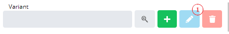
  - **Delete Variant**: Removes the current variant from the ABAP step. A variant must be selected or created first to enable this button.
    
- **Language**: Two-character language abbreviation (for example, `EN` for English).
- **Print Specifications**: Opens the Print Specifications dialog.
  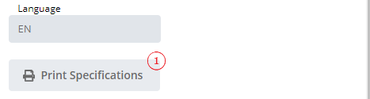

### Abap Variants

#### Search Variant Dialog

Select the search variant button  to open the dialog, then select the search button to retrieve all variants for the selected ABAP step.

Select a **Variant** and select **OK** to apply it to the ABAP step.
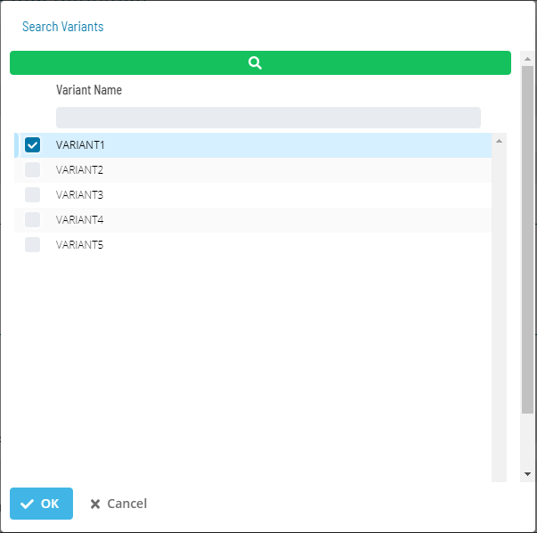
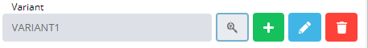

#### Add Variant Dialog

Select the add variant button  to open the dialog. Wait for the SAP system to return **Variant Parameters**.
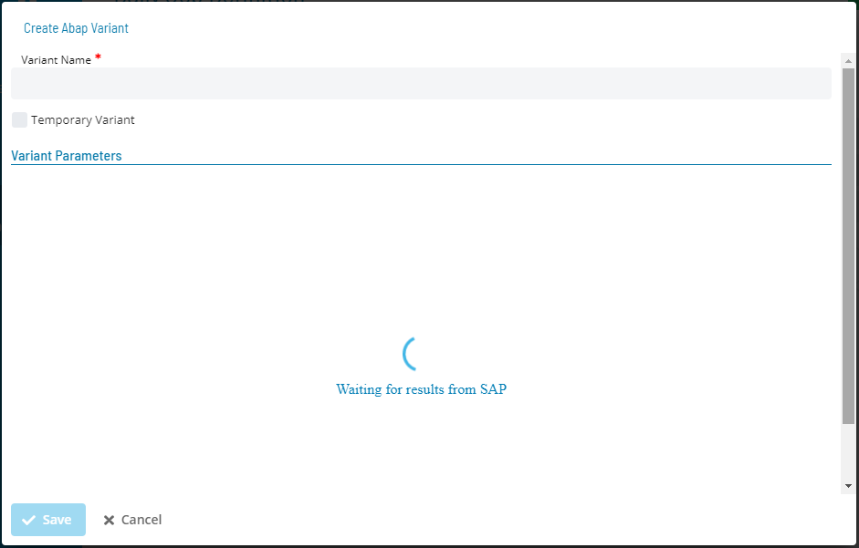

- **Variant Name**: Name for the variant being created.
- **Temporary Variant**: Creates the variant in the local database. The variant is created when the daily job is saved and deleted when the daily job or SAP job is deleted.
- **Variant Parameters**: Returned automatically from the SAP system when the dialog opens.

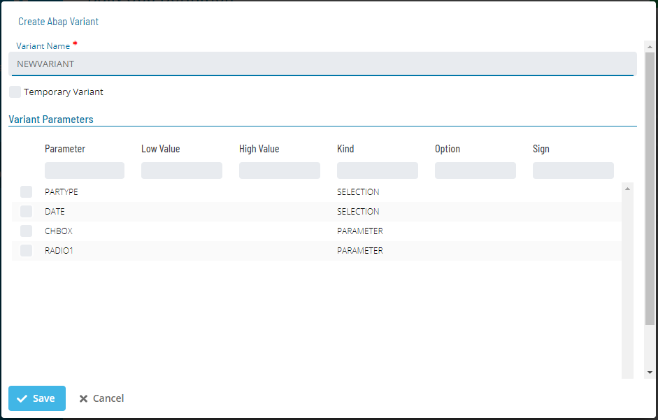

Select a variant parameter to update its values, then select the update button to apply the change.
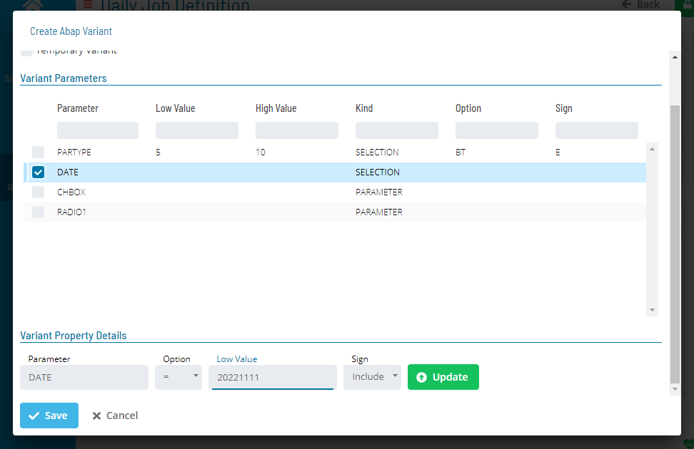

#### Edit Variant Dialog

Select or create a variant to enable the edit variant button, then select it to open the dialog.

Wait for **Variant Parameters** to load.
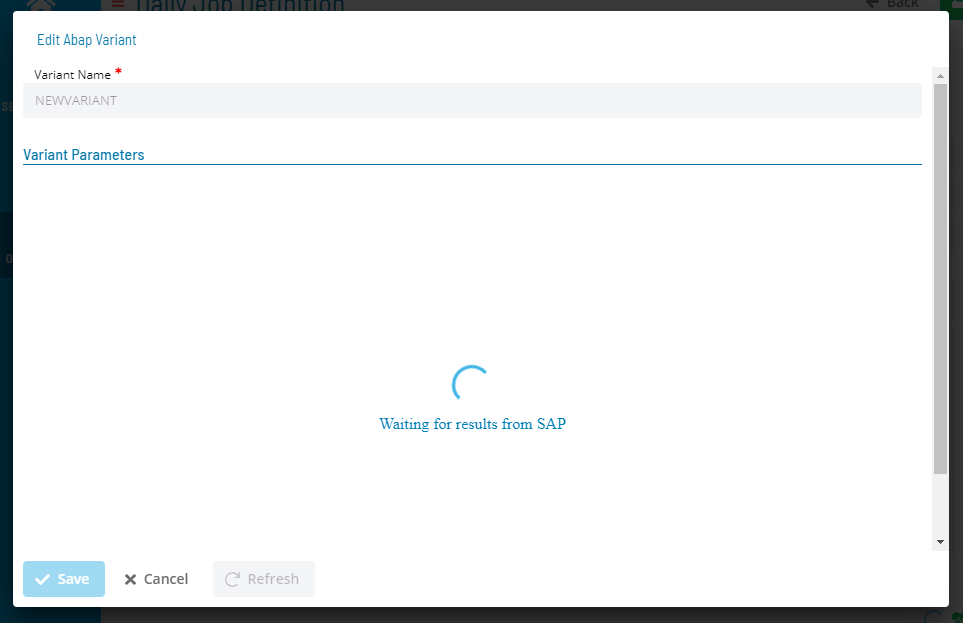

- **Variant Name**: Name of the variant being updated (read-only).
- **Refresh**: Reloads parameter values from the SAP system.

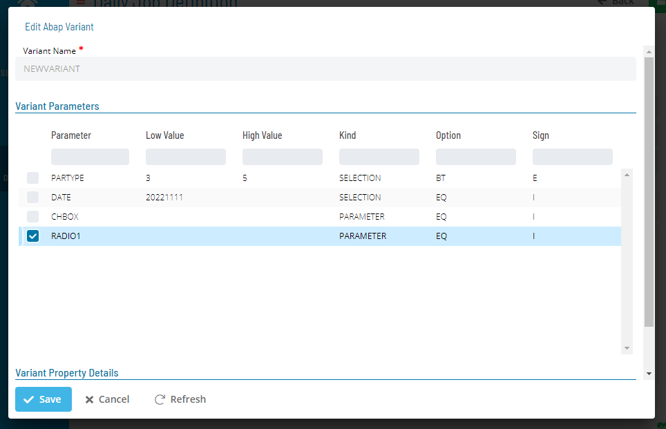

Select a variant parameter to update its values, then select the update button to apply the change.
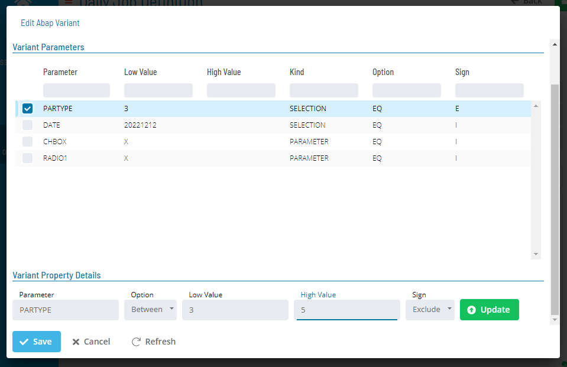

#### Delete Variant Dialog

Select or create a variant to enable the delete variant button, then select it to remove the variant from the **Abap Program** step.

:::note
This removes the variant from the ABAP step only. It does not permanently delete the variant from the SAP system.
:::

### Abap Print Specifications

Select the **Print Specifications** button to open the dialog.

#### General Attribute Tab

- **Output Device**: Output device for printing. Select the search button to query SAP for available devices.
  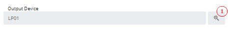

  :::note
  An output device must be selected before querying for print formats.
  :::

- **Number of Copies**: Number of copies to print.
- **Time of Printing**: When to print.
- **Print Format**: Format for printing. Select the search button to query SAP for available formats.
  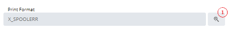
  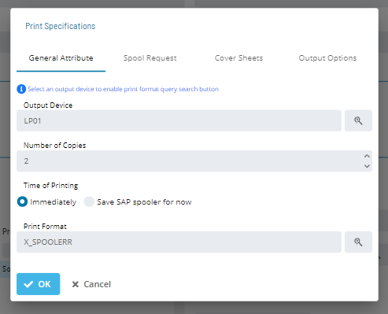

#### Spool Request Tab

- **Name**: Spool request name.
- **Title**: Spool request title.
- **Authorization**: Spool request authorization.
  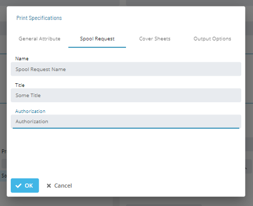

#### Cover Sheets Tab

- **SAP Cover Page**: Whether to print a cover page.
- **Selection Cover Sheet**: Selection cover sheet setting.
- **Recipient**: Recipient field.
- **Department**: Department field.
  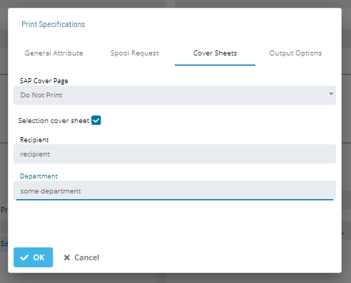

#### Output Options Tab

- **Spool Retention Period**: When to delete after printing.
- **Delete Immediately After Printing**: Deletes the spool request immediately after printing.
- **New Spool Request**: Creates a new spool request.
  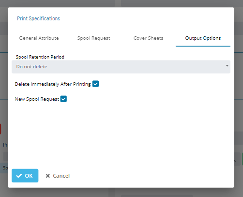

### External Command Details

- **Command**: Name of the selected external command.
- **Parameters**: Parameters for the external command.
- **Operating System**: Operating system for the external command.
- **Target Server**: Target server for the external command.
- **Log external output to job log**: Logs external output to the job log.
- **Log external errors to job log**: Logs external errors to the job log.
- **Job awaiting external termination**: Waits for external termination.
- **Active trace**: Activates trace.
  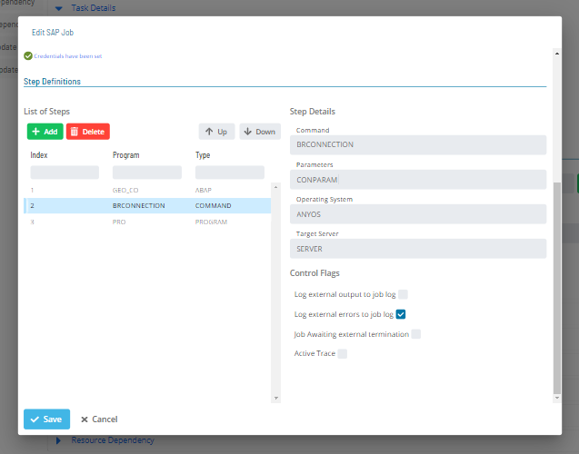

### External Program Details

- **Program**: Name of the selected external program.
- **Parameters**: Parameters for the external program.
- **Target Server**: Target server for the external program.
- **Log external output to job log**: Logs external output to the job log.
- **Log external errors to job log**: Logs external errors to the job log.
- **Job awaiting external termination**: Waits for external termination.
- **Active trace**: Activates trace.
  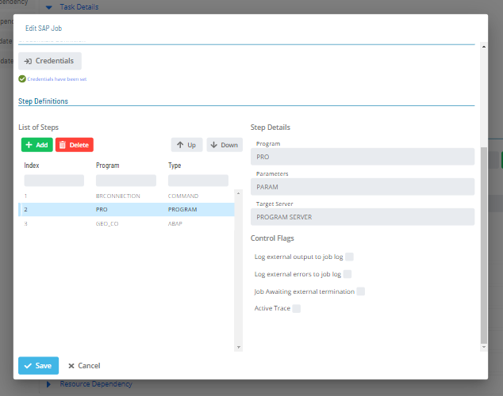

### Select running Target

Select the search button next to **Exec. Target** to open the SAP Query dialog.
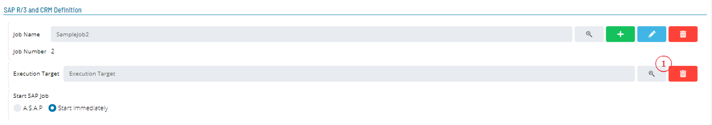

#### In the SAP Query dialog:

- **Machine**: SAP R3 Agent machine name.
- **Language**: Two-character language abbreviation (for example, `EN` for English).
- **User ID**: Username for SAP credentials.
- **Password**: Password for SAP credentials.

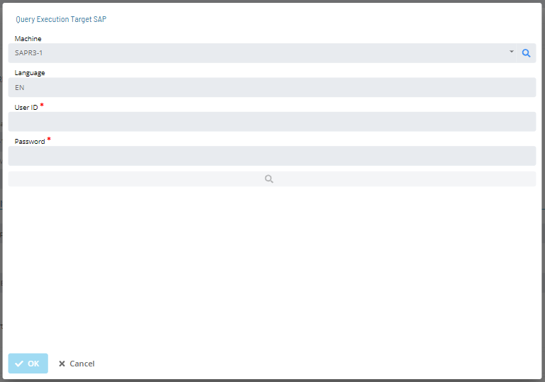

Enter SAP credentials and select the search button to retrieve all running targets.

Select a target from the list and select **OK** to assign it to **Exec. Target** in the SAP R3 Daily Job Definition.

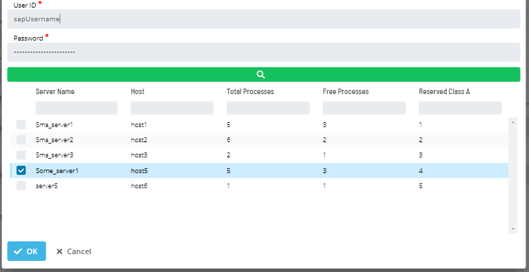

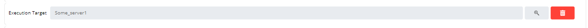

### Remove running Target

To remove the **running Target**, select the delete button.
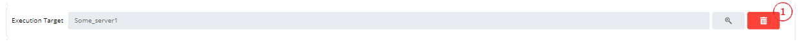

:::note
Select **Save** to apply changes to the daily job, or **Undo** to revert them.
:::
