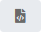

# Updating UNIX Job Details

**Theme:** Configure  
**Who Is It For?** System Administrator, Automation Engineer

## What Is It?

In **Admin** mode, UNIX job type properties can be updated or defined.
For a UNIX job, you can:

- [Update Job Action: Run Program Job Details](#Updating)
- [Update Job Action: File Arrival Job Details](#Updating2)
- [Update Job Action: Embedded Script Job Details](#Updating3)

For conceptual information, refer to [UNIX Job Details](../../../job-types/unix.md) in the **Concepts** online help.

:::note
Only those with the appropriate permissions will have access to the **Lock** button and can update job properties. For details about privileges, refer to [Required Privileges](Accessing-Daily-Job-Definition.md#Required) in the **Accessing Daily Job Definition** topic.
:::

:::note
If you do not have the Machine Privilege, you will not be able to edit the daily job definition.
:::

:::note
Changes made to the job properties in the **Daily Job Definition** will take place immediately. If the job has already run, the changes will take effect the next time the job runs.
:::

## Updating Job Action: Run Program Job Details

To perform this procedure:

Select on the **Processes** button at the top-right of the **Operations Summary** page. The **Processes** page will display.

Ensure that both the **Date** and **Schedule** toggle switches are enabled so that you can make your date and schedule selection, respectively. Each switch will appear green when enabled.

Select the desired **date(s)** to display the associated schedule(s).

Select one or more **schedule(s)** in the list.

Select one **job** in the list. A record of your selection will display in the [status bar](SM-UI-Layout.md#Status) at the bottom of the page in the form of a breadcrumb trail.

Select on the job record (e.g., 1 job(s)) in the status bar to display the **Selection** panel.

:::note
As an alternative, you can right-click on the job selected in the list to display the **Selection** panel.
:::

.png "Job Summary Tab in Operations")

Select the **Daily Job Definition** button  at the top-left corner of the panel to access the **Daily Job Definition** page. By default, this page will be in **Read-only** mode.

Select the **Lock** button  at the top-right corner to place the page in **Admin** mode. The button will switch to display a white lock unlocked on a green background  when enabled.

:::note
The **Lock** button will not be visible to users who do not have the appropriate permissions.
:::

Expand the **Task Details** panel to expose its content.

:::note
All required fields are designated by a red asterisk.
:::

Select a **User Id** to use when running the job. Either use the default value of "0/0" or assign it to an available batch user. Keep in mind that user information must be defined as a Batch User ID in OpCon Administration.

Select from the **Machines or Machine Group** list the **machine** where the agent is installed. To specify a machine group instead, toggle the **Machines** switch to *Machine Group* then select the **machine group** from the list. When toggled to Machine Group, the button will appear green .

**In the Prerun frame:**

The **Prerun** frame defines a prerequisite process that runs immediately before the primary job.

\

Enable the **Prerun** switch .

Enter the *command line detail* for the prerun process. This should be the full path to the executable file on the agent machine to run immediately before the job specified in the Start Image. This field permits up to 4000 characters.

**In the Run frame:**

The **Run** frame defines the information for running the primary job.

\

Enter the *full path and file name of the program to run in the UNIX Start Image*. This field permits up to 4000 characters.

Enter any required *command-line parameters*. This field permits up to 4000 characters.

:::note
OpCon concatenates the Start Image and Parameters and inserts a space between them before sending the job to the UNIX LSAM.
:::

Enter the *NICE Value* to increase/decrease the priority of the job and prerun (if present). Valid values range from -20 to 20 with a default of zero (0).

:::note
A lower NICE Value signifies a higher priority; entering a negative number raises the priority and a positive number lowers it.
:::

**In the Job Output Parsing frame:**

The **Job Output Parsing** frame defines search criteria for analyzing job output. Matches against the defined string result in the defined exit code.

Select the green **Add** button (**+**) to define the parsing criteria.

Select the **Search Operation** from the list.

Enter the **String to Search**. Wildcard characters are supported. This field permits up to 255 characters.

Select or enter the **Exit Code**.

:::note
Remove any defined parsing criteria by clicking the **Delete** button at the end of the row.
:::

Enter the **Custom Application Log Path**. Wildcard characters are supported for specifying multiple logs.

**In the Failure Criteria frame:**

The **Failure Criteria** frame defines the criteria OpCon uses to determine the final status of the primary job.

\

Select an **operator** then enter or select the **exit code integer**.

Specify whether the defined criteria should be used to determine if the job Failed or Finished OK.

Defining Multiple Failure Criteria:

Use the **and/or** field to define multiple failure criteria. This field defines the way the strings are evaluated together.

:::note
You must define all "And" comparisons before the "Or" comparisons. Additionally, if the Comparison Operator on the previous group is "Equal To", then the *and/or* value must be set to "Or".
:::

Use the **Fail on Core Dump** switch to configure how the agent reports the job status when the job does or does not create a core file.

- If the **Fail on Core Dump** switch is enabled  and a core dump is produced, the job status returns a failed exit code
- If the **Fail on Core Dump** switch is enabled  and a core dump is not produced, the job succeeds (assuming all other exit code processing is good)

:::note
The final exit code processing has nothing to do with whether a core dump is produced or not. It is a final determination of whether the program produced an acceptable job status.
:::

Define up to five different signal failure criteria. If any signal failure criterion is TRUE when a job finishes, OpCon reports the job as Failed.

**In the Environment Variables frame:**

The **Environment Variables** frame defines the environment variables for the job to use.

\

Select the green **Add** button (**+**) to define the environment variables.

Enter a *name* in the **Name** field.

Enter a *value* in the **Value** field. Remove any defined environment variable by clicking the **Delete** button at the end of the row.

Select the **OK** button to add the name/value.

:::note
Select the **Undo** button if you wish to undo your changes for any reason.
:::

Select the **Save** button.

## Updating Job Action: File Arrival Job Details

### Navigate to the Daily Job Definition

To navigate to the daily job definition for the File Arrival job, complete the following steps:

1. Select on the **Processes** button at the top-right of the **Operations Summary** page. The **Processes** page will display
2. Ensure that both the **Date** and **Schedule** toggle switches are enabled so that you can make your date and schedule selection, respectively. Each switch will appear green when enabled
3. Select the desired **date(s)** to display the associated schedule(s)
4. Select one or more **schedule(s)** in the list
5. Select one **job** in the list. A record of your selection will display in the [status bar](SM-UI-Layout.md#Status) at the bottom of the page in the form of a breadcrumb trail
6. Select on the job record (e.g., 1 job(s)) in the status bar to display the **Selection** panel
7. Select the **Daily Job Definition** button  at the top-left corner of the panel to access the **Daily Job Definition** page. By default, this page will be in **Read-only** mode
8. Select the **Lock** button  at the top-right corner to place the page in **Admin** mode. The button will switch to display a white lock unlocked on a green background  when enabled
9. Expand the **Task Details** panel to expose its content

### Configure File Arrival Job Settings

To configure the file arrival detection criteria and failure handling, complete the following steps:

1. Select a **User Id** to use when running the job. Either use the default value of "0/0" or assign it to an available batch user. Keep in mind that user information must be defined as a Batch User ID in OpCon Administration
2. Select from the **Machines or Machine Group** list the **machine** where the agent is installed. To specify a machine group instead, toggle the **Machines** switch to *Machine Group* then select the **machine group** from the list. When toggled to Machine Group, the switch will appear green
3. Enter the *file path and name of the file to detect* in the **File Name** field. UNIX wildcard characters are supported (e.g., /usr/local/abc\*.txt). This field permits up to 4000 characters
4. Specify whether to search the sub-directory under the specified path using the **Sub-directory Search** toggle switch. When enabled, the switch will appear green
5. Specify the time frame (*Start Time* and *End Time*) within which the file must arrive in the directory. Either manually input the time frame or use the input field selectors
6. Specify the amount of time in seconds (*Duration*) that the file size must remain stable. Either manually input the number of seconds or use the input field selector(s)
7. Select an **operator** then enter or select the **exit code integer**
8. Specify whether the defined criteria should be used to determine if the job Failed or Finished OK
9. Select the **Save** button

## Updating Job Action: Embedded Script Job Details

For conceptual information, refer to [Embedded Scripts](../../../automation-concepts/embedded-scripts.md) in the **Concepts** online help.

:::note
If you do not have the Script Privilege for the script, you will not be able to see the task details or edit the daily job definition (the Lock button will be disabled).
:::

To perform this procedure:

Select on the **Processes** button at the top-right of the **Operations Summary** page. The **Processes** page will display.

Ensure that both the **Date** and **Schedule** toggle switches are enabled so that you can make your date and schedule selection, respectively. Each switch will appear green when enabled.

Select the desired **date(s)** to display the associated schedule(s).

Select one or more **schedule(s)** in the list.

Select one **job** in the list. A record of your selection will display in the [status bar](SM-UI-Layout.md#Status) at the bottom of the page in the form of a breadcrumb trail.

Select on the job record (e.g., 1 job(s)) in the status bar to display the **Selection** panel.

:::note
As an alternative, you can right-click on the job selected in the list to display the **Selection** panel.
:::

.png "Job Summary Tab in Operations")

Select the **Daily Job Definition** button  at the top-left corner of the panel to access the **Daily Job Definition** page. By default, this page will be in **Read-only** mode.

Select the **Lock** button  at the top-right corner to place the page in **Admin** mode. The button will switch to display a white lock unlocked on a green background  when enabled.

:::note
The **Lock** button will not be visible to users who do not have the appropriate permissions.
:::

Expand the **Task Details** panel to expose its content.

:::note
All required fields are designated by a red asterisk.
:::

Select a **User Id** to use when running the job. Either use the default value of "0/0" or assign it to an available batch user. Keep in mind that user information must be defined as a Batch User ID in OpCon Administration.

Select from the **Machines or Machine Group** list the **machine** where the agent is installed. To specify a machine group instead, toggle the **Machines** switch to *Machine Group* then select the **machine group** from the list. When toggled to Machine Group, the switch will appear green.

**In the Embedded Script frame:**

The **Embedded Script** frame associates an embedded script to run with the job.

\

Select the **script** to associate with the job. The **Type** field will populate to show the type of script selected.

Select the specific **version (or revision) of the script** to run for this job. The **Comments** field will populate with any notes provided about the script.

:::note
Selecting the "Latest" version means the latest version of the script will be used just before the job runs.
:::

Viewing Scripts:

To view the details about a script, select the **Preview** button (). The **Script Viewer** pop-up window will display information (e.g., name, description, type, version, version comment, author, created, updated) about and the contents of the selected script.

:::note
The **Preview** button is only enabled for scripts where the user is a member of a role with privileges to view the contents. A user must have All Administrative Functions, All Function Privileges, View Embedded Script Contents privilege, or must be in the ocadm role to view the contents.
:::

:::note
If you do not have the View Embedded Script Contents privilege, you will not be able to see any of the script contents in **Preview** mode.
:::

**In the Runner frame:**

The **Runner** frame configures the run definition used to run the script.

\

Select the **runner** (interpreter) to run the script. The **Run Command Template** field will populate to show the syntax for the runner.

Enter any *argument(s)* to pass to the script at runtime. This field permits up to 255 characters.

:::note
When defining the argument, keep in mind that the equal sign (=) is a restricted character.
:::

**In the Failure Criteria frame:**

The **Failure Criteria** frame defines the criteria OpCon uses to determine the final status of the job.

\

Select an **operator** then enter or select the **exit code integer**.

Specify whether the defined criteria should be used to determine if the job Failed or Finished OK.

Defining Multiple Failure Criteria:

Use the **and/or** field to define multiple failure criteria. This field defines the way the strings are evaluated together.

:::note
You must define all "And" comparisons before the "Or" comparisons. Additionally, if the Comparison Operator on the previous group is "Equal To", then the *and/or* value must be set to "Or".
:::

Use the **Fail on Core Dump** switch to configure how the agent reports the job status when the job does or does not create a core file.

- If the **Fail on Core Dump** switch is enabled  and a core dump is produced, the job status returns a failed exit code
- If the **Fail on Core Dump** switch is enabled  and a core dump is not produced, the job succeeds (assuming all other exit code processing is good)

:::note
The final exit code processing has nothing to do with whether a core dump is produced or not. It is a final determination of whether the program produced an acceptable job status.
:::

Define up to five different signal failure criteria. If any signal failure criterion is TRUE when a job finishes, OpCon reports the job as Failed.

**In the Environment Variables frame:**

The **Environment Variables** frame defines the environment variables for the job to use.

\

Select the green **Add** button (**+**) to define the environment variables.

Enter a *name* in the **Name** field.

Enter a *value* in the **Value** field. Remove any defined environment variable by clicking the **Delete** button at the end of the row.

Select the **OK** button to add the name/value.

:::note
Select the **Undo** button if you wish to undo your changes for any reason.
:::

Select the **Save** button.

## FAQs

**Q: How many steps does the Updating UNIX Job Details procedure involve?**

The Updating UNIX Job Details procedure involves 18 steps. Complete all steps in order and save your changes.

**Q: What does Updating UNIX Job Details cover?**

This page covers Updating Job Action: Run Program Job Details, Updating Job Action: File Arrival Job Details, Updating Job Action: Embedded Script Job Details.

## Glossary

**LSAM (Local Schedule Activity Monitor)**: An agent installed on a target platform that runs jobs in the native language of that platform and communicates results back to SAM via SMANetCom over TCP/IP.

**Embedded Script**: A script stored and versioned directly within the OpCon database. Embedded scripts can be assigned to Windows jobs and run at runtime without requiring the script file to exist on the target machine.

**Resource**: A numeric variable in OpCon representing a finite pool. Jobs can be configured to require a set number of resource units to run, limiting concurrent executions and preventing resource contention.

**Role**: A named security profile in OpCon that groups privileges together. Roles are assigned to user accounts to control which features, schedules, jobs, machines, and administrative functions a user can access.

**Privilege**: A specific permission granted through an OpCon role that controls access to a feature, function, or object type. Privileges are organized into categories such as Function Privileges, Machine Privileges, Schedule Privileges, and Access Codes.

**Machine**: A platform defined in the OpCon database that has an agent installed. OpCon routes job execution requests to machines via SMANetCom, and machines report job completion status back to SAM.

**Schedule**: A named container for jobs in OpCon, built for a specific date to create that day's automation. Schedules define build settings, frequencies, and the jobs that run within them.

**Job**: The fundamental unit of work in OpCon. A job defines what to run, on which machine, when to start, and what conditions must be met. Job results are tracked and can trigger events and notifications.
