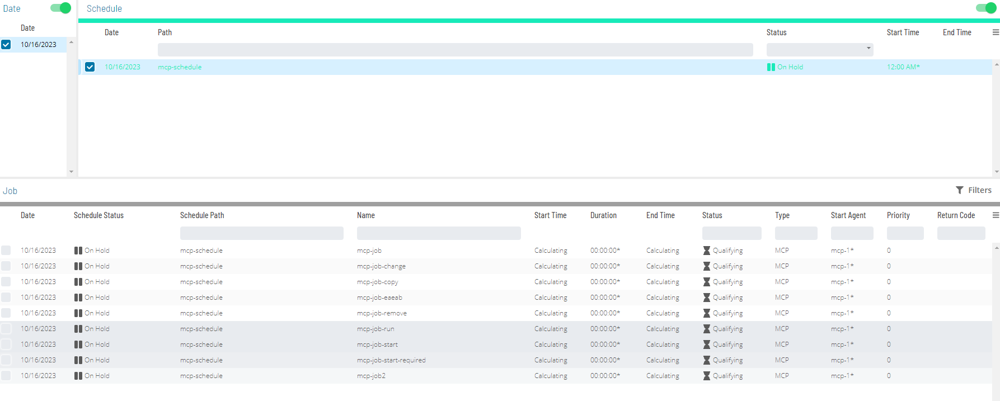
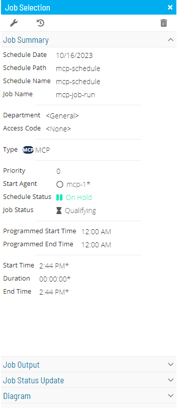
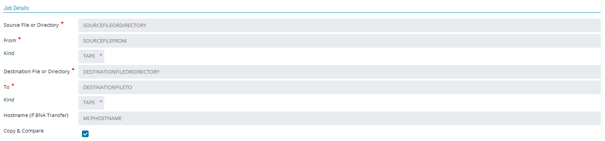
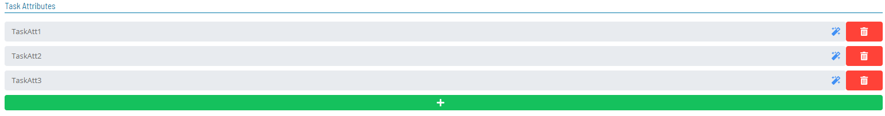
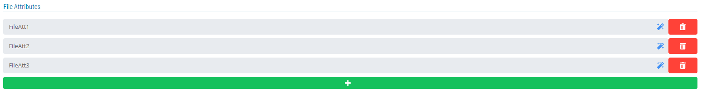
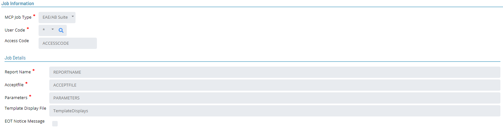
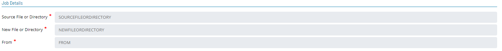
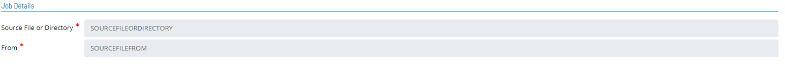
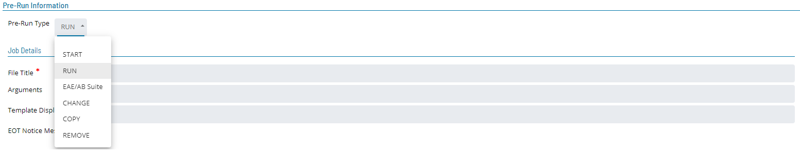
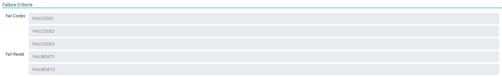

# Updating MCP Job Details

**Theme:** Configure  
**Who Is It For?** System Administrator, Automation Engineer

## What Is It?

In **Admin** mode, MCP job type properties can be updated or defined.

For conceptual information, refer to [MCP Job Details](../../../job-types/mcp.md) in the **Concepts** online help.

- [Update Job Type: START Job](#updating-job-type-start)
- [Update Job Type: RUN Job](#updating-job-type-run)
- [Update Job Type: EAE/AB Suite Job](#updating-job-type-eaeab-suite)
- [Update Job Type: CHANGE Job](#updating-job-type-change)
- [Update Job Type: COPY Job](#updating-job-type-copy)
- [Update Job Type: REMOVE Job](#updating-job-type-remove)

:::note
Only those with the appropriate permissions will have access to the **Lock** button and can update job properties. For details about privileges, refer to [Required Privileges](Accessing-Daily-Job-Definition.md#Required) in the **Accessing Daily Job Definition** topic.
:::

:::note
If you do not have the Machine Privilege, you will not be able to edit the daily job definition.
:::

:::note
Changes made to job properties in the **Daily Job Definition** take place immediately. If the job has already run, changes take effect the next time the job runs.
:::

To perform this procedure, complete the following steps:

1. Select the **Processes** button at the top-right of the **Operations Summary** page
2. Enable both the **Date** and **Schedule** toggle switches. Each switch appears green when enabled

   

3. Select the desired **date(s)** to display the associated schedule(s)
4. Select one or more **schedule(s)** in the list
5. Select one **job** in the list. Your selection displays in the [status bar](SM-UI-Layout.md#Status) at the bottom of the page as a breadcrumb trail
6. Right-click the job to display the **Selection** panel

   

7. Select the **Daily Job Definition** button  at the top-left corner of the panel. The page opens in **Read-only** mode by default
8. Select the **Lock** button  at the top-right corner to enter **Admin** mode. The button switches to a white unlocked lock on a green background  when enabled

   :::note
   The **Lock** button is not visible to users without the appropriate permissions.
   :::

9. Expand the **Task Details** panel

   :::note
   All required fields are designated by a red asterisk.
   :::

10. Select a **User Id** for running the job. Use the default value of "0/0" or assign an available batch user. User information must be defined as a Batch User ID in OpCon Administration
11. From the **Machines or Machine Group** list, select the **machine** where the agent is installed. To specify a machine group instead, toggle the **Machines** switch to _Machine Group_ and select the group. The button appears green  when toggled to Machine Group

## Updating MCP Job Task Details

### Updating Job Type START

- **File Title:** WFL or program to run (max 96 characters)
  - Do not begin with START or RUN — this causes the job to fail
  - Lowercase characters are not allowed
- **Arguments:** Parameters and/or task attributes passed to the task (max 200 characters)
  - Valid arguments: strings, numbers, and booleans
  - Parentheses may wrap all arguments. Separate arguments with a comma (,)
- **Template Display File:** File used in lieu of a job-specific displays file. Allows a single set of definitions for multiple OpCon jobs
- **EOT Notice Message:** When enabled, treats each end-of-task notification as a display message, allowing an Automated Response to trigger on task completion without waiting for the job to fully complete
- **Task Attributes:** Modify, override, or elaborate existing task attributes for the MCP program or WFL (max 300 characters each)
  - Each attribute must fit on a single line; continuation across lines is not supported
  - Up to 10 task attributes allowed. To define more, append additional ones to an existing attribute using a semicolon. For example: `SW1=TRUE;SW2=TRUE`

### Updating Job Type RUN

- **File Title:** WFL or program to run (max 96 characters)
  - Do not begin with START or RUN — this causes the job to fail
  - Lowercase characters are not allowed
- **Arguments:** Parameters and/or task attributes passed to the task (max 200 characters)
  - Valid arguments: strings, numbers, and booleans
  - Parentheses may wrap all arguments. Separate arguments with a comma (,)
- **Template Display File:** File used in lieu of a job-specific displays file. Allows a single set of definitions for multiple OpCon jobs
- **EOT Notice Message:** When enabled, treats each end-of-task notification as a display message, allowing an Automated Response to trigger on task completion without waiting for the job to fully complete
- **Task Attributes:** Modify, override, or elaborate existing task attributes for the MCP program or WFL (max 300 characters each)
  - Each attribute must fit on a single line
  - Up to 10 task attributes allowed. Append additional ones using a semicolon. For example: `SW1=TRUE;SW2=TRUE`
- **File Attributes:** Subset of Task Attributes used to define, enhance, or override default attributes for files used by the MCP program (max 300 characters each)
  - Each attribute must fit on a single line
  - Up to 10 file attributes allowed. Append additional ones using a semicolon. For example: `SW1=TRUE;SW2=TRUE`

### Updating Job Type EAE/AB Suite

- **Report Name:** Name of the EAE/AB Suite report to run (max 256 characters). Tokens are supported
- **Acceptfile:** Filename the agent creates with the arguments from the Parameters field for the EAE/AB Suite command (max 256 characters). Tokens are supported
  - After job completion or failure, the Acceptfile is saved permanently in `*SMA/LINC17/FILES/=`. Clean up this directory regularly using the `SMA/WFL/CLEANUP/LINC17/FILES` utility included in the MCP LSAM release container, which can be scheduled via OpCon
- **Parameters:** All parameters to run the EAE/AB Suite report (max 256 characters). Tokens are supported
- **Template Display File:** File used in lieu of a job-specific displays file. Allows a single set of definitions for multiple OpCon jobs. For more information, refer to [Automated Response](https://help.smatechnologies.com/opcon/agents/mcp/latest/Files/Agents/MCP/Automated-Response.md#Automate).
- **EOT Notice Message:** When enabled, treats each end-of-task notification as a display message, allowing an Automated Response to trigger on task completion without waiting for the job to fully complete. For more information, refer to [Automated Response](https://help.smatechnologies.com/opcon/agents/mcp/latest/Files/Agents/MCP/Automated-Response.md#Automate).

### Updating Job Type COPY

- **Source File or Directory** (Required): Filename (e.g., `(UC)MYUSER/FILES`) or directory (e.g., `(UC)MYUSER/=`) to copy (max 256 characters). Tokens are supported
- **From** (Required): Family Disk name or tape name where the source file resides (max 40 characters). Tokens are supported
- **Kind** (Required): Device type for the source file — PACK or TAPE (default)
- **Destination File or Directory:** New filename (e.g., `(UC)MYUSER/SAVED/FILES`) or directory (e.g., `(UC)MYUSER/SAVED/=`) for the copied file (max 256 characters). Tokens are supported
- **To** (Required): Family Disk name or tape name where the destination file will be placed (max 40 characters). Tokens are supported
- **Kind** (Required): Device type for the destination file — PACK or TAPE (default)
- **Hostname (if BNA Transfer)** (Optional): Unisys MCP hostname to copy the file to (max 256 characters). If blank, the application assumes this is not a BNA Transfer copy. Tokens are supported
- **Copy & Compare** (Optional): When selected, uses the "COPY & COMPARE" feature when copying the file

### Updating Job Type CHANGE

- **Source File or Directory** (Required): Filename (e.g., `(UC)MYUSER/FILES`) or directory (e.g., `(UC)MYUSER/=`) to change (max 256 characters). Tokens are supported
- **New File or Directory** (Required): New filename (e.g., `*(UC)MYUSER/SAVED/FILES`) or directory (e.g., `*(UC)MYUSER/SAVED/=`) (max 256 characters). Tokens are supported
- **From** (Required): Family Disk name or tape name where the source file resides (max 40 characters). Tokens are supported

### Updating Job Type REMOVE

- **Source File or Directory** (Required): Filename (e.g., `(UC)MYUSER/FILES`) or directory (e.g., `*(UC)MYUSER/FILES/=`) to remove (max 256 characters). Tokens are supported
- **From** (Required): Family Disk name or tape name where the source file resides (max 40 characters). Tokens are supported

:::note
Effective with MCP LSAM 16.02, `*SMA/WFL/REMOVEJOB` can be modified to complete OK even when no files are deleted. Security errors and locked files still cause the REMOVEJOB WFL to fail.

To enable the alternate behavior, modify a working copy of `*SMA/WFL/REMOVEJOB`: comment out sequence #26600 and uncomment sequence 26650. Re-apply this modification after each MCP LSAM upgrade if the alternate behavior is desired.
:::

## Pre-Run Information

A Prerun tests required preconditions before job execution. If the Prerun fails, it is rescheduled at a user-defined interval and retried until it succeeds. Once the Prerun completes successfully, the job defined in the Job Description is allowed to process.

## Failure Criteria

- **Fail Codes:** Words to compare against the MCP console display. If they match, the agent follows the configured failure logic
  - The entry must begin with the first word of the MCP console display, followed by any additional words to include in the search
  - End the entry with an asterisk (*) as a wildcard for remaining words
  - Fail Codes are an alternative to programming a WFL to ABORT if a program `ISNT COMPLETEDOK`. Fail Codes apply to WFL jobs only — not programs
- **Fail Reset:** Words to compare against the MCP console display. If they match, the agent follows the configured failure logic

## FAQs

**Q: How many steps does the Updating MCP Job Details procedure involve?**

The Updating MCP Job Details procedure involves 11 steps. Complete all steps in order and save your changes.

**Q: What does Updating MCP Job Details cover?**

This page covers Updating MCP Job Task Details, Pre-Run Information, Failure Criteria.

## Glossary

**LSAM (Local Schedule Activity Monitor)**: An agent installed on a target platform that runs jobs in the native language of that platform and communicates results back to SAM via SMANetCom over TCP/IP.

**Notification**: A message sent by the SMA Notify Handler when a Machine, Schedule, or Job changes to a specific status. Notifications can be delivered as emails, text messages, Windows Event Log entries, SNMP traps, or other formats.

**Resource**: A numeric variable in OpCon representing a finite pool. Jobs can be configured to require a set number of resource units to run, limiting concurrent executions and preventing resource contention.

**Privilege**: A specific permission granted through an OpCon role that controls access to a feature, function, or object type. Privileges are organized into categories such as Function Privileges, Machine Privileges, Schedule Privileges, and Access Codes.

**Machine**: A platform defined in the OpCon database that has an agent installed. OpCon routes job execution requests to machines via SMANetCom, and machines report job completion status back to SAM.

**Schedule**: A named container for jobs in OpCon, built for a specific date to create that day's automation. Schedules define build settings, frequencies, and the jobs that run within them.

**Job**: The fundamental unit of work in OpCon. A job defines what to run, on which machine, when to start, and what conditions must be met. Job results are tracked and can trigger events and notifications.

**OpCon**: Continuous' workflow automation platform. The OpCon server includes the database, SAM and Supporting Services (SAM-SS), and graphical user interfaces. agents installed on target platforms run jobs and report results.
