# Using PERT View

**Theme:** Configure  
**Who Is It For?** System Administrator, Automation Engineer

## What Is It?

PERT functionality renders on-demand diagrams that show job dependency relationships. These visualizations can be accessed from the **Processes** page in the **Operations** module.

PERT View in Solution Manager

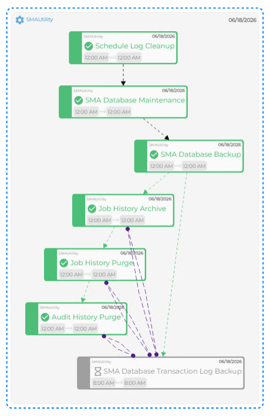

## PERT View Tips

- Use the **Refresh** button to update the PERT representation
- Use the **Auto-refresh** toggle switch to control auto-refreshing. When enabled, structural changes are detected and the view refreshes automatically
- Press **Ctrl** and scroll the mouse wheel to zoom in or out on the diagram
- A dashed royal blue border appears around nodes to indicate what was originally selected for visualization
- Tooltips are available for Status and Alert icons within nodes

Node colors reflect the underlying job status:

- Green - Finished OK
- Black - Cancelled
- Magenta - Skipped
- Orange - Missed Start Time
- Red - Failed
- Gray - Qualifying
- Turquoise - Held

Hovering over a node displays a tooltip showing job documentation and frequency. Only the first 80 characters of documentation are shown. If no documentation is available, the tooltip shows a dash (-).

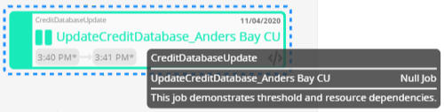

Container job nodes are styled differently from other nodes. When hovering over a Container job, the cursor changes to a hand to indicate drill-down capability. Use the breadcrumb at the top-left to navigate back to previous views.

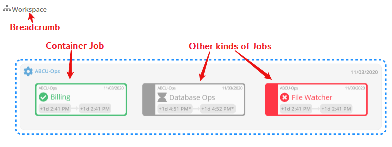

Enable the **Include Thresholds/Resources** switch () to display threshold and resource dependencies. Hovering over a dependency line shows the required value as a tooltip.

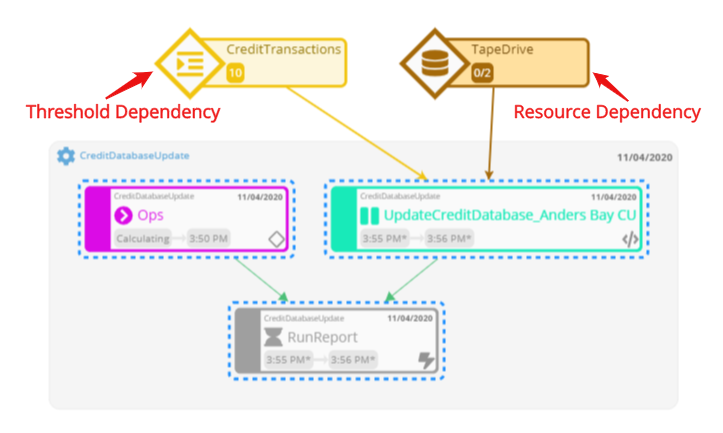

- Hovering over a resource dependency line shows the number of resources the job requires
- Hovering over a threshold dependency line shows the threshold value with one of these operators: equal (=), greater than (\>), less than (<), greater than or equal to (≥), less than or equal to (≤), not equal (≠)

Icons within nodes:

-  - Threshold/resource updates exist for underlying Daily jobs. Hover to see the associated update
-  - OpCon Events exist for underlying Daily jobs. Hover to see the associated event
-  - Expression dependencies exist for underlying Daily jobs. Hover to see the associated expression dependency
-  - A required dependency is missing. Hover to see the number of missing dependencies

For extremely complex diagrams with many jobs, nodes, or dependencies, the diagram renders with a simplified layout.

## PERT View Access

To access PERT View, complete the following steps:

1. Select the **Processes** button at the top-right of the **Operations Summary** page
2. Enable both the **Date** and **Schedule** toggle switches. Each switch shows a green checkmark when enabled

   

3. Select the desired **date(s)** to display the associated schedules
4. Select one or more **schedules** or **jobs** in the perspective list
5. Right-click on the selection to display the **Selection** panel
6. Select the **Diagram** accordion-style tab in the panel

   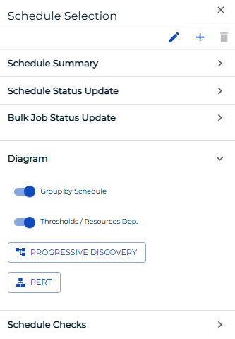

7. Enable the **Group by Schedule** switch () to organize the workflow by schedule. When disabled, jobs are integrated in the diagram

   - Enabling **Group by Schedule** also displays a **Schedule Status** indicator and tooltip near the schedule name to help you take appropriate actions

8. Select one of the following options:

   **PERT**: Displays individual jobs and job dependency relationships for a schedule.

   :::note
   The PERT action displays all jobs and dependencies for the selected schedule(s). The Dependency Chain, Predecessors, or Successors actions on jobs display only jobs related to the original selection.
   :::

   :::note
   When PERT is requested for a schedule, cross-schedule dependencies are also displayed. If **Group by Schedule** is enabled, only predecessor jobs from other schedules appear in the workflow.
   :::

   **Isolate Dependency Chain**: Displays the entire dependency chain, including preceding and subsequent jobs.

   **Isolate Predecessors**: Displays all preceding jobs in a dependent chain.

   **Isolate Successors**: Displays all subsequent jobs in a dependent chain.

   **Progressive Discovery**: Displays a focused view of dependency relationships for real-time impact analysis. It loads the current selection and shows direct (level 1) predecessor and successor jobs. Cloud shapes in the diagram indicate a job has additional predecessor/successor trees. Select a cloud shape to expand that level and continue discovering deeper levels. Cross-schedule dependencies are also shown.

   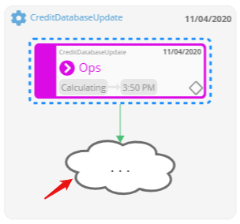

   - In Progressive Discovery mode, right-clicking a threshold dependency line opens the **Selection** panel. From there, look up and add dependent jobs (jobs that depend on the threshold) or update jobs (jobs that update the threshold). Results can be sorted by name, date, or schedule path. Select the left arrow next to a job, or select the job, to add it to the diagram. Jobs already in the diagram appear grayed out and cannot be selected
   - In Progressive Discovery mode, right-clicking a resource dependency line opens the **Selection** panel. From there, add dependent jobs or update jobs. Dependent jobs can also be filtered to show only jobs currently using the resource or all jobs dependent on it. Select the left arrow or the job to add it to the diagram. Jobs already in the diagram appear grayed out and cannot be selected

9. Select the **Export** button to save the current view as a PNG file

   :::note
   To export the entire PERT representation, use the zoom options to ensure all content is on screen before exporting.
   :::

## PERT View Dependency Lines

In PERT View, each dependency type uses a different line style and endpoint indicator.

|||
|--- |--- |
||Requires Failed: A solid red line with arrow. The selected job (arrow end) requires the dependent job (line start) to fail before it will run. If the dependent job is not in the Daily tables, the selected job will not run unless overridden.|
||Requires Finished OK: A solid green line with arrow. The selected job (arrow end) requires the dependent job (line start) to complete successfully before it will run. If the dependent job is not in the Daily tables, the selected job will not run unless overridden.|
||Requires Ignore Exit Code: A solid black line with arrow. The selected job (arrow end) runs when the dependent job (line start) completes, regardless of exit status. If the dependent job is not in the Daily tables, the selected job will not run unless overridden.|
||After Failed: A dashed red line with arrow. The selected job (arrow end) waits until the dependent job (line start) fails. If the dependent job is not in the Daily tables, the selected job runs without waiting.|
||After Finished OK: A dashed green line with arrow. The selected job (arrow end) waits until the dependent job (line start) completes successfully. If the dependent job is not in the Daily tables, the selected job runs without waiting.|
||After Ignore Exit Code: A dashed black line with arrow. The selected job (arrow end) waits until the dependent job (line start) completes, regardless of exit status. If the dependent job is not in the Daily tables, the selected job runs without waiting.|
||Excludes: A solid orange line with X. The job at the X end is excluded by the job where the line starts.|
||Conflict: A dashed purple line with a circle. The job at the circle end will not run if the job at the line start is running.|
||Resource Dependency: A solid gold line with arrow. The job at the arrow end requires the resource where the line starts.|
||Threshold Dependency: A solid brown line with arrow. The job at the arrow end has a dependency on the threshold where the line starts.|

## PERT View Search

The Search bar in the top-left corner lets you search for jobs in the PERT View. Enter any keyword or pattern; results appear below the search bar with matching terms highlighted. Select any result to navigate directly to that job in the diagram.

:::note
Wildcards are supported. Use an asterisk (\*) for any characters and a question mark (?) for a single character substitution.
:::

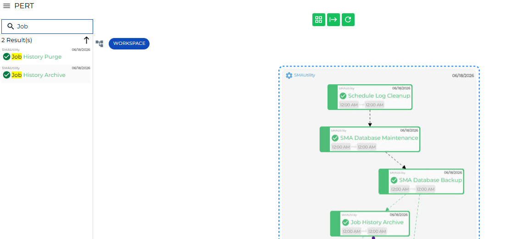

## PERT View Job Status Updates

Job status updates can be performed within PERT View. Select a single job or press **Ctrl** and select multiple jobs. A solid royal blue border appears around selected jobs.

Right-click to display the **Selection** panel with the **Job Status Update** tab in focus. Follow Steps 6–9 of the [Performing Job Status Changes](Performing-Job-Status-Changes.md) topic to change the status of the selected jobs.

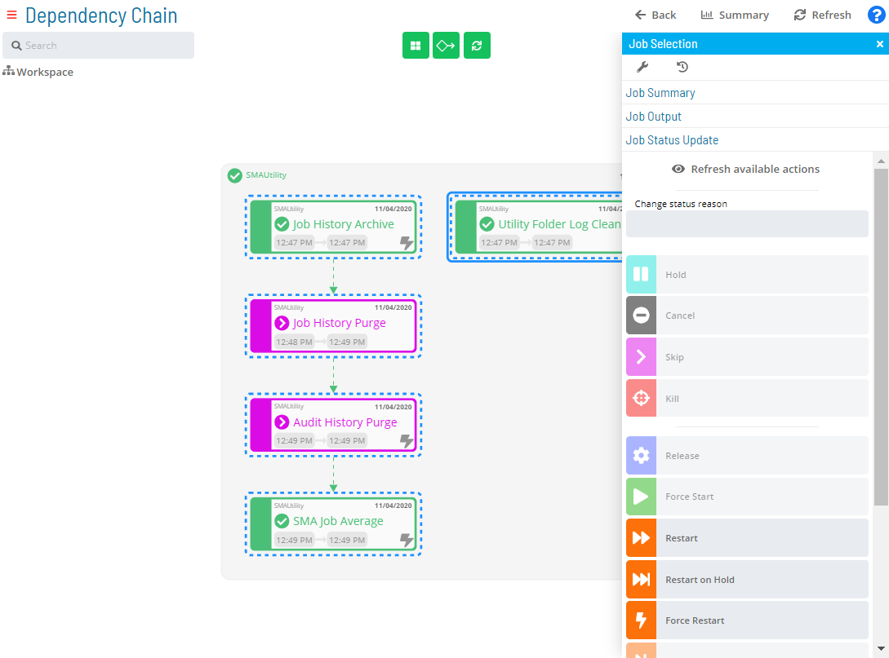

## PERT View Job Output Requests

Job output files can be retrieved in PERT View for a job that is completed or has started, is neither a NULL nor Container job, and does not have a status of Waiting, On Hold, Cancelled, Missed Start Time, or Skipped.

Select a single job in the diagram, then right-click to display the **Selection** panel. Select the **Job Output** accordion-style tab, then follow Steps 5–9 of the [Viewing Job Output](Viewing-Job-Output.md) topic.

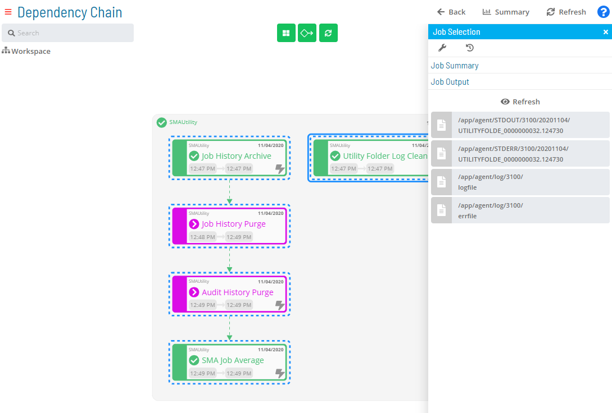

## PERT View Job Summary Access

The Daily job summary can be viewed in PERT View. Select a single job, then right-click to display the **Selection** panel. Select the **Job Summary** accordion-style tab. For details on job summary fields and options, refer to the [Accessing Job Summary](Accessing-Job-Summary.md) topic.

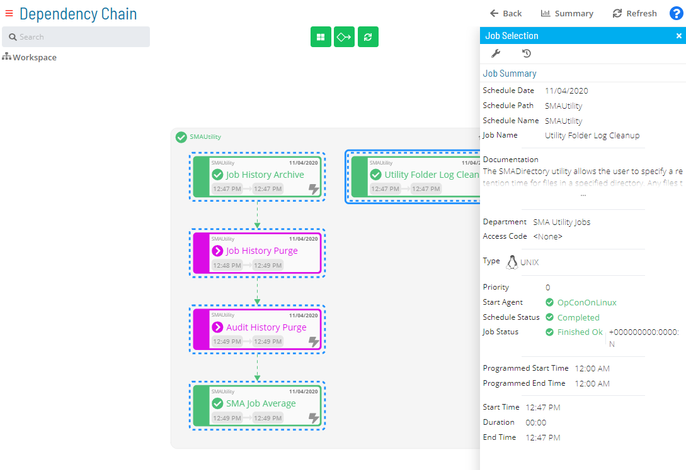

## PERT View Daily Job Definition Access

Job configuration can be accessed in PERT View. Select a single job, then right-click to display the **Selection** panel. Select the **Daily Job Definition** button at the top-left of the panel. For details on reconfiguring job properties, refer to the [Accessing Daily Job Definition](Accessing-Daily-Job-Definition.md) topic.

## PERT View Job Executions History Access

Job executions history can be accessed in PERT View. Select a single job, then right-click to display the **Selection** panel. Select the **Job Executions History** button at the top-left of the panel. Refer to the [Accessing Job Executions History](Accessing-Job-Executions-History.md) topic for details on the available options.

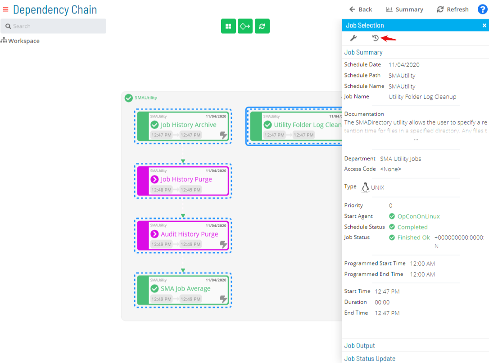

## PERT View Schedule Status Updates

Schedule status updates can be performed within PERT View. Select a single schedule or press **Ctrl** and select multiple schedules. A solid royal blue border appears around selected schedules.

Right-click to display the **Selection** panel with the **Schedule Status Update** tab in focus. Follow Steps 6–9 of the [Performing Schedule Status Changes](Performing-Schedule-Status-Changes.md) topic to change the status of the selected schedules.

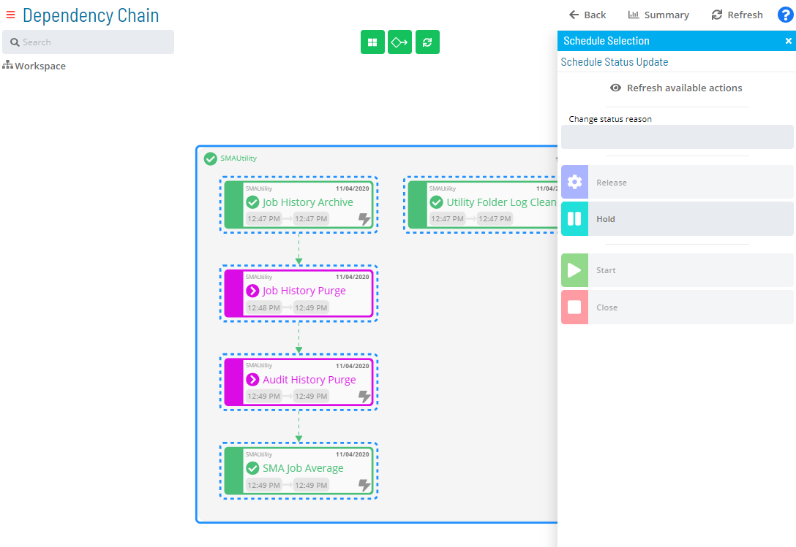

## PERT View Bulk Job Status Updates (Schedule Level)

Bulk job status updates at the schedule level can be performed within PERT View. Select a single schedule or press **Ctrl** and select multiple schedules. A solid royal blue border appears around selected schedules.

Right-click to display the **Selection** panel, then select the **Bulk Job Status Update** accordion-style tab. Follow Steps 6–9 of the [Performing Bulk Job Status Updates (Schedule Level)](Performing-Bulk-Job-Status-Updates-Schedule-Level.md) topic.

inPERT.png "Bulk Job Status Update (Schedule Level) in PERT View")

.png "More Info icon") Related Topics

- [Performing Schedule Status Changes](Performing-Schedule-Status-Changes.md)
- [Performing Job Status Changes](Performing-Job-Status-Changes.md)
- [Performing Bulk Status Job Updates (Schedule Level)](Performing-Bulk-Job-Status-Updates-Schedule-Level.md)
- [Performing Agent Status Updates](Performing-Agent-Status-Updates.md)
- [Viewing Job Output](Viewing-Job-Output.md)
- [Viewing Job Configuration](Viewing-Job-Configuration.md)
- [Accessing Job Summary](Accessing-Job-Summary.md)
- [Accessing Daily Job Definition](Accessing-Daily-Job-Definition.md)
- [Accessing Job Executions History](Accessing-Job-Executions-History.md)
- [Managing Daily Processes](Managing-Daily-Processes.md)

## Configuration Options

| Setting | What It Does | Default | Notes |
|---|---|---|---|
## FAQs

**Q: What can you do with PERT View?**

PERT View allows you to pert view tips, pert view access, pert view dependency lines.

**Q: Who has access to PERT View?**

Access to PERT View is controlled by the privileges assigned to your OpCon role. Contact your system administrator if you need access.

## Glossary

**Solution Manager**: OpCon's browser-based graphical user interface for managing automation data, performing operational actions, and administering the system.

**Container Job**: A job type that runs a subschedule. Container jobs enable hierarchical schedule structures and support properties and events just like standard jobs.

**Daily Tables**: The OpCon database tables that hold the active, date-specific instances of schedules and jobs built for execution. Changes to daily tables affect only the current day's automation.

**Frequency**: A set of rules that defines when a job or schedule is eligible to run, based on calendar rules, day-of-week settings, period offsets, and other timing criteria.

**Threshold**: A numeric variable stored in the OpCon database used to control job execution. Jobs can be made dependent on threshold values, and OpCon events can update threshold values at runtime.

**OpCon Event**: A command sent to OpCon that triggers an automated action, such as adding a job to a schedule, updating a property value, sending a notification, or changing a job or schedule status.

**Resource**: A numeric variable in OpCon representing a finite pool. Jobs can be configured to require a set number of resource units to run, limiting concurrent executions and preventing resource contention.

**Role**: A named security profile in OpCon that groups privileges together. Roles are assigned to user accounts to control which features, schedules, jobs, machines, and administrative functions a user can access.
