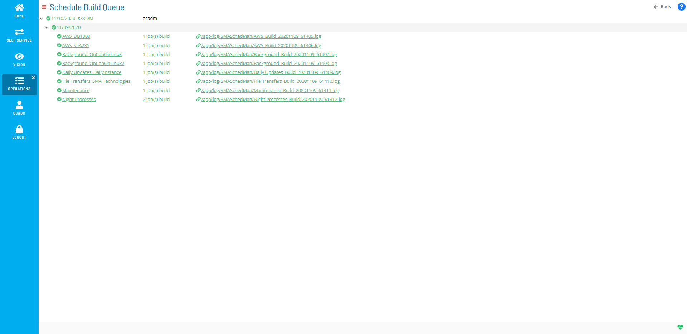

# Using Schedule Build Queue

**Theme:** Configure  
**Who Is It For?** System Administrator, Automation Engineer

## What Is It?

The **Schedule Build Queue** page displays all schedules that are building or have completed building.

Selecting the .log path following the link icon () displays the build log.

.png "More Info icon")
Related Topics

- [Managing Schedules](Managing-Schedules.md)

## When Would You Use It?

- The **Schedule Build Queue** page displays all schedules that are building or have completed building

## Why Would You Use It?

- **Using Schedule**: The **Schedule Build Queue** page displays all schedules that are building or have completed building

## Configuration Options

| Setting | What It Does | Default | Notes |
|---|---|---|---|
## FAQs

**Q: What can you do with Schedule Build Queue?**

Schedule Build Queue allows you to manage and configure related settings.

**Q: Who has access to Schedule Build Queue?**

Access to Schedule Build Queue is controlled by the privileges assigned to your OpCon role. Contact your system administrator if you need access.

## Glossary

**Resource**: A numeric variable in OpCon representing a finite pool. Jobs can be configured to require a set number of resource units to run, limiting concurrent executions and preventing resource contention.

**Role**: A named security profile in OpCon that groups privileges together. Roles are assigned to user accounts to control which features, schedules, jobs, machines, and administrative functions a user can access.

**Privilege**: A specific permission granted through an OpCon role that controls access to a feature, function, or object type. Privileges are organized into categories such as Function Privileges, Machine Privileges, Schedule Privileges, and Access Codes.

**Schedule**: A named container for jobs in OpCon, built for a specific date to create that day's automation. Schedules define build settings, frequencies, and the jobs that run within them.

**OpCon**: Continuous' workflow automation platform. The OpCon server includes the database, SAM and Supporting Services (SAM-SS), and graphical user interfaces. agents installed on target platforms run jobs and report results.
