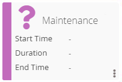

# Viewing Cards in Vision Live

Cards are displayed on the Vision Live page and you can use the filter
bar to view cards for certain days.

## Card Views

To identify whether a card is a group or tag card, group cards will have
the top-right corner of the card folded while tag cards do not have a
folded corner.

Tag cards defined to a remote instance will display the badge icon on
the right-hand side of the card. For more information on the badge icon,
refer to [Vision Card Colors](#Vision) in the **Solution
Manager** online help.

Cards have two views: a summary of time information on the front (shown
in the image on the left below) and a summary of job statuses on the
back (shown in the image on the right below).

The front of a card displays the following fields:

- The **Start Time** indicates the earliest start time for any jobs
    matching the tag pattern defined for the card (or the child cards).
    When a card has a Frequency SLA defined, a triangular icon will
    appear next to the Start Time. For more information on the SLA icon,
    refer to [Vision Card Colors](#Vision) in the
    **Solution Manager** online help.
- The **Duration** indicates the duration of all jobs matching the tag
    pattern defined for the card (or the child cards).
- The **End Time** indicates the end time for any jobs matching the
    tag pattern defined for the card (or the child cards). When a card
    has a Frequency SLA defined, a triangular icon will appear next to
    the End Time. For more information on the SLA icon, refer to [Vision     Card Colors](#Vision) in the **Solution
    Manager** online help.

The back of a card displays the following fields:

**Waiting** indicates the total number of jobs in the following possible
statuses:

- Job to be Skipped
- Late to Start
- On Hold
- Prerun Failed
- Qualifying
- Released
- Wait Expression Dependency
- Wait Job Conflict
- Wait Job Dependency
- Wait Machine
- Wait Start Time
- Wait Threshold/Resource Dependency
- Wait to Start
- Wait to Start; Forced

**Running** indicates the total number of jobs in the following possible
statuses:

- Attempt to Start
- Job Running
- Job Running; To be Terminated
- Prerun Active
- Start Attempted
- Still Attempting Start

**Finished** indicates the total number of jobs in the following
possible statuses:

- Finished OK
- Fixed
- Marked Finished OK

**Warning** indicates the total number of jobs in the following possible
statuses:

- Cancelled
- Missed Start Time
- Skipped

**Error** indicates the total number of jobs in the following possible
statuses:

- Failed
- Initialization Error
- Marked Failed
- Under Review

:::tip Example
To further explain the back view of a card, each tag card has a count of the jobs in various statuses, and each group card has the sum of the count for each job status for its child cards.

An example scenario:

- **Card1**: 7 Waiting, 11 Running, 8 Finished, 2 Error
- **Card2**: 5 Waiting, 10 Running, 3 Finished, 2 Error
- **Card3**: 2 Waiting, 1 Running, 5 Finished, 0 Failed

Card2 and Card3 are tag cards that have a count of jobs they are tracking. Card1 is a group cards and gets its count by simply adding the counts of its children.

Now, if Card2 has a Pattern of "tag1" and Card3 has a Pattern of "tag2", and if there is a job that has Finished OK and has two tags associated with it ("tag1" and "tag2"), this job will get counted once for Card2 and once for Card3. But, since Card1 has a sum of counts for Card2 and Card3, that same job gets counted twice for Card1.

So, while Card1 shows 8 Finished, there are only 7 jobs that actually Finished.
:::

## Card Hierarchy

On the Vision Live page, clicking on a group card will display the child
card(s) on a new page. You can navigate through the hierarchy of group
cards by clicking the name links in the breadcrumb trail.

:::note
The Edit button will only be visible to users in Admin mode.
:::

Clicking the Edit button next to the breadcrumb trail will display the
card hierarchy and take you to the Vision Settings page.

If editing from the current branch in the hierarchy (e.g., Background in
the image above), changes will apply only to that branch.

Clicking on the Edit button from the Vision Home page will provide a
view of the entire card hierarchy. Any edits made at this level will be
made to the entire tree.

:::note
You must have the appropriate privileges to view Vision Settings. For more information, refer to [Working in Admin Mode](Working-in-Admin-Mode_Vision.md) in the **Solution Manager** online help.
:::

## Card Links

Clicking on a tag card defined to the current instance will display the
Daily Processes page in the Operations module. For more information on
the Daily Processes page, refer to [Managing Daily Processes](Managing-Daily-Processes.md) in the
**Solution Manager** online help.

Clicking on a tag card defined to a remote instance will open a separate
Solution Manager page that corresponds to the Solution Manager URL and
additional settings defined for that remote instance. The new Solution
Manager will display the Daily Processes page for the remote instance.
For more information on Vision remote instances, refer to [Managing Vision Remote
Instances](Managing-Vision-Remote-Instances.md) in
the **Solution Manager** online help.

## Vision Card Colors

The Vision module categorizes cards on the Vision Live and sub-pages
using icons and colors that dynamically change based on the status of
the job(s) the card monitors.

Vision cards use the following icon and color combinations:

|||
|---|---|
|  | **Finished OK**: A white check mark icon on a green background indicates all jobs have completed with a *Finished OK* or *Marked Finished OK* job status. |
| .png "Vision Card Finished with Error(s)") | **Finished with Error(s)**: A white X icon on a red background indicates that all jobs have completed and at least one job has completed with a *Failed*, *Initiailization Error* or *Marked Failed* job status. |
| .png "Vision  Card Finished with Warning(s)") | **Finished with Warning(s)**: A white exclamation point icon on an orange background indicates that all jobs have completed and at least one job has completed with a *Missed Start Time*, *Skipped*, or *Cancelled* job status. |
|  | **In Process**: A blue gear icon on a white background indicates that at least one job is in an *Attempt to Start*, *Job Running*, *Job Running; To be Terminated*, *Prerun Active*, *Start Attempted*, or *Still Attempting Start* job status and no jobs are in a failed or warning status. |
| .png "Vision Card In Process with Error(s)") | **In Process**: A red gear icon on a white background indicates that at least one job is in an *Attempt to Start*, *Job Running*, *Job Running; To be Terminated*, *Prerun Active*, *Start Attempted*, or *Still Attempting Start* job status and another job is in a *Failed*, *Initialization Error*, or *Marked Failed* job status. |
| .png "Vision Card In Process with Warning(s)") | **In Process**: An orange gear icon on a white background indicates that one or more underlying jobs is in process in an *Attempt to Start*, *Job Running*, *Job Running; To be Terminated*, *Prerun Active*, *Start Attempted*, or *Still Attempting Start* job status and at least one job is in a warning category state in a *Missed Start Time*, *Skipped*, or *Cancelled* job status. |
|  | **Waiting**: A gray hourglass icon on a white background indicates all jobs are in waiting category states with a *Job to be Skipped*, *Late to Start*, *On Hold*, *Prerun Failed*, *Qualifying*, *Released*, *Wait Expression Dependency*, *Wait Job Conflict*, *Wait Job Dependency*, *Wait Machine*, *Wait Start Time*, *Wait Threshold/Resource Dependency*, *Wait to Start*, or *Wait to Start; Forced* job status. |
|  | **None**: A purple question mark icon on a white background indicates the job(s) have not been found for the specified day. |
|  | **Computing**: A spinning purple line icon on a white background indicates the status of the card is currently being calculated. This is a temporary status that gets replaced at the next processing interval. |
|  | A white unlocked padlock icon on a gray background indicates the card does not match the Vision Frequency. This card only appears in Admin mode. |

|||
|---|---|
|  | **Badge**: The badge icon indicates the card is defined to a remote instance. For more information on the badge field, refer to [Managing Vision Remote Instances](Managing-Vision-Remote-Instances.md). |
|  | **SLA**: The gray SLA icon indicates there is a problem with a child of the group. |
|  | **SLA**: The orange SLA icon indicates there is a problem with a group (or a tag if on a tag card). |
|  | **Edit**: The blue edit button allows you to edit a card. |
|  | **Delete**: The red delete button allows you to delete a card. |
