# Viewing Cards in Vision Live

**Theme:** Configure  
**Who Is It For?** System Administrator, Automation Engineer

## What Is It?

Cards are displayed on the Vision Live page. Use the filter bar to view cards for certain days.

## When Would You Use It?

- You need to inspect or audit Cards in Vision Live records in Solution Manager
- An audit, compliance review, or operational check requires inspection of current Cards in Vision Live state

## Why Would You Use It?

- **Improve operational visibility**: Inspecting Cards in Vision Live records in Solution Manager supports informed decision-making and provides an audit trail for compliance reviews
- Information in Solution Manager reflects the live database state, ensuring that the data reviewed is current at the time of inspection

## Card Views

Group cards have the top-right corner folded; tag cards do not.

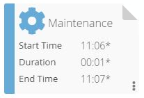

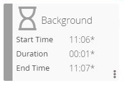

Tag cards defined to a remote instance display the badge icon on the right-hand side. For more on the badge icon, refer to [Vision Card Colors](#Vision) in the **Solution Manager** online help.

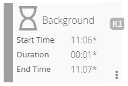

Cards have two views: a summary of time information on the front and a summary of job statuses on the back.

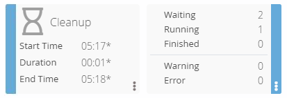

The front of a card displays:

- **Start Time**: The earliest start time for any jobs matching the tag pattern defined for the card (or child cards). When a Frequency SLA is defined, a triangular icon appears next to the Start Time. For more on the SLA icon, refer to [Vision Card Colors](#Vision) in the **Solution Manager** online help
- **Duration**: The duration of all jobs matching the tag pattern defined for the card (or child cards)
- **End Time**: The end time for any jobs matching the tag pattern defined for the card (or child cards). When a Frequency SLA is defined, a triangular icon appears next to the End Time. For more on the SLA icon, refer to [Vision Card Colors](#Vision) in the **Solution Manager** online help

The back of a card displays:

**Waiting** — total jobs in:

- Job to be Skipped
- Late to Start
- On Hold
- Prerun Failed
- Qualifying
- Released
- Wait Expression Dependency
- Wait Job Conflict
- Wait Job Dependency
- Wait Machine
- Wait Start Time
- Wait Threshold/Resource Dependency
- Wait to Start
- Wait to Start; Forced

**Running** — total jobs in:

- Attempt to Start
- Job Running
- Job Running; To be Terminated
- Prerun Active
- Start Attempted
- Still Attempting Start

**Finished** — total jobs in:

- Finished OK
- Fixed
- Marked Finished OK

**Warning** — total jobs in:

- Cancelled
- Missed Start Time
- Skipped

**Error** — total jobs in:

- Failed
- Initialization Error
- Marked Failed
- Under Review

:::tip Example
Each tag card shows a count of jobs in various statuses. Each group card shows the sum of counts from its child cards.

Example scenario:

- **Card1**: 7 Waiting, 11 Running, 8 Finished, 2 Error
- **Card2**: 5 Waiting, 10 Running, 3 Finished, 2 Error
- **Card3**: 2 Waiting, 1 Running, 5 Finished, 0 Failed

Card2 and Card3 are tag cards. Card1 is a group card whose counts are the sum of its children.

If Card2 has Pattern "tag1" and Card3 has Pattern "tag2", a job tagged with both "tag1" and "tag2" is counted once for Card2 and once for Card3. Card1 counts it twice. So Card1 shows 8 Finished, but only 7 jobs actually finished.
:::

## Card Hierarchy

On the Vision Live page, selecting a group card displays its child cards on a new page. Navigate the hierarchy using the name links in the breadcrumb trail.

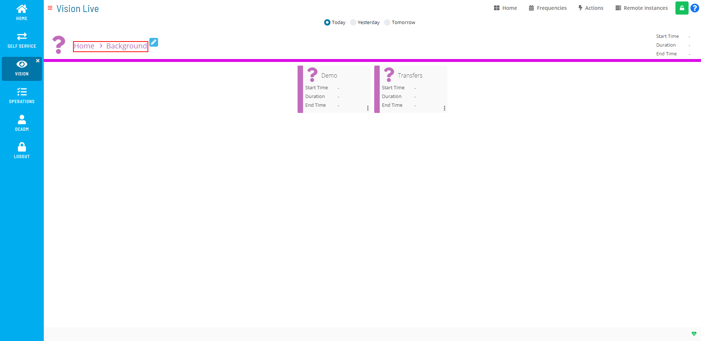

:::note
The Edit button is only visible to users in Admin mode.
:::

Selecting the Edit button next to the breadcrumb trail displays the card hierarchy and opens the Vision Settings page. Edits made from a specific branch apply only to that branch. Selecting Edit from the Vision Home page gives a view of the entire hierarchy; edits apply to the entire tree.

:::note
You must have the appropriate privileges to view Vision Settings. For more information, refer to [Working in Admin Mode](Working-in-Admin-Mode_Vision.md) in the **Solution Manager** online help.
:::

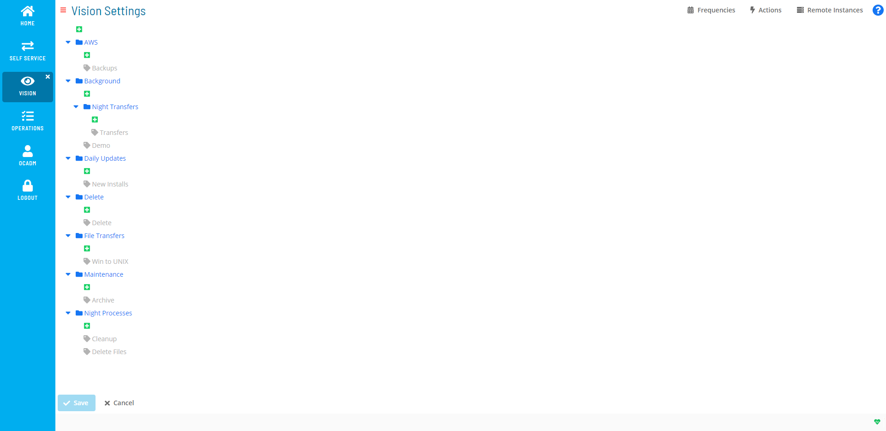

## Card Links

Selecting a tag card defined to the current instance displays the Daily Processes page in the Operations module. For more information, refer to [Managing Daily Processes](Managing-Daily-Processes.md) in the **Solution Manager** online help.

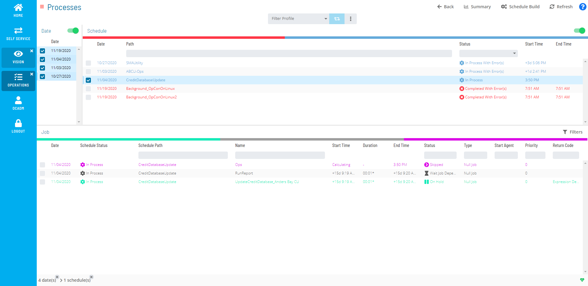

Selecting a tag card defined to a remote instance opens a separate Solution Manager page using the URL and settings defined for that remote instance, displaying the Daily Processes page for the remote instance. For more on Vision remote instances, refer to [Managing Vision Remote Instances](Managing-Vision-Remote-Instances.md) in the **Solution Manager** online help.

## Vision Card Colors

The Vision module uses icons and colors that dynamically change based on job status.

|||
|---|---|
| 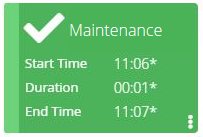 | **Finished OK**: A white check mark icon on a green background indicates all jobs completed with a *Finished OK* or *Marked Finished OK* status. |
| .png "Vision Card Finished with Error(s)") | **Finished with Error(s)**: A white X icon on a red background indicates all jobs completed and at least one has a *Failed*, *Initialization Error*, or *Marked Failed* status. |
| .png "Vision  Card Finished with Warning(s)") | **Finished with Warning(s)**: A white exclamation point icon on an orange background indicates all jobs completed and at least one has a *Missed Start Time*, *Skipped*, or *Cancelled* status. |
| 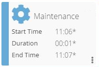 | **In Process**: A blue gear icon on a white background indicates at least one job is in *Attempt to Start*, *Job Running*, *Job Running; To be Terminated*, *Prerun Active*, *Start Attempted*, or *Still Attempting Start* status, with no jobs in a failed or warning status. |
| .png "Vision Card In Process with Error(s)") | **In Process with Error(s)**: A red gear icon on a white background indicates at least one job is in process and another is in *Failed*, *Initialization Error*, or *Marked Failed* status. |
| .png "Vision Card In Process with Warning(s)") | **In Process with Warning(s)**: An orange gear icon on a white background indicates at least one job is in process and at least one is in *Missed Start Time*, *Skipped*, or *Cancelled* status. |
| 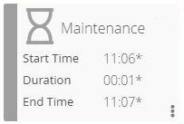 | **Waiting**: A gray hourglass icon on a white background indicates all jobs are in waiting states. |
| 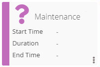 | **None**: A purple question mark icon on a white background indicates no jobs were found for the specified day. |
| 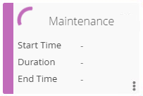 | **Computing**: A spinning purple line icon on a white background indicates the card status is being calculated. This is a temporary status replaced at the next processing interval. |
| 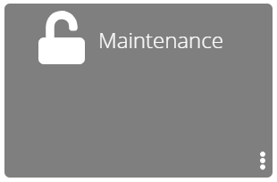 | A white unlocked padlock icon on a gray background indicates the card does not match the Vision Frequency. This card only appears in Admin mode. |

|||
|---|---|
|  | **Badge**: Indicates the card is defined to a remote instance. For more, refer to [Managing Vision Remote Instances](Managing-Vision-Remote-Instances.md). |
|  | **SLA**: The gray SLA icon indicates a problem with a child of the group. |
|  | **SLA**: The orange SLA icon indicates a problem with a group (or a tag on a tag card). |
|  | **Edit**: The blue edit button allows you to edit a card. |
|  | **Delete**: The red delete button allows you to delete a card. |

## Configuration Options

| Setting | What It Does | Default | Notes |
|---|---|---|---|
| Start Time | The earliest start time for any jobs matching the tag pattern defined for the card (or child cards). | — | — |
| Duration | The duration of all jobs matching the tag pattern defined for the card (or child cards) | — | — |
| End Time | The end time for any jobs matching the tag pattern defined for the card (or child cards). | — | — |
| Waiting | total jobs in: | — | — |
| Running | total jobs in: | — | — |
| Finished | total jobs in: | — | — |
| Error | total jobs in: | — | — |
| Card1 | 7 Waiting, 11 Running, 8 Finished, 2 Error | — | — |
| Card2 | 5 Waiting, 10 Running, 3 Finished, 2 Error | — | — |
| Card3 | 2 Waiting, 1 Running, 5 Finished, 0 Failed | — | — |

## FAQs

**Q: What does Viewing Cards in Vision Live cover?**

This page covers Card Views, Card Hierarchy, Card Links.

## Glossary

**Solution Manager**: OpCon's browser-based graphical user interface for managing automation data, performing operational actions, and administering the system.

**Frequency**: A set of rules that defines when a job or schedule is eligible to run, based on calendar rules, day-of-week settings, period offsets, and other timing criteria.

**Threshold**: A numeric variable stored in the OpCon database used to control job execution. Jobs can be made dependent on threshold values, and OpCon events can update threshold values at runtime.

**Resource**: A numeric variable in OpCon representing a finite pool. Jobs can be configured to require a set number of resource units to run, limiting concurrent executions and preventing resource contention.

**Privilege**: A specific permission granted through an OpCon role that controls access to a feature, function, or object type. Privileges are organized into categories such as Function Privileges, Machine Privileges, Schedule Privileges, and Access Codes.

**Machine**: A platform defined in the OpCon database that has an agent installed. OpCon routes job execution requests to machines via SMANetCom, and machines report job completion status back to SAM.

**Job**: The fundamental unit of work in OpCon. A job defines what to run, on which machine, when to start, and what conditions must be met. Job results are tracked and can trigger events and notifications.
