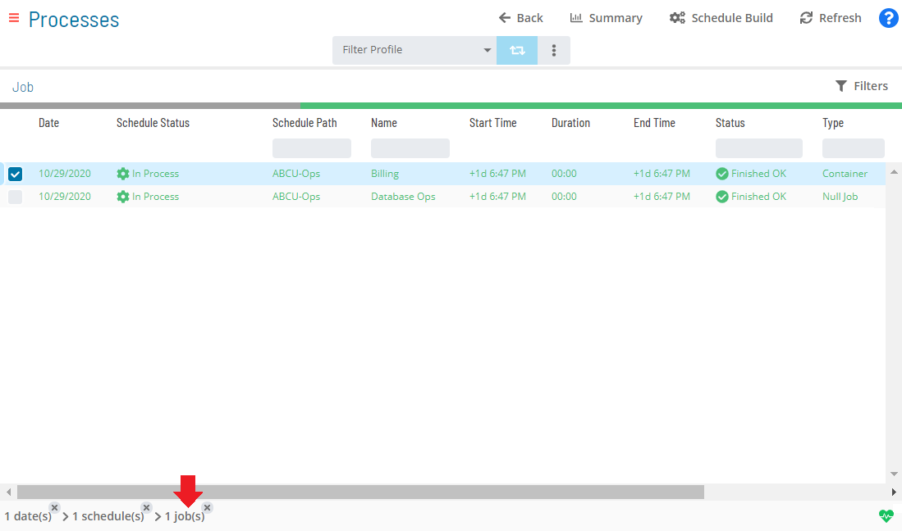

# Viewing Container Job Details

**Theme:** Configure  
**Who Is It For?** System Administrator, Automation Engineer

## What Is It?

Container job details can only be viewed in **Daily Job Definition**. For more conceptual information, refer to [Container Job Type](../../../job-types/container.md) in the **Concepts** online help.

To view job details, complete the following steps:

1. Select the **Processes** button at the top-right of the **Operations Summary** page

2. Enable both the **Date** and **Schedule** toggle switches. Each switch appears green when enabled

   

3. Select the desired **date(s)** to display the associated schedules

4. Select one or more **schedule(s)** in the list

5. Select one **Container job** in the list. Your selection appears in the [status bar](SM-UI-Layout.md#Status) at the bottom of the page as a breadcrumb trail

   

6. Select the job record (e.g., 1 job(s)) in the status bar to display the **Selection** panel

   :::note
   As an alternative, right-click the job in the list to display the **Selection** panel.
   :::

   .png "Job Summary Tab for Container Jobs")

7. Select the **Daily Job Definition** button  at the top-left of the panel. The page opens in **Read-only** mode by default

8. Expand the **Task Details** panel. The following read-only fields are displayed for Container jobs:

   - **Type**: The job type
   - **Master Sub-Schedule**: The Master subschedule name
   - **Sub-Schedule Name**: The Daily subschedule name
   - **Sub-Schedule Path**: The Daily subschedule path

   :::note
   If the schedule has not been granted privilege to run as a sub-schedule, the Task Details field values are hidden.
   :::

## When Would You Use It?

- You need to inspect or audit Container Job Details records in Solution Manager
- An audit, compliance review, or operational check requires inspection of current Container Job Details state

## Why Would You Use It?

- **Improve operational visibility**: Inspecting Container Job Details records in Solution Manager supports informed decision-making and provides an audit trail for compliance reviews
- Information in Solution Manager reflects the live database state, ensuring that the data reviewed is current at the time of inspection

## Configuration Options

| Setting | What It Does | Default | Notes |
|---|---|---|---|

## FAQs

**Q: How many steps does the Viewing Container Job Details procedure involve?**

The Viewing Container Job Details procedure involves 8 steps. Complete all steps in order and save your changes.

## Glossary

**Subschedule**: A schedule that runs as a child process within a Container job, allowing hierarchical, nested workflow automation where a parent schedule can trigger and monitor an entire child schedule.

**Container Job**: A job type that runs a subschedule. Container jobs enable hierarchical schedule structures and support properties and events just like standard jobs.

**Resource**: A numeric variable in OpCon representing a finite pool. Jobs can be configured to require a set number of resource units to run, limiting concurrent executions and preventing resource contention.

**Privilege**: A specific permission granted through an OpCon role that controls access to a feature, function, or object type. Privileges are organized into categories such as Function Privileges, Machine Privileges, Schedule Privileges, and Access Codes.

**Schedule**: A named container for jobs in OpCon, built for a specific date to create that day's automation. Schedules define build settings, frequencies, and the jobs that run within them.

**Job**: The fundamental unit of work in OpCon. A job defines what to run, on which machine, when to start, and what conditions must be met. Job results are tracked and can trigger events and notifications.
