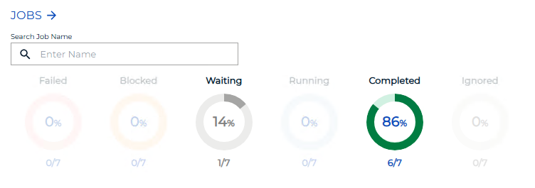
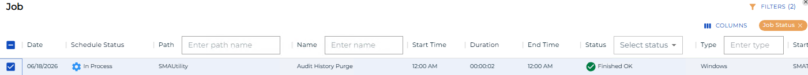
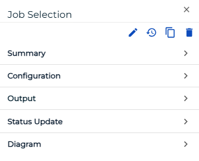
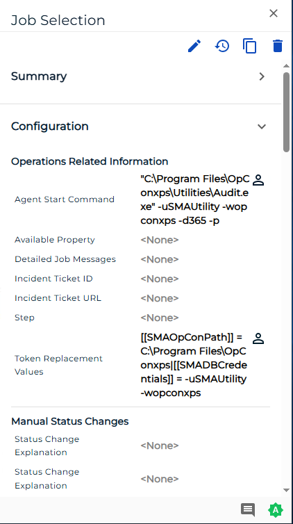

# Viewing Job Configuration

**Theme:** Configure  
**Who Is It For?** System Administrator, Automation Engineer

## What Is It?

The **Operations** module allows you to retrieve the configuration for a job if it:

- is completed or has started
- does not have a status of Waiting, On Hold, Cancelled, Missed Start Time, or Skipped

To view job configuration, complete the following steps:

1. Select the **Failed**, **Running**, or **Completed** operation dial, or use the **Quick Search** field (type the keyword and press **Enter**) in the **Jobs** section on the **Operations Summary** page

   

   The **Processes** page will display.

2. Select one **job** in the list. Your selection appears in the [status bar](SM-UI-Layout.md#Status) at the bottom of the page as a breadcrumb trail

   

3. Select the job record (e.g., 1 job(s)) in the status bar to display the **Selection** panel

   :::note
   As an alternative, right-click the job in the list to display the **Selection** panel.
   :::

4. Select the **Configuration** accordion-style tab in the panel

   

   The Configuration tab displays an overarching view of your daily job details, including operations details, manual status changes, job time details, retry and recurrence information, and additional information based on the job type. Fields without a value display \<None\>. User-defined fields display this icon: { width=25 }

   

5. Close the **Selection** panel when done

.png "More Info icon")
Related Topics

- [Performing Job Status Changes](Performing-Job-Status-Changes.md)
- [Performing Schedule Status Changes](Performing-Schedule-Status-Changes.md)
- [Performing Bulk Status Job Updates (Schedule Level)](Performing-Bulk-Job-Status-Updates-Schedule-Level.md)
- [Performing Agent Status Updates](Performing-Agent-Status-Updates.md)
- [Using PERT View](Using-PERT-View.md)
- [Managing Daily Processes](Managing-Daily-Processes.md)
- [Viewing Job Output](Viewing-Job-Output.md)

## When Would You Use It?

- You need to inspect or audit Job Configuration records in Solution Manager
- An audit, compliance review, or operational check requires inspection of current Job Configuration state

## Why Would You Use It?

- **Improve operational visibility**: Inspecting Job Configuration records in Solution Manager supports informed decision-making and provides an audit trail for compliance reviews
- Information in Solution Manager reflects the live database state, ensuring that the data reviewed is current at the time of inspection

## Configuration Options

| Setting | What It Does | Default | Notes |
|---|---|---|---|

## FAQs

**Q: How many steps does the Viewing Job Configuration procedure involve?**

The Viewing Job Configuration procedure involves 5 steps. Complete all steps in order and save your changes.

## Glossary

**Resource**: A numeric variable in OpCon representing a finite pool. Jobs can be configured to require a set number of resource units to run, limiting concurrent executions and preventing resource contention.

**Schedule**: A named container for jobs in OpCon, built for a specific date to create that day's automation. Schedules define build settings, frequencies, and the jobs that run within them.

**Job**: The fundamental unit of work in OpCon. A job defines what to run, on which machine, when to start, and what conditions must be met. Job results are tracked and can trigger events and notifications.
