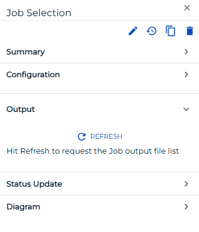
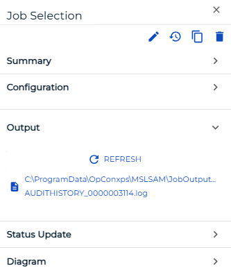

# Viewing Job Output

**Theme:** Configure  
**Who Is It For?** System Administrator, Automation Engineer

## What Is It?

The **Operations** module allows you to retrieve the output file(s) for a job if it:

- is completed or has started
- is not a NULL or Container job
- does not have a status of Waiting, On Hold, Cancelled, Missed Start Time, or Skipped

:::note
Before attempting to view a job's output file, first refer to [Viewing a Job Output File](../../../operations/job-output.md) in the **Concepts** online help.
:::

To view job output:

Select on the **Failed**, **Running**, or **Completed** operation dial or use the **Quick Search** field (type the keyword and select **Enter**) in the **Jobs** section on the **Operations Summary** page.

The **Processes** page will display.

Select one **job** in the list. A record of your selection will display in the [status bar](SM-UI-Layout.md#Status) at the bottom of the page in the form of a breadcrumb trail.

Select on the job record (e.g., 1 job(s)) in the status bar to display the **Selection** panel.

:::note
As an alternative, you can right-click on the job selected in the list to display the **Selection** panel.
:::

Select the **Job Output** accordion-style tab in the panel.

Select the **Refresh** button to fetch a list of existing or new job output files for the selected job. The button toggles to **Cancel**, which you can select at any time to stop the refresh.

:::note
The **Refresh** button will be disabled if no job output is available for the selected job.
:::

Select any **Job Output** button that appears after the refresh to view the output file.

The **Job Output** page displays. Select any of the following options:

- **Refresh/Cancel**: Refreshes the data in the output file or cancels the refresh
- **Export**: Saves the job output file locally to your machine

Select the **Close** button to return to the previous page. Close the **Selection** panel when done.

.png "More Info icon")
Related Topics

- [Performing Job Status Changes](Performing-Job-Status-Changes.md)
- [Performing Schedule Status Changes](Performing-Schedule-Status-Changes.md)
- [Performing Bulk Status Job Updates (Schedule Level)](Performing-Bulk-Job-Status-Updates-Schedule-Level.md)
- [Performing Agent Status Updates](Performing-Agent-Status-Updates.md)
- [Using PERT View](Using-PERT-View.md)
- [Managing Daily Processes](Managing-Daily-Processes.md)
- [Viewing Job Configuration](Viewing-Job-Configuration.md)

## Configuration Options

| Setting | What It Does | Default | Notes |
|---|---|---|---|
| Refresh/Cancel | Refreshes the data in the output file or cancels the refresh | — | — |

## FAQs

**Q: What information does the Job Output view display?**

The Job Output view displays the current state and details for the selected item. Use this view to monitor status and take action as needed.

## Glossary

**Container Job**: A job type that runs a subschedule. Container jobs enable hierarchical schedule structures and support properties and events just like standard jobs.

**Resource**: A numeric variable in OpCon representing a finite pool. Jobs can be configured to require a set number of resource units to run, limiting concurrent executions and preventing resource contention.

**Machine**: A platform defined in the OpCon database that has an agent installed. OpCon routes job execution requests to machines via SMANetCom, and machines report job completion status back to SAM.

**Schedule**: A named container for jobs in OpCon, built for a specific date to create that day's automation. Schedules define build settings, frequencies, and the jobs that run within them.

**Job**: The fundamental unit of work in OpCon. A job defines what to run, on which machine, when to start, and what conditions must be met. Job results are tracked and can trigger events and notifications.
