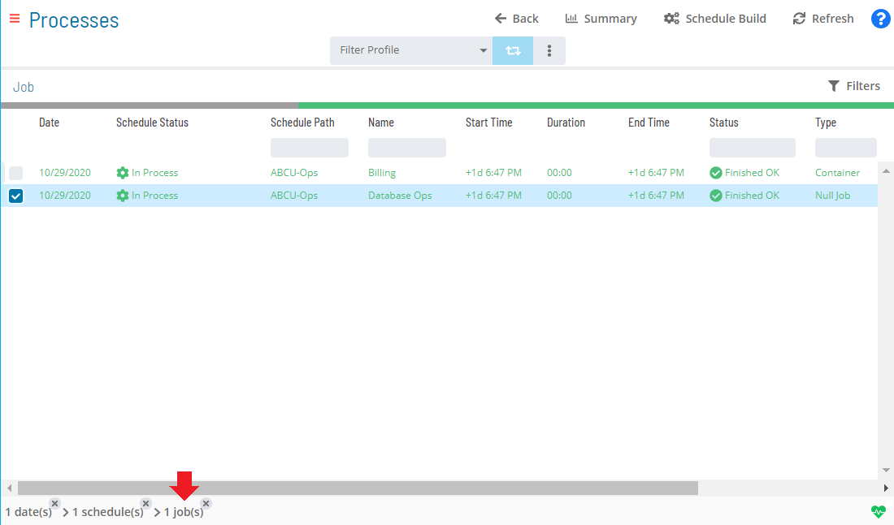

# Viewing Null Job Details

**Theme:** Configure  
**Who Is It For?** System Administrator, Automation Engineer

## What Is It?

Null job details are only viewable in **Daily Job Definition**. For more conceptual information, refer to [Null Job Details](../../../job-types/null.md) in the **Concepts** online help.

To view job details:

Select the **Processes** button at the top-right of the **Operations Summary** page. The **Processes** page will display.

Ensure that both the **Date** and **Schedule** toggle switches are enabled. Each switch will appear green when enabled.

Select the desired **date(s)** to display the associated schedule(s).

Select one or more **schedule(s)** in the list.

Select one **Null job** in the list. A record of your selection will display in the [status bar](SM-UI-Layout.md#Status) at the bottom of the page in the form of a breadcrumb trail.

Select on the job record (e.g., 1 job(s)) in the status bar to display the **Selection** panel.

:::note
As an alternative, you can right-click on the job selected in the list to display the **Selection** panel.
:::

.png "Job Summary Tab for Null Jobs")

Select the **Daily Job Definition** button  at the top-left corner of the panel. By default, this page opens in **Read-only** mode.

Expand the **Task Details** panel to view its content. For Null jobs, the following read-only detail is displayed:

- **Type**: The job type

## When Would You Use It?

- You need to inspect or audit Null Job Details records in Solution Manager
- An audit, compliance review, or operational check requires inspection of current Null Job Details state

## Why Would You Use It?

- **Improve operational visibility**: Inspecting Null Job Details records in Solution Manager supports informed decision-making and provides an audit trail for compliance reviews
- Information in Solution Manager reflects the live database state, ensuring that the data reviewed is current at the time of inspection

## Configuration Options

| Setting | What It Does | Default | Notes |
|---|---|---|---|
| Type | The job type | — | — |

## FAQs

**Q: What information does the Null Job Details view display?**

The Null Job Details view displays the current state and details for the selected item. Use this view to monitor status and take action as needed.

## Glossary

**Null Job**: A job type that performs no execution on any platform. Null jobs are used to hold dependencies, trigger OpCon events, and keep schedules open after all other jobs complete.

**Resource**: A numeric variable in OpCon representing a finite pool. Jobs can be configured to require a set number of resource units to run, limiting concurrent executions and preventing resource contention.

**Schedule**: A named container for jobs in OpCon, built for a specific date to create that day's automation. Schedules define build settings, frequencies, and the jobs that run within them.

**Job**: The fundamental unit of work in OpCon. A job defines what to run, on which machine, when to start, and what conditions must be met. Job results are tracked and can trigger events and notifications.
