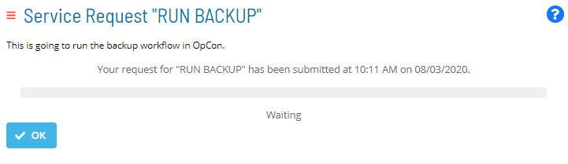
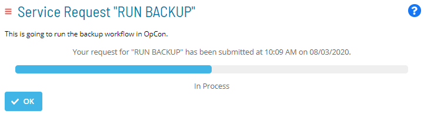
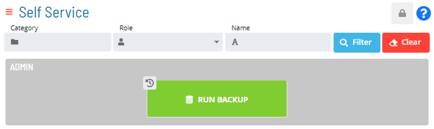
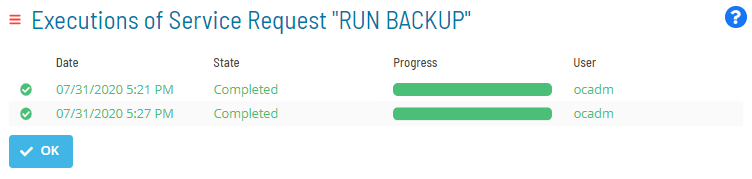

# Viewing Service Request Process Indicators

**Theme:** Configure  
**Who Is It For?** System Administrator, Automation Engineer

## What Is It?

When you submit a Service Request and form validation succeeds, a page displays the execution status via a progress bar. Select the **OK** button to exit the page.

### Service Request Execution Status Pages

Once a Service Request is run, an **Execution** indicator appears at the top-left corner of the Service Request button.

### Execution Indicator on Service Request Button

* The **Execution** indicator displayed as  indicates the number of concurrent Service Request executions still in process
* The **Execution** indicator displayed as  indicates that the Service Request has a previous execution history record

Select the **Execution** indicator to access the history record of any processing or processed instances. This history is a sortable table that displays:

* The date on which the Service Request was triggered
* The current state and progress of the Service Request
* The user who triggered the Service Request

### Service Request Execution History Record

:::

## When Would You Use It?

- You need to inspect or audit Service Request Process Indicators records in Solution Manager
- An audit, compliance review, or operational check requires inspection of current Service Request Process Indicators state

## Why Would You Use It?

- **Improve operational visibility**: Inspecting Service Request Process Indicators records in Solution Manager supports informed decision-making and provides an audit trail for compliance reviews
- Information in Solution Manager reflects the live database state, ensuring that the data reviewed is current at the time of inspection

## FAQs

**Q: What information does the Service Request Process Indicators view display?**

The Service Request Process Indicators view displays the current state and details for the selected item. Use this view to monitor status and take action as needed.

## Glossary

**Service Request**: A Solution Manager feature that lets operators trigger predefined automation workflows using a simple form. Service Requests encapsulate schedule builds, job submissions, or events without requiring direct access to schedule definitions.

**Resource**: A numeric variable in OpCon representing a finite pool. Jobs can be configured to require a set number of resource units to run, limiting concurrent executions and preventing resource contention.
