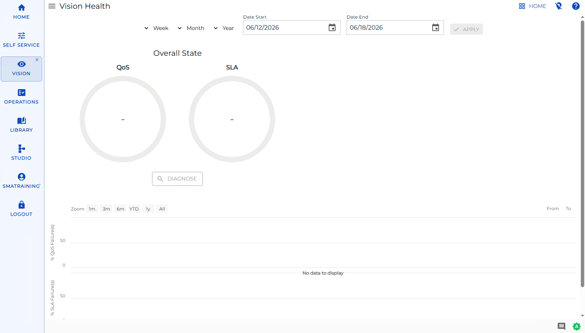
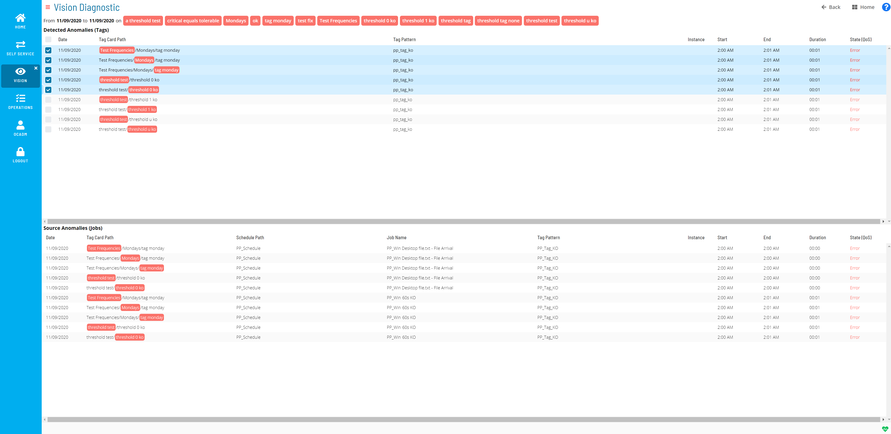

# Viewing Vision Health

**Theme:** Configure  
**Who Is It For?** System Administrator, Automation Engineer

## What Is It?

Vision Health provides a dashboard of historical data for completed Vision cards and a high-level view of data from the Operations module. For more information, refer to [Working with Operations](Working-with-Operations.md) in the **Solution Manager** online help.

Vision Health Page

The health summary includes quantitative performance data for completed cards and their associated jobs. Two views are available: QoS (Quality of Service) and SLA (Service Level Agreement), displaying summary rates for a selected Vision card over a selected period.

An administrator can set critical and tolerable threshold levels on cards for both QoS and SLA. For more information, refer to [Managing Vision Settings](Managing-Vision-Settings.md#Thresholds) in the **Solution Manager** online help.

- **Overall State/Partial State**: Summarizes operational health based on selected cards and their QoS and SLA over a selected period. By default, all cards are selected
  - **QoS**: Percentage of times jobs completed successfully. Defaults to an average across all cards
  - **SLA**: Percentage of times jobs completed within defined SLAs. Defaults to an average across all cards
  - **Diagnose**: Navigates to the [Vision Diagnostic](#Vision) page for additional anomaly details
- **Week**: Filters data by week
  - **Last**: Previous Monday through Sunday
  - **Sliding**: Last seven days, including today
- **Month**: Filters data by month
  - **Last**: The last named calendar month
  - **Sliding**: Last 28-31 days, including today
- **Year**: Filters data by year
  - **Last**: The full year prior to the current year
  - **Sliding**: Last 365 or 366 days, including today
- **Calendar**: Defines a custom date range via the calendar tool, manual entry, or a Week/Month/Year option
- **Apply**: Applies manually-defined dates
- **Zoom**: Zooms the data to a selected range: **1m**, **3m**, **6m**, **YTD**, **1y**, or **All**
- **From**: Starting date for the % QoS Failure(s) and % SLA Failure(s) frames
- **To**: Ending date for the % QoS Failure(s) and % SLA Failure(s) frames
- **% QoS Failure(s)**: Percentage of QoS failures for the specified date range
- **% SLA Failure(s)**: Percentage of SLA failures for the specified date range

## Vision Diagnostic

The Vision Diagnostic page identifies the root cause(s) of health anomalies. It uses the date range from the Vision Health page combined with the cards selected in the Detected Anomalies (Tags) section to find what caused a low QoS percentage or an SLA failure.

Vision Diagnostic Page

- **From \[Date\] to \[Date\] on \[Tag\]**: The date range from the Vision Health page for the listed card pattern (tag)

- **Detected Anomalies (Tags)**: Tag-related data for detected anomalies

  - **Date**: Date the anomaly was detected
  - **Tag Card Path**: The card path
  - **Tag Pattern**: The pattern (tag) defined for the card
  - **Instance**: The remote instance (if any) defined for the card
  - **Start**: Start time for the card
  - **End**: End time for the card
  - **Duration**: How long the card ran
  - **State (QoS)**: The state of the card

- **Anomalies Source (Jobs)**: Job-related details for the tag(s) selected in the Detected Anomalies (Tags) frame

  - **Date**: Date the anomaly was detected
  - **Tag Card Path**: The card path
  - **Schedule Path**: The schedule path for the associated job(s)
  - **Job Name**: The job name associated to the card
  - **Tag Pattern**: The pattern (tag) defined for the card
  - **Instance**: The remote instance (if any) defined for the card
  - **Start**: Start time for the job
  - **End**: End time for the job
  - **Duration**: How long the job ran
  - **State (QoS)**: The state of the job

## Vision Health Colors

Vision Health uses colors for QoS and SLA charts that change dynamically based on threshold levels set for a card. For more on thresholds, refer to [Managing Vision Settings](Managing-Vision-Settings.md#Thresholds) in the **Solution Manager** online help.

- **Green**: The card threshold is good
- **Orange**: The card threshold is tolerable
- **Red**: The card threshold is critical
- **Blue**: The card threshold is unknown — no thresholds are set, or multiple values exist within the selected time period

:::note
The colored bullets indicate a card is selected and are unrelated to thresholds.
:::

## Configuration Options

| Setting | What It Does | Default | Notes |
|---|---|---|---|
| Overall State/Partial State | Summarizes operational health based on selected cards and their QoS and SLA over a selected period. | an average across all cards | — |
| Week | Filters data by week | — | — |
| Month | Filters data by month | — | — |
| Year | Filters data by year | — | — |
| Zoom | Zooms the data to a selected range: **1m**, **3m**, **6m**, **YTD**, **1y**, or **All** | — | — |
| % QoS Failure(s) | Percentage of QoS failures for the specified date range | — | — |
| % SLA Failure(s) | Percentage of SLA failures for the specified date range | — | — |
| From \[Date\] to \[Date\] on \[Tag\] | The date range from the Vision Health page for the listed card pattern (tag) | — | — |
| Detected Anomalies (Tags) | Tag-related data for detected anomalies | — | — |
| Anomalies Source (Jobs) | Job-related details for the tag(s) selected in the Detected Anomalies (Tags) frame | — | — |
| Green | The card threshold is good | — | — |
| Orange | The card threshold is tolerable | — | — |
| Red | The card threshold is critical | — | — |
| Blue | The card threshold is unknown — no thresholds are set, or multiple values exist within the selected time period | — | — |

## FAQs

**Q: What does Viewing Vision Health cover?**

This page covers Vision Diagnostic, Vision Health Colors.

## Glossary

**Solution Manager**: OpCon's browser-based graphical user interface for managing automation data, performing operational actions, and administering the system.

**Threshold**: A numeric variable stored in the OpCon database used to control job execution. Jobs can be made dependent on threshold values, and OpCon events can update threshold values at runtime.

**Calendar**: A named collection of dates in OpCon used by schedules and frequencies to determine when automation runs or is excluded. Calendars can represent holidays, working days, or any custom date set.

**Resource**: A numeric variable in OpCon representing a finite pool. Jobs can be configured to require a set number of resource units to run, limiting concurrent executions and preventing resource contention.

**Schedule**: A named container for jobs in OpCon, built for a specific date to create that day's automation. Schedules define build settings, frequencies, and the jobs that run within them.

**Job**: The fundamental unit of work in OpCon. A job defines what to run, on which machine, when to start, and what conditions must be met. Job results are tracked and can trigger events and notifications.
