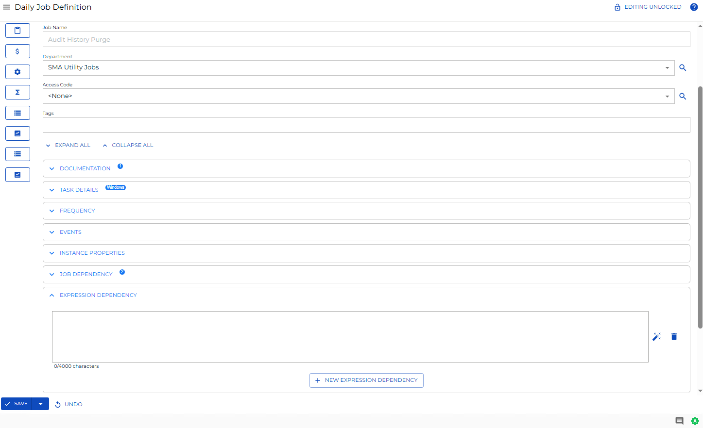

# Viewing and Updating Expression Dependencies

**Theme:** Configure  
**Who Is It For?** System Administrator, Automation Engineer

## What Is It?

The **Expression Dependency** panel in **Daily Job Definition** displays defined expression dependencies for the selected job.

- Select the icon () at the far right of the panel bar to enter or exit **Full Screen** mode
- When the panel contains defined properties, a blue circular indicator () appears to the right of the panel name showing the property count

## Adding or Updating Expression Dependencies

In **Admin** mode, expression dependencies can be updated. For conceptual information, refer to [Property Expressions API Syntax](../../../reference/property-expressions-syntax.md) and [Use Cases](../../../reference/property-expressions-syntax.md#Use).

:::note
Only users with the appropriate permissions can access the **Lock** button and update job properties. Refer to [Required Privileges](Accessing-Daily-Job-Definition.md#Required) for details.
:::

:::note
Changes made in **Daily Job Definition** take effect immediately. If the job has already run, changes apply the next time the job runs.
:::

To perform this procedure:

1. Select the **Processes** button at the top-right of the **Operations Summary** page

2. Ensure both the **Date** and **Schedule** toggle switches are enabled (green)

    

To add or Updating Expression Dependencies, complete the following steps:

3. Select the desired **date(s)** to display associated schedules

4. Select one or more **schedule(s)** in the list

5. Select one **job** in the list. Your selection appears in the [status bar](SM-UI-Layout.md#Status) as a breadcrumb trail

    

6. Select the job record (e.g., 1 job(s)) in the status bar to open the **Selection** panel

    :::note
    Alternatively, right-click the job in the list to open the **Selection** panel.
    :::

    .png "Job Summary Tab in Operations")

7. Select the **Daily Job Definition** button  at the top-left of the panel. The page opens in **Read-only** mode by default

8. Select the **Lock** button  at the top-right to enter **Admin** mode. The button switches to a white unlocked lock on a green background 

    :::note
    The **Lock** button is not visible to users without the appropriate permissions.
    :::

9. Expand the **Expression Dependency** panel

    

10. Make any of the following updates:

    a. Edit or delete existing property expressions as needed.
    b. Select the green **Add** button (**+**) to define a new property expression. Each field allows up to 4000 characters. A maximum of two (2) property expressions are allowed per job.

    :::note
    Select the **Undo** button to discard changes.
    :::

11. Select the **Save** button

## FAQs

**Q: How many steps does the Viewing and Updating Expression Dependencies procedure involve?**

The Viewing and Updating Expression Dependencies procedure involves 11 steps. Complete all steps in order and save your changes.

**Q: What does Viewing and Updating Expression Dependencies cover?**

This page covers Adding or Updating Expression Dependencies.

## Glossary

**Resource**: A numeric variable in OpCon representing a finite pool. Jobs can be configured to require a set number of resource units to run, limiting concurrent executions and preventing resource contention.

**Privilege**: A specific permission granted through an OpCon role that controls access to a feature, function, or object type. Privileges are organized into categories such as Function Privileges, Machine Privileges, Schedule Privileges, and Access Codes.

**Schedule**: A named container for jobs in OpCon, built for a specific date to create that day's automation. Schedules define build settings, frequencies, and the jobs that run within them.

**Job**: The fundamental unit of work in OpCon. A job defines what to run, on which machine, when to start, and what conditions must be met. Job results are tracked and can trigger events and notifications.
