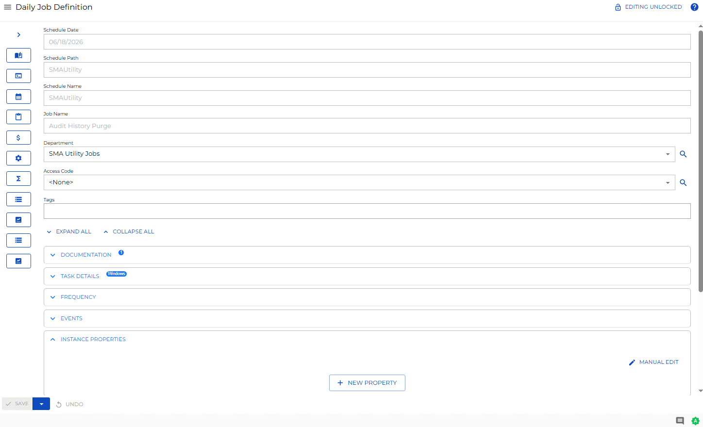

# Viewing and Updating Instance Properties

**Theme:** Configure  
**Who Is It For?** System Administrator, Automation Engineer

## What Is It?

The **Instance Properties** panel in **Daily Job Definition** displays the defined properties for each instance of the job.

- Select the full screen icon () at the far-right of the panel bar to enter **Full Screen** mode. Select it again to exit
- When properties are defined, a blue circular indicator () appears to the right of the panel name showing the number of defined properties

## Adding or Updating Instance Properties

In **Admin** mode, instance properties can be updated. For conceptual information, refer to [Instance Definition](../../../job-components/instances.md) in the **Concepts** online help.

:::note
Only users with appropriate permissions can access the **Lock** button and update job properties. For details, refer to [Required Privileges](Accessing-Daily-Job-Definition.md#Required) in the **Accessing Daily Job Definition** topic.
:::

:::note
Changes to job properties in **Daily Job Definition** take effect immediately. If the job has already run, changes apply on the next run.
:::

To perform this procedure:

Select the **Processes** button at the top-right of the **Operations Summary** page.

Enable both the **Date** and **Schedule** toggle switches. Each switch appears green when enabled.

Select the desired **date(s)** to display the associated schedules.

Select one or more **schedule(s)** in the list.

Select one **job** in the list. Your selection displays in the [status bar](SM-UI-Layout.md#Status) at the bottom of the page as a breadcrumb trail.

Select the job record (e.g., 1 job(s)) in the status bar to display the **Selection** panel.

:::note
Alternatively, right-click the job in the list to display the **Selection** panel.
:::

.png "Job Summary Tab in Operations")

Select the **Daily Job Definition** button  at the top-left of the panel. The page opens in **Read-only** mode by default.

Select the **Lock** button  at the top-right corner to switch to **Admin** mode. The button displays a white unlocked lock on a green background  when enabled.

:::note
The **Lock** button is not visible to users without appropriate permissions.
:::

Expand the **Instance Properties** panel.

Do any of the following to make updates:

a.  Edit or delete existing instance properties.
b.  Select the green **Add** button (**+**) to define a new instance property, then enter the name and value.
c.  Select the **Manual Edit** button to update existing properties or define new ones using the format **PropertyName=PropertyValue**. Separate each definition with a semicolon (**;**).

:::note
Select the **Undo** button to revert any changes.
:::

Select the **Save** button.

## FAQs

**Q: What does Viewing and Updating Instance Properties cover?**

This page covers Adding or Updating Instance Properties.

## Glossary

**Resource**: A numeric variable in OpCon representing a finite pool. Jobs can be configured to require a set number of resource units to run, limiting concurrent executions and preventing resource contention.

**Privilege**: A specific permission granted through an OpCon role that controls access to a feature, function, or object type. Privileges are organized into categories such as Function Privileges, Machine Privileges, Schedule Privileges, and Access Codes.

**Schedule**: A named container for jobs in OpCon, built for a specific date to create that day's automation. Schedules define build settings, frequencies, and the jobs that run within them.

**Job**: The fundamental unit of work in OpCon. A job defines what to run, on which machine, when to start, and what conditions must be met. Job results are tracked and can trigger events and notifications.
