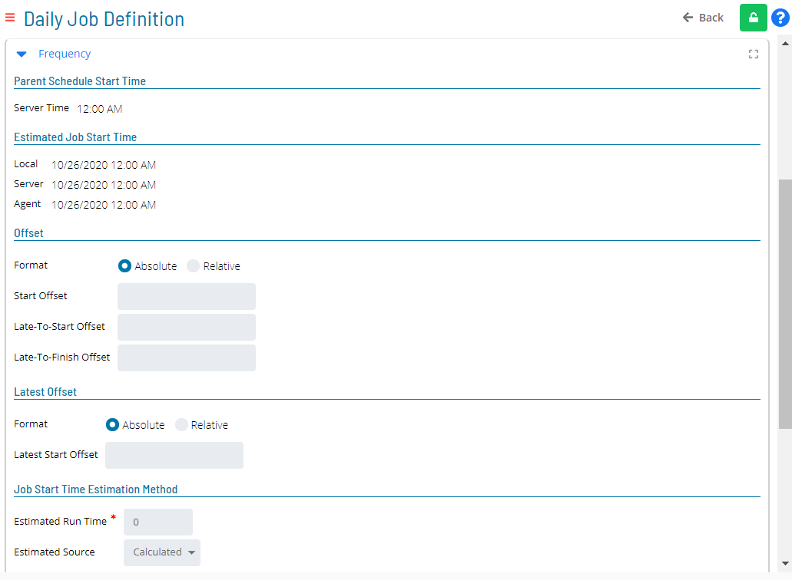

# Viewing and Updating Job Frequencies

The **Frequency** panel in **Daily Job Definition** displays all frequency information for a job. In **Admin** mode you can update these settings to control when the job starts, how late-start and late-finish thresholds are calculated, priority, maximum run time, retry behavior, and post-completion recurrence.

When the panel contains defined properties, a blue circular indicator containing a number appears to the right of the panel name, showing how many properties are set. Select the expand button at the far-right of the panel bar to enter **Full Screen** mode; select it again to exit.

:::note
Only users with the appropriate permissions can see the **Lock** button and update job properties. For details, refer to [Required Privileges](Accessing-Daily-Job-Definition.md#Required) in the **Accessing Daily Job Definition** topic.
:::

:::note
Changes saved in **Daily Job Definition** take effect immediately. If the job has already run, the changes apply the next time the job runs.
:::

For conceptual background on frequencies, refer to [Job Frequency](../../../job-components/frequency.md).

## Update job frequency settings

To update the frequency settings for a daily job, complete the following steps:

1. Select the **Processes** button at the top-right of the **Operations Summary** page.

   The **Processes** page opens.

2. Enable the **Date** and **Schedule** toggle switches so that you can make your date and schedule selections. Each switch appears green when enabled.

   

3. Select the desired date(s) to display the associated schedules.

4. Select one or more schedules in the list.

5. Select one job in the list. A breadcrumb record of your selection appears in the [status bar](SM-UI-Layout.md#Status) at the bottom of the page.

   

6. Select the job record (for example, **1 job(s)**) in the status bar to open the **Selection** panel.

   :::note
   Alternatively, right-click the job in the list to open the **Selection** panel.
   :::

   .png "Job Summary Tab in Operations")

7. Select the **Daily Job Definition** button () at the top-left corner of the panel.

   The **Daily Job Definition** page opens in **Read-only** mode.

8. Select the **Lock** button () at the top-right corner to switch the page to **Admin** mode.

   The button changes to a white unlocked lock on a green background ().

   :::note
   The **Lock** button is not visible to users who do not have the appropriate permissions.
   :::

9. Expand the **Frequency** panel to expose its content.

   

10. Review or update the fields described in [Frequency panel fields](#frequency-panel-fields) below.

11. Select the **Save** button.

    :::note
    Select the **Undo** button to discard any unsaved changes.
    :::

**Result:** The frequency settings for the daily job are saved and take effect immediately or at the next job run.

## Frequency panel fields

The **Frequency** panel is divided into the following sections.

### Parent Schedule Start Time

This section displays read-only start time information for the schedule that contains the selected job.

| Field | Description |
|---|---|
| **Server Time** | The current time on the SAM server. Read-only. |

### Estimated Job Start Time

This section displays read-only fields showing the estimated start times OpCon will use for the job.

| Field | Description |
|---|---|
| **Local** | The estimated start time in the local browser time zone. Read-only. |
| **Server** | The estimated start time on the SAM server. Read-only. |
| **Agent** | The estimated start time on the Agent machine. Read-only. |

### Offset

The **Offset** section defines the start offset and late-status thresholds for the job.

| Field | Description |
|---|---|
| **Format** | Determines how offsets are calculated. Select **Absolute** to calculate from the schedule's assigned start time. Select **Relative** to calculate from the time the schedule was released to run. |
| **Start Offset** | Positive hours and minutes to offset the job's start time from the schedule start time. Range: 1–5999 minutes. |
| **Late-To-Start Offset** | Positive hours and minutes added to the Start Offset to determine when the job is marked **Late to Start**. The threshold is calculated as Schedule Start Time + Start Offset + Late-To-Start Offset. A value of `00:00` disables this feature. Range: 1–5999 minutes. |
| **Late-To-Finish Offset** | Positive hours and minutes added to the Start Offset to determine when a running job is marked **Running; Late to Finish**. The threshold is calculated as Schedule Start Time + Start Offset + Late-To-Finish Offset. A value of `00:00` disables this feature. Range: 1–5999 minutes. |

### Latest Offset

The **Latest Offset** section defines the latest allowable start time for the job.

| Field | Description |
|---|---|
| **Format** | Determines how the latest start offset is calculated. Select **Absolute** to calculate from the schedule's assigned start time. Select **Relative** to calculate from the time the schedule was released to run. |
| **Latest Start Offset** | Positive hours and minutes that define the latest time the job may start. If this time passes before the job qualifies for running, the job is set to **Missed Latest Start Time** status and will not run automatically. A value of `00:00` disables this feature. Range: 1–5999 minutes. |

### Job Start Time Estimation Method

This section controls how the SMA Start Time Calculator predicts the job's estimated start time.

| Field | Description |
|---|---|
| **Estimated Run Time** | The expected duration of the job in minutes. Used by the Start Time Calculator for schedule forecasting. Minimum value: 0. |
| **Estimated Source** | The source used to predict the job's estimated start time. Select **Calculated** (default) to use the job's start offset value and dependency chain — best when the job has no external dependencies. Select **History** to use the job's average start time by frequency from history — useful when a job depends on external events or user interaction. Select **User Defined** to use a hard-coded predicted start time offset from the schedule's start time — useful when **History** does not provide sufficient accuracy. |
| **Predicted Start Time Offset** | Visible only when **Estimated Source** is **User Defined**. Specifies the days, hours, and minutes offset from the schedule's start time to use as the predicted start time. Range: 1–5759 minutes. |

### Job Execution

The **Job Execution** section sets the job's scheduling priority and maximum allowed run time.

| Field | Description |
|---|---|
| **SAM Priority** | The priority value SAM uses when submitting jobs to a machine that has more queued jobs than it can accept at once. Higher values are submitted first. Range: 0 (lowest) – 32767. |
| **Max Run time** | The maximum number of minutes the job is allowed to run. Range: 0–32767. A value of `0` disables the limit. |

### When Job Fails

The **When Job Fails** section controls automatic retry behavior after a job failure.

| Field | Description |
|---|---|
| **Retry** | Toggle switch. Enable to allow OpCon to automatically restart the job after a failure. |
| **Minutes Between Attempts** | The number of minutes to wait between restart attempts. Visible when **Retry** is enabled. Range: 0–1440. |
| **Maximum Attempts** | The maximum number of restart attempts OpCon will make. Visible when **Retry** is enabled. Range: 1–999. |

:::note
OpCon processes events, threshold and resource updates, and subsequent job dependencies only after the job fails on the final retry attempt.
:::

### When Job Finishes Ok

The **When Job Finishes Ok** section controls whether the job is automatically rescheduled after a successful run.

**Run Again** field options:

| Option | Description |
|---|---|
| **None** | The job is not rescheduled after a successful run. |
| **Recurring Instances** | The job is rescheduled to run at specific fixed times throughout the day. |
| **Restart Offset** | The job is rescheduled at regular intervals throughout the day. |

#### Recurring Instances options

Available when **Run Again** is set to **Recurring Instances**.

| Field | Description |
|---|---|
| **Recurring Instance Time(s)** | The list of specific times at which the job will run again. Use the **Add**, **Edit**, and **Delete** controls to manage entries. Times appear in chronological order. |
| **Action on Overlap of Job Recurrence** | Behavior when a previous run is still active at the next scheduled time. Select **Skip** to skip the overlapping occurrence. Select **Start On Completion** to start the next occurrence as soon as the previous run finishes. |

#### Restart Offset options

Available when **Run Again** is set to **Restart Offset**.

| Field | Description |
|---|---|
| **Run Interval** | The interval type. Select **Minutes from Start to Start** to measure the interval from the start of one run to the start of the next. Select **Minutes from End to Start** to measure the interval from the end of one run to the start of the next. |
| **Value** | The number of minutes for the selected run interval. Range: 0–1440. |
| **Latest Run Time (Offset)** | Optional. The latest time offset (from the schedule start time) at which the recurring job may start. Range: 1–1439 minutes. |
| **Number of Runs** | Optional. The total number of times the job will run. Range: 2–999. |
