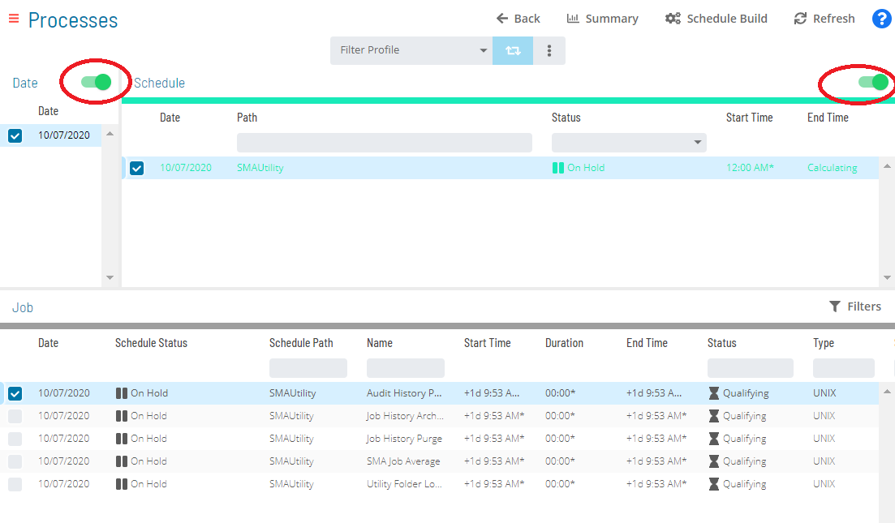
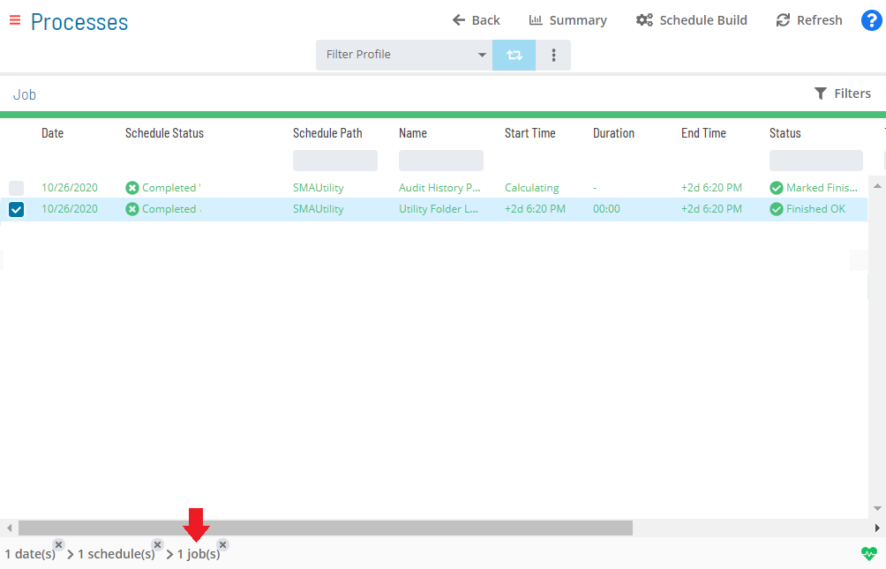
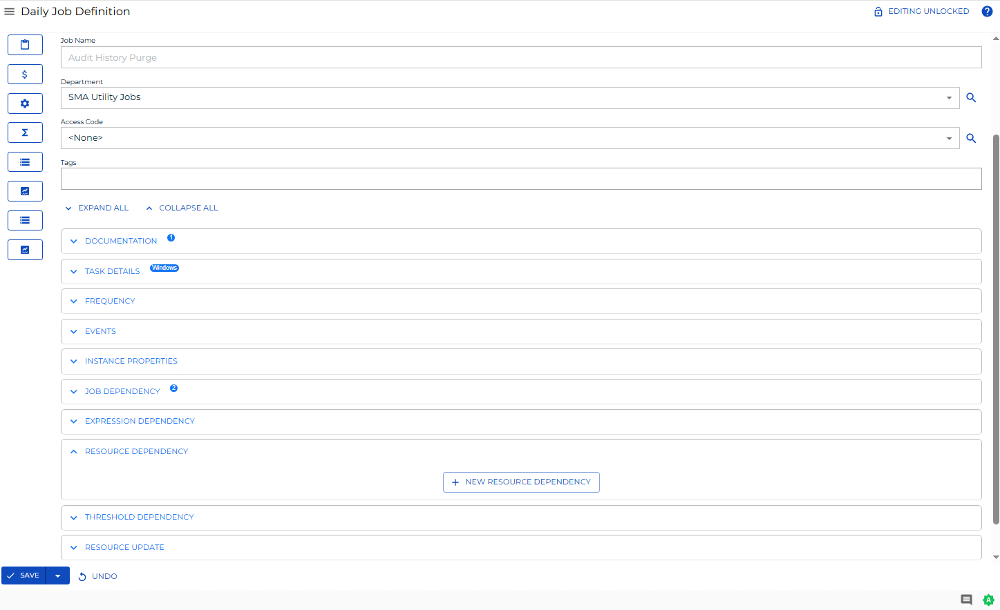
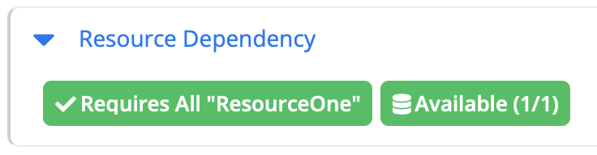

# Viewing and Updating Resource Dependencies

**Theme:** Configure  
**Who Is It For?** System Administrator, Automation Engineer

## What Is It?

The **Resource Dependency** panel in **Daily Job Definition** displays
any defined resource dependencies related to the selected job.

- The panel can be placed in **Full Screen** mode by simply clicking
    the icon ()
    to the far-right side of the panel bar. Escape **Full Screen** mode
    by clicking on the icon again.
- When the panel contains defined properties, a blue circular
    indicator containing a number ()
    will appear to the right of the panel name to indicate the number of
    properties that have been defined.

## When Would You Use It?

- You need to inspect or audit and Updating Resource Dependencies records in Solution Manager
- An audit, compliance review, or operational check requires inspection of current and Updating Resource Dependencies state

## Why Would You Use It?

- **Improve operational visibility**: Inspecting and Updating Resource Dependencies records in Solution Manager supports informed decision-making and provides an audit trail for compliance reviews
- Information in Solution Manager reflects the live database state, ensuring that the data reviewed is current at the time of inspection

## Adding or Updating Resource Dependencies

In **Admin** mode, resource dependencies can be updated. For conceptual
information, refer to [Threshold/Resource Dependencies](../../../job-components/threshold-resource-dependencies.md)
 in the **Concepts** online help.

:::note
Only those with the appropriate permissions will have access to the **Lock** button and can update job properties. For details about privileges, refer to [Required Privileges](Accessing-Daily-Job-Definition.md#Required) in the **Accessing Daily Job Definition** topic.
:::

:::note
Changes made to the job properties in the **Daily Job Definition** will take place immediately. If the job has already run, the changes will take effect the next time the job runs.
:::

To perform this procedure:

Select on the **Processes** button at the top-right of the **Operations
Summary** page. The **Processes** page will display.

Ensure that both the **Date** and **Schedule** toggle switches are
enabled so that you can make your date and schedule selection,
respectively. Each switch will appear green when enabled.

Select the desired **date(s)** to display the associated schedule(s).

Select one or more **schedule(s)** in the list.

Select one **job** in the list. A record of your selection will display
in the [status bar](SM-UI-Layout.md#Status) at the bottom of the
page in the form of a breadcrumb trail.

Select on the job record (e.g., 1 job(s)) in the status bar to display
the **Selection** panel.

:::note
As an alternative, you can right-click on the job selected in the list to display the **Selection** panel.
:::

.png "Job Summary Tab in Operations")

Select the **Daily Job Definition** button 
at the top-left corner of the panel to access the **Daily Job
Definition** page. By default, this page will be in **Read-only** mode.

Select the **Lock** button 
at the top-right corner to place the page in **Admin** mode. The button
will switch to display a white lock unlocked on a green background

when enabled.

:::note
The **Lock** button will not be visible to users who do not have the appropriate permissions.
:::

Expand the **Resource Dependency** panel to expose its content.

Do any of the following to make updates:

Edit or delete any existing resource dependencies if necessary.

Select the green **Add** button (**+**) to define a new resource
dependency. When the **Resource Dependency** dialog displays:

- Select the name of the resource from list
- Select the **Requires All** option to specify that the job must
    consume all resources when it runs or select the number of resources
    (Value) that the job requires.
- Select **Save** to save your selections and close the dialog

## Indicators

The defined resource dependency will appear in the **Resource
Dependency** panel with visual indicators, similar to the graphic, that
indicate whether the dependency is in good standings, if what is
required for the job is available to that job.

- Appears green if the resource defined is correct. For     example, when the current resource value is \> 1 and the defined
    value is 2.

- Appears red if the resource defined is not correct. For     example, when the current resource value is = 1 and the defined
    value is 2.

- Available resources are displayed to the right as *Available
    (resource available/resource total)*.

:::note
The SAM will check to make sure the number of available resources is greater than the number required before the dependency is met.
:::

:::note
Select the **Undo** button if you wish to undo your changes for any reason.
:::

Select the **Save** button.

## FAQs

**Q: What does Viewing and Updating Resource Dependencies cover?**

This page covers Adding or Updating Resource Dependencies, Indicators.

## Glossary

**SAM (Schedule Activity Monitor)**: The logical processor for OpCon workflow automation. SAM monitors schedule and job start times, dependencies, and user commands to determine job execution timing, and processes OpCon events.

**Threshold**: A numeric variable stored in the OpCon database used to control job execution. Jobs can be made dependent on threshold values, and OpCon events can update threshold values at runtime.

**Resource**: A numeric variable in OpCon representing a finite pool. Jobs can be configured to require a set number of resource units to run, limiting concurrent executions and preventing resource contention.

**Privilege**: A specific permission granted through an OpCon role that controls access to a feature, function, or object type. Privileges are organized into categories such as Function Privileges, Machine Privileges, Schedule Privileges, and Access Codes.

**Schedule**: A named container for jobs in OpCon, built for a specific date to create that day's automation. Schedules define build settings, frequencies, and the jobs that run within them.

**Job**: The fundamental unit of work in OpCon. A job defines what to run, on which machine, when to start, and what conditions must be met. Job results are tracked and can trigger events and notifications.
