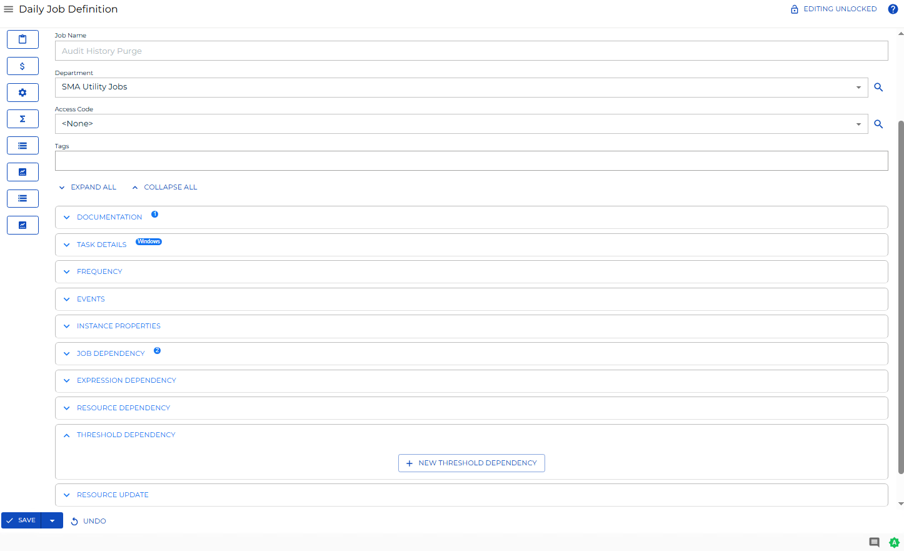
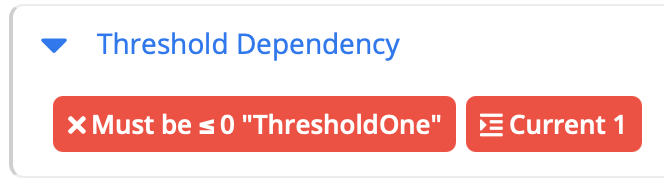

# Viewing and Updating Threshold Dependencies

The **Threshold Dependency** panel in **Daily Job Definition** displays any defined threshold dependencies for the selected job.

When the panel contains defined properties, a blue circular indicator with a number () appears to the right of the panel name showing the count of defined properties.

You can expand the panel to full-screen view by selecting the full-screen button () at the far right of the panel bar. Select it again to exit full-screen view.

For conceptual information about threshold dependencies, refer to [Threshold/Resource Dependencies](../../../job-components/threshold-resource-dependencies.md).

## Required Privileges

To update threshold dependencies, you must have the **Lock** button available, which requires the appropriate privileges. For details, refer to [Required Privileges](Accessing-Daily-Job-Definition.md#Required) in the **Accessing Daily Job Definition** topic.

:::note
Changes made to job properties in **Daily Job Definition** take effect immediately. If the job has already run, the changes take effect the next time the job runs.
:::

## Add or Update Threshold Dependencies

To add or update threshold dependencies for a daily job, complete the following steps:

1. Select the **Processes** button at the top-right of the **Operations Summary** page. The **Processes** page displays.
2. Ensure both the **Date** and **Schedule** toggle switches are enabled. Each switch appears green when enabled.

   

3. Select the desired **date(s)** to display the associated schedule(s).
4. Select one or more **schedule(s)** in the list.
5. Select one **job** in the list. Your selection appears in the [status bar](SM-UI-Layout.md#Status) at the bottom of the page as a breadcrumb trail.

   

6. Select the job record (for example, **1 job(s)**) in the status bar to display the **Selection** panel.

   :::note
   You can also right-click the job in the list to display the **Selection** panel.
   :::

   .png "Job Summary Tab in Operations")

7. Select the **Daily Job Definition** button () at the top-left corner of the panel. The **Daily Job Definition** page opens in **Read-only** mode.
8. Select the **Lock** button () at the top-right corner to switch the page to **Admin** mode. The button changes to a white unlocked lock on a green background ().

   :::note
   The **Lock** button is not visible to users who do not have the appropriate permissions.
   :::

9. Expand the **Threshold Dependency** panel to display its contents.

   

10. Do any of the following:
    - To modify an existing threshold dependency, edit the fields inline.
    - To remove an existing threshold dependency, select the delete option for the entry.
    - To add a new threshold dependency, select the green **Add** button (**+**). When the **Threshold Dependency** dialog opens:
      1. Select the threshold name from the list.
      2. Select the **Operator** that SAM uses when checking the dependency. Valid operators are: `=` (equal), `>` (greater than), `<` (less than), `>=` (greater than or equal to), `<=` (less than or equal to), `!=` (not equal).
      3. Select the **Value** to which SAM applies the operator when comparing the current threshold value.
      4. Select **Save** to save your selections and close the dialog.

11. Select the **Save** button to apply all changes.

**Result:** The threshold dependencies are saved for the daily job. The **Threshold Dependency** panel updates to reflect the new or changed entries.

:::note
Select the **Undo** button to discard any unsaved changes.
:::

## Threshold Dependency Indicators

Each threshold dependency in the panel displays a visual indicator showing whether the dependency condition is currently met.

| Indicator color | Meaning | Example |
|---|---|---|
| Green | The dependency condition is met | Current threshold value is `2` and the operator is `> 1` |
| Red | The dependency condition is not met | Current threshold value is `1` and the operator is `= 2` |

The current threshold value appears to the right of the dependency entry.
