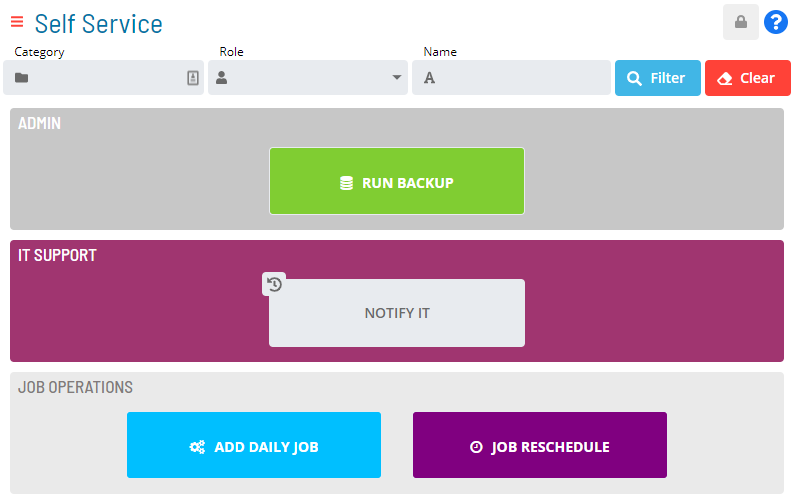

# Working in Admin Mode

**Theme:** Configure  
**Who Is It For?** System Administrator, Automation Engineer

## What Is It?

Users in the **ocadm** role or a role with the **Maintain Service Request** privilege will see a Self Service page that is similar to the example graphic here.

### Admin Mode Self Service Page Display

:::note
For more on Function Privileges including those pertaining to the Maintaining Service Requests, refer to [Function Privileges](../../../administration/privileges.md#function-privileges) in the **Concepts** online help.
:::

### .png "More Info icon") Related Topics

- [Filter Service Requests](Filtering-Service-Requests.md)
- [Create Service Requests](Creating-Service-Requests.md)
- [Manage Service Requests](Managing-Service-Requests.md)
- [Stylize Service Requests](Stylizing-Service-Requests.md)
- [Set up OpCon Events](Setting-up-OpCon-Events.md)
- [Set up Privileges](Setting-up-Privileges.md)
- [Set up User Inputs](Setting-up-User-Inputs.md)
- [View Service Request     Processes](Viewing-Service-Request-Process-Indicators.md)

## When Would You Use It?

- Users in the **ocadm** role or a role with the **Maintain Service Request** privilege will see a Self Service page that is similar to the example graphic here

## Why Would You Use It?

- **Working in**: Users in the **ocadm** role or a role with the **Maintain Service Request** privilege will see a Self Service page that is similar to the example graphic here

## Configuration Options

| Setting | What It Does | Default | Notes |
|---|---|---|---|
## FAQs

**Q: What can you do in Admin Mode?**

Admin Mode provides access to related configuration and management tasks. Use the navigation options to add, edit, or delete records as needed.

**Q: Who can access admin mode in OpCon?**

Access is controlled by the privileges assigned to your OpCon role. Contact your system administrator if you need access to admin mode.

## Glossary

**OpCon Event**: A command sent to OpCon that triggers an automated action, such as adding a job to a schedule, updating a property value, sending a notification, or changing a job or schedule status.

**Service Request**: A Solution Manager feature that lets operators trigger predefined automation workflows using a simple form. Service Requests encapsulate schedule builds, job submissions, or events without requiring direct access to schedule definitions.

**Resource**: A numeric variable in OpCon representing a finite pool. Jobs can be configured to require a set number of resource units to run, limiting concurrent executions and preventing resource contention.

**Role**: A named security profile in OpCon that groups privileges together. Roles are assigned to user accounts to control which features, schedules, jobs, machines, and administrative functions a user can access.

**Privilege**: A specific permission granted through an OpCon role that controls access to a feature, function, or object type. Privileges are organized into categories such as Function Privileges, Machine Privileges, Schedule Privileges, and Access Codes.

**OpCon**: Continuous' workflow automation platform. The OpCon server includes the database, SAM and Supporting Services (SAM-SS), and graphical user interfaces. agents installed on target platforms run jobs and report results.
