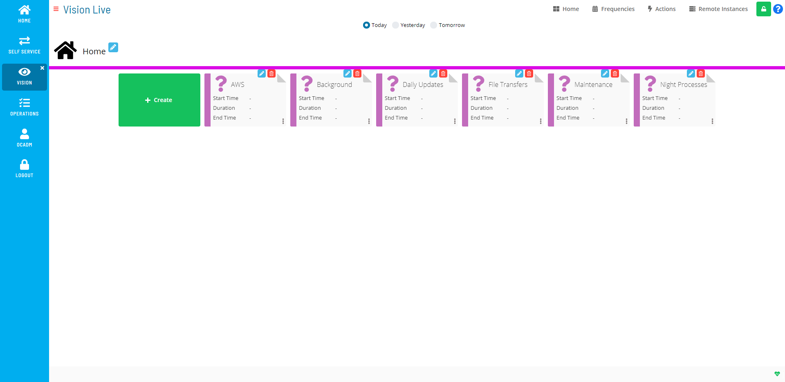

# Working in Admin Mode

**Theme:** Configure  
**Who Is It For?** System Administrator, Automation Engineer

## What Is It?

Users in the «ocadm» role will see a Vision Live page that is similar to
the example graphic here.

Admin Mode Vision Live Page Display

Users in the «ocadm» role will have access to the Vision Frequencies,
Vision Actions, and Vision Remote Instances pages. Only users in the
«ocadm» role will have access to Vision Remote Instances.

Users not in the «ocadm» role must be granted the appropriate Vision
privileges to view or perform functions:

- Maintain Vision Actions
- Maintain Vision Frequencies
- Maintain Vision Workspaces
- View Vision Workspaces

:::note
For more on Function Privileges including those pertaining to Vision, refer to [Function Privileges](../../../administration/privileges.md#function-privileges) in the **Concepts** online help.
:::

From this page, you can do any of the following:

- [Manage Vision Settings](Managing-Vision-Settings.md)
- [Manage Vision Frequencies](Managing-Vision-Frequencies.md)
- [Manage Vision Actions](Managing-Vision-Actions.md)
- [Manage Vision Remote     Instances](Managing-Vision-Remote-Instances.md)
- [View Cards in Vision     Live](Viewing-Cards-in-Vision-Live.md)

## Configuration Options

| Setting | What It Does | Default | Notes |
|---|---|---|---|
## FAQs

**Q: What can you do in Admin Mode?**

Admin Mode provides access to related configuration and management tasks. Use the navigation options to add, edit, or delete records as needed.

**Q: Who can access admin mode in OpCon?**

Access is controlled by the privileges assigned to your OpCon role. Contact your system administrator if you need access to admin mode.

## Glossary

**Frequency**: A set of rules that defines when a job or schedule is eligible to run, based on calendar rules, day-of-week settings, period offsets, and other timing criteria.

**Resource**: A numeric variable in OpCon representing a finite pool. Jobs can be configured to require a set number of resource units to run, limiting concurrent executions and preventing resource contention.

**Role**: A named security profile in OpCon that groups privileges together. Roles are assigned to user accounts to control which features, schedules, jobs, machines, and administrative functions a user can access.

**Privilege**: A specific permission granted through an OpCon role that controls access to a feature, function, or object type. Privileges are organized into categories such as Function Privileges, Machine Privileges, Schedule Privileges, and Access Codes.

**OpCon**: Continuous' workflow automation platform. The OpCon server includes the database, SAM and Supporting Services (SAM-SS), and graphical user interfaces. agents installed on target platforms run jobs and report results.
