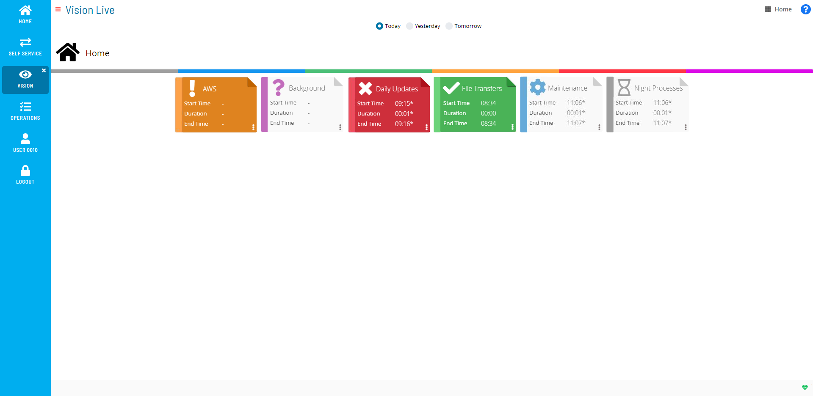

# Working in User Mode

**Theme:** Configure  
**Who Is It For?** System Administrator, Automation Engineer

## What Is It?

Users without the «ocadm» role, or without the «Maintain Vision Actions», «Maintain Vision Frequencies», or «Maintain Vision Workspaces» privileges, see a read-only Vision Live page. These users must have the «View Vision Workspaces» privilege and can only view cards — they cannot create, edit, or delete them.

User Mode Vision Page Display

From this page, you can do any of the following:

- [View Cards in Vision Live](Viewing-Cards-in-Vision-Live.md)

## When Would You Use It?

- Users without the «ocadm» role, or without the «Maintain Vision Actions», «Maintain Vision Frequencies», or «Maintain Vision Workspaces» privileges, see a read-only Vision Live page

## Why Would You Use It?

- **Working in**: Users without the «ocadm» role, or without the «Maintain Vision Actions», «Maintain Vision Frequencies», or «Maintain Vision Workspaces» privileges, see a read-only Vision Live page

## Configuration Options

| Setting | What It Does | Default | Notes |
|---|---|---|---|
## FAQs

**Q: What can you do in User Mode?**

User Mode provides access to related configuration and management tasks. Use the navigation options to add, edit, or delete records as needed.

**Q: Who can access user mode in OpCon?**

Access is controlled by the privileges assigned to your OpCon role. Contact your system administrator if you need access to user mode.

## Glossary

**Frequency**: A set of rules that defines when a job or schedule is eligible to run, based on calendar rules, day-of-week settings, period offsets, and other timing criteria.

**Resource**: A numeric variable in OpCon representing a finite pool. Jobs can be configured to require a set number of resource units to run, limiting concurrent executions and preventing resource contention.

**Role**: A named security profile in OpCon that groups privileges together. Roles are assigned to user accounts to control which features, schedules, jobs, machines, and administrative functions a user can access.

**Privilege**: A specific permission granted through an OpCon role that controls access to a feature, function, or object type. Privileges are organized into categories such as Function Privileges, Machine Privileges, Schedule Privileges, and Access Codes.

**OpCon**: Continuous' workflow automation platform. The OpCon server includes the database, SAM and Supporting Services (SAM-SS), and graphical user interfaces. agents installed on target platforms run jobs and report results.
