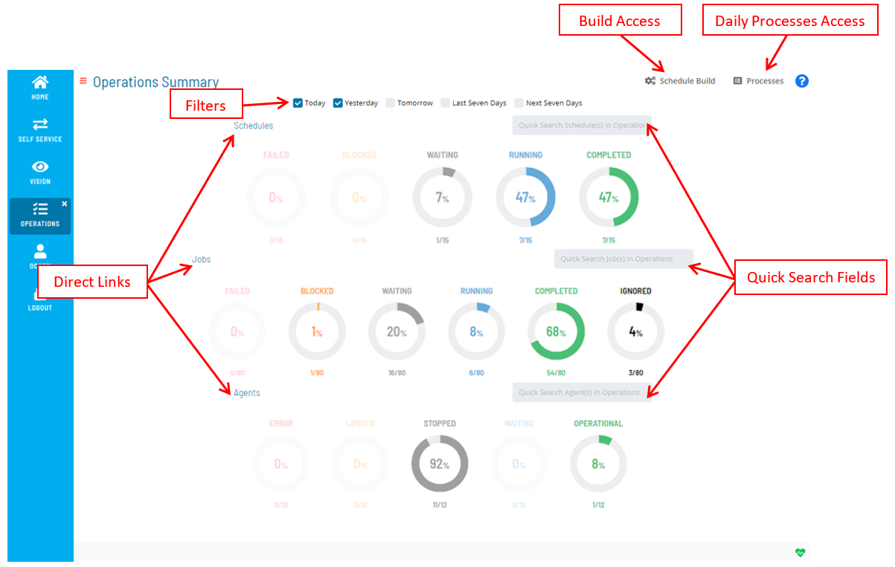
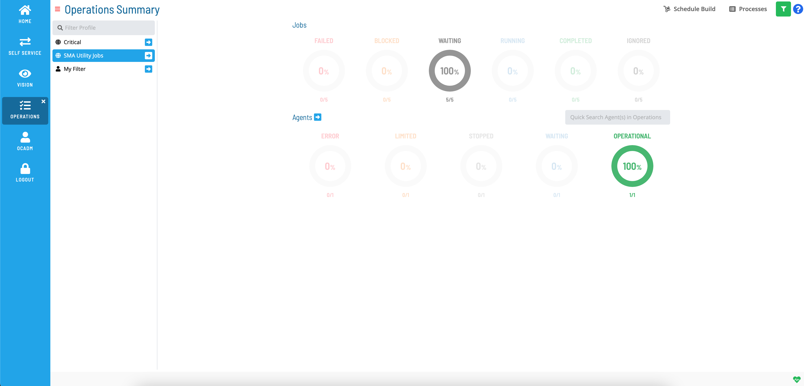

# Working with Operations

**Theme:** Configure  
**Who Is It For?** System Administrator, Automation Engineer

## What Is It?

Operations is an SMA Solution Manager module that shows high-level
summary information (by way of graphical dials) for schedules, jobs, and
Agent machines in operation. Each dial has drill-down capability to view
the details or processes on which the summary information is based.

Solution Manager Operations

## When Would You Use It?

- You need to work with Operations, an SMA Solution Manager module that shows high-level, in OpCon

## Why Would You Use It?

- **Working with**: Operations is an SMA Solution Manager module that shows high-level

## Filtering

The Filter bar at the top of the page can be used to filter the
schedules, jobs, and Agent machines based on what is stored in the
system for the current day, the day before, the day after, the last
seven days, and/or the next seven days.

Filtering Options

## Quick Search

For each of the OpCon object types (schedules, jobs, and Agent
machines), a Quick Search field is provided. You simply type in the
keyword in the appropriate field and select **Enter** to access the
search criteria results.

Quick Search

## Direct Links

Clicking on any of these links grants you direct access to the
**Processes** page for the OpCon object type.

- Select the [Schedules](Performing-Schedule-Status-Changes.md)
    link to access all schedules. Any filter selection(s) made on the
    main **Operations** page before clicking on the link may be
    reflected in the initial data that is displayed.
- Select the [Jobs](Performing-Job-Status-Changes.md) link to
    access all jobs. Any filter selection(s) made on the main
    **Operations** page before clicking on the link may be reflected
    in the initial data that is displayed.
- Select the [Agents](Performing-Agent-Status-Updates.md) link
    to access all Agent machines.

## Daily Processes Access

The 
button takes you to the page where you can [view and manage](Managing-Daily-Processes.md) the Daily processes in
operation.

## Schedule Build Access

The 
button takes you to the page where you can [view and build](Managing-Schedules.md) schedules.

## Filter Profiles

The 
**Filter Profile** button allows users to apply stored filters on the
Operations Summary screen. When selected, the ability to Go to the
**Processes** page with filtering is limited to the direct link next to
the profile name. This button will only be displayed in the top toolbar
if at least one profile is defined.

Solution Manager Operations with Filter Profiles

.png "More Info icon")
Related Topics

- [Performing Schedule Status     Changes](Performing-Schedule-Status-Changes.md)
- [Performing Job Status     Changes](Performing-Job-Status-Changes.md)
- [Performing Bulk Status Job Updates (Schedule     Level)](Performing-Bulk-Job-Status-Updates-Schedule-Level.md)
- [Performing Agent Status     Updates](Performing-Agent-Status-Updates.md)
- [Viewing Job Output](Viewing-Job-Output.md)
- [Viewing Job Configuration](Viewing-Job-Configuration.md)
- [Using PERT View](Using-PERT-View.md)
- [Managing Daily Processes](Managing-Daily-Processes.md)
- [Using Schedule Build](Managing-Schedules.md)
:::

## Configuration Options

| Setting | What It Does | Default | Notes |
|---|---|---|---|
## FAQs

**Q: What does Working with Operations cover?**

This page covers Filtering, Quick Search, Direct Links.

## Glossary

**Solution Manager**: OpCon's browser-based graphical user interface for managing automation data, performing operational actions, and administering the system.

**Resource**: A numeric variable in OpCon representing a finite pool. Jobs can be configured to require a set number of resource units to run, limiting concurrent executions and preventing resource contention.

**Machine**: A platform defined in the OpCon database that has an agent installed. OpCon routes job execution requests to machines via SMANetCom, and machines report job completion status back to SAM.

**Schedule**: A named container for jobs in OpCon, built for a specific date to create that day's automation. Schedules define build settings, frequencies, and the jobs that run within them.

**Job**: The fundamental unit of work in OpCon. A job defines what to run, on which machine, when to start, and what conditions must be met. Job results are tracked and can trigger events and notifications.

**OpCon**: Continuous' workflow automation platform. The OpCon server includes the database, SAM and Supporting Services (SAM-SS), and graphical user interfaces. agents installed on target platforms run jobs and report results.
