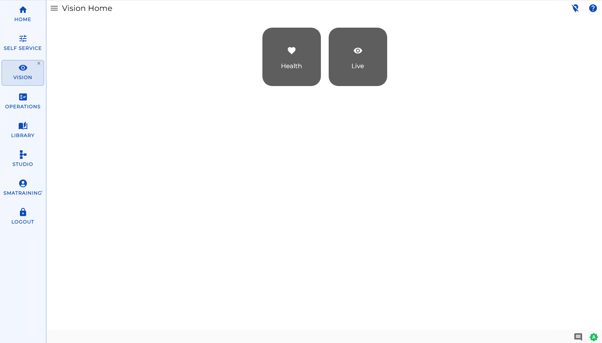

# Working with Vision

**Theme:** Configure  
**Who Is It For?** System Administrator, Automation Engineer

## What Is It?

Vision is an SMA Solution Manager module that allows you to define cards
that show a summary of the status of all jobs with a matching tag and
view the health of cards based on their historical completion.

## When Would You Use It?

- You need to allows you to define cards using Vision is an SMA Solution Manager module that

## Why Would You Use It?

- **Operational value**: Allows you to define cards that show a summary of the status of all jobs with a matchin

## Vision Live

The Vision Live page allows you to view cards and their statuses. For
more information on cards, refer to [Viewing Cards in Vision Live](Viewing-Cards-in-Vision-Live.md) in the
**Solution Manager** online help.

### Cards

There are two types of cards, group and tag, which can be organized in a
hierarchical structure.

Group cards are parent cards that can be defined at the root level or as
a child card of an existing group. The group card definition must
contain a name, role, and at least one tag card defined at the lowest
group level.

Tag cards can be defined individually at the root level or as child
cards of an existing group. The tag card definition must contain a
pattern (which matches a tag defined in the Enterprise Manager), job
offset, role, and one or more frequencies.

Cards can be assigned frequencies which will determine which days the
card is displayed in the Vision module. When a card is displayed, it
will show a summary containing the start time, duration, end time, and
job statuses for any jobs defined in the Enterprise Manager that match
the pattern defined for the card. If a card is blank, there are no jobs
defined in the Enterprise Manager that match the pattern for that date.

### Job Status Summary

Clicking the 
(vertical ellipsis) icon on a card flips the card to its back which
displays the total number of jobs per job status that match the pattern
defined for a tag card or, when viewing a parent group card, the total
number of jobs per job status that match the pattern(s) defined for all
child cards.

### Filtering

The Filter bar at the top of the page can be used to display cards that
have a job defined based on what is stored in the system for the current
day, the day before, and the day after.

Filtering Options

## Vision Health

Vision Health allows you to view a dashboard of the historical data for
completed Vision cards. For more on Vision Health, refer to
[Viewing Vision Health](Viewing-Vision-Health.md) in
the **Solution Manager** online help.

## Vision Settings

The Vision Settings page allows you to create, edit, and delete cards
and provides access to the Vision Frequencies, Vision Actions, and
Vision Remote Instances pages for defining and managing those settings.
For more on these pages, refer to the [Related Topics](#Related_Topics).

## License File Request and Storing

Vision is included with Solution Manager; however, you will need to
obtain a license that will allow access to all features of the Vision
solution. Without the license, you will not have access to Actions,
Triggers, and SLAs. To request and save the license file, follow these
next procedures.

To request the license file, complete the following steps:

1. Open Enterprise Manager
2. Use menu path: **Help \> About OpCon Enterprise Manager**
3. Select the **License Information** tab
4. Select the **System ID** \[e.g., (OpconServer_6410)\] at the end of     the first line
5. Right-click and select **Copy**

6. Send an email to <license@smatechnologies.com> to request an updated
    license file for OpCon that includes support for "SMA Vision" and
    paste the System ID into the email request. You should receive the
    license within an hour during regular business hours.
7. Select **OK** to close the **About** dialog

After Continuous responds to the license request, follow this next procedure to save the license file to the SAM
directory.

To save the license file, complete the following steps:

1. Save the file to the **<Configuration
    Directory\>\\OpConxps\\SAM\\** folder on your OpCon server when you
    receive your license file from Continuous. SAM will automatically pick up
    this new file within 6 hours.
2. *(Optional)* Stop and restart the **SMA OpCon
    Service Manager** in your **Windows Services** tool to pick up the
    file immediately.

.png "More Info icon") Related Topics

- [Viewing Cards in Vision Live](Viewing-Cards-in-Vision-Live.md)
- [Viewing Vision Health](Viewing-Vision-Health.md)
- [Managing Vision Settings](Managing-Vision-Settings.md)
- [Managing Vision Frequencies](Managing-Vision-Frequencies.md)
- [Managing Vision Actions](Managing-Vision-Actions.md)
- [Managing Vision Remote Instances](Managing-Vision-Remote-Instances.md)

## Configuration Options

| Setting | What It Does | Default | Notes |
|---|---|---|---|
## FAQs

**Q: How many steps does the Working with Vision procedure involve?**

The Working with Vision procedure involves 9 steps. Complete all steps in order and save your changes.

**Q: What does Working with Vision cover?**

This page covers Vision Live, Vision Health, Vision Settings.

## Glossary

**SAM (Schedule Activity Monitor)**: The logical processor for OpCon workflow automation. SAM monitors schedule and job start times, dependencies, and user commands to determine job execution timing, and processes OpCon events.

**Enterprise Manager (EM)**: OpCon's rich client graphical user interface for Windows and Linux, used to define schedules and jobs, manage automation data, and perform operational tasks.

**Solution Manager**: OpCon's browser-based graphical user interface for managing automation data, performing operational actions, and administering the system.

**Frequency**: A set of rules that defines when a job or schedule is eligible to run, based on calendar rules, day-of-week settings, period offsets, and other timing criteria.

**OpConxps**: The standard installation directory name for OpCon program files, configuration files, and output data on Windows machines.

**Resource**: A numeric variable in OpCon representing a finite pool. Jobs can be configured to require a set number of resource units to run, limiting concurrent executions and preventing resource contention.

**Role**: A named security profile in OpCon that groups privileges together. Roles are assigned to user accounts to control which features, schedules, jobs, machines, and administrative functions a user can access.

**Job**: The fundamental unit of work in OpCon. A job defines what to run, on which machine, when to start, and what conditions must be met. Job results are tracked and can trigger events and notifications.
