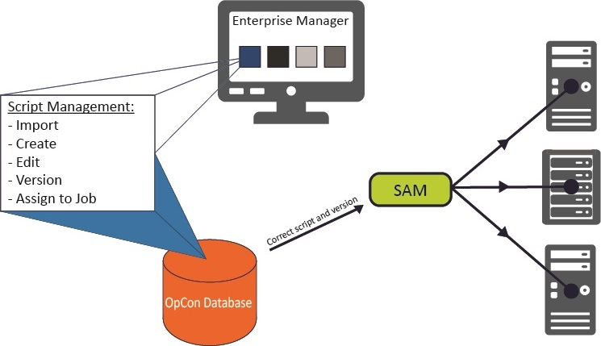
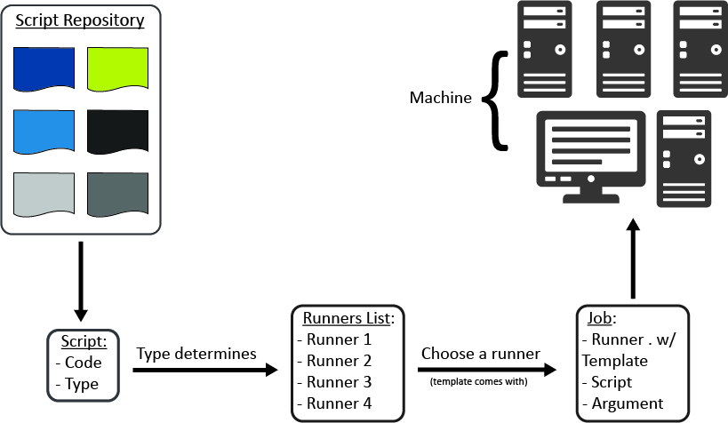

# Embedded Scripts

**Theme:** Configure  
**Who Is It For?** Automation Engineer, Business Analyst

## What Is It?

Embedded Scripts in OpCon lets users centrally manage scripts for distribution to Agents. Centralized script storage:

- Eliminates script maintenance across multiple machines
- Supports running different script versions across different machines
- Secures script access and enables auditing of script changes
- Provides version control

Embedded Scripts Overview

## When Would You Use It?

- You need to manage scripts for distribution to Agents using Embedded Scripts in OpCon lets users centrally

## Why Would You Use It?

- **Operational value**: Eliminates script maintenance across multiple machines - Supports running different script

## Understanding the Process Flow

Scripts are defined in the database and associated with a script type. The script type is associated with one or more runners. The runner is the local program configuration responsible for running a script of a specific type on remote machines. At runtime, the runner, type, and script information are passed to the Agent for execution.

## Reasons to Use Embedded Scripts

Embedded Scripts reduces administration and increases security in the automation environment:

- Scripts maintained inside OpCon eliminate the need to edit or copy scripts across multiple machines or environments
- One OpCon account can maintain all automation scripts, reducing the need for direct logins to Agent machines
- Built-in auditing automatically tracks every script change, whether versioned or not. This is especially useful in environments without version control software
- Selecting a script version for a job provides these benefits:
  - Assigning a specific version ensures the job always uses that approved version
  - Selecting LATEST ties the job to the highest script version, useful for test jobs to verify new versions before assigning them to production

## Configuration Options

| Setting | What It Does | Default | Notes |
|---|---|---|---|
## FAQs

**Q: What is the main benefit of using Embedded Scripts instead of storing scripts on agent machines?**

Scripts stored in OpCon are maintained in one central location, eliminating the need to copy or edit scripts across multiple machines or environments. One account can manage all automation scripts, reducing the need for direct logins to agent machines.

**Q: How does Embedded Scripts support auditing?**

Built-in auditing automatically tracks every script change, whether versioned or not. This is especially useful in environments without dedicated version control software.

**Q: What is the difference between assigning a specific version vs. LATEST to a job?**

Assigning a specific version ensures the job always uses that approved, fixed version. Selecting LATEST automatically uses the highest script version available, which is useful for test jobs that need to validate new versions before they are assigned to production.

## Glossary

**Embedded Script**: A script stored and versioned directly within the OpCon database. Embedded scripts can be assigned to Windows jobs and run at runtime without requiring the script file to exist on the target machine.

**Resource**: A numeric variable in OpCon representing a finite pool. Jobs can be configured to require a set number of resource units to run, limiting concurrent executions and preventing resource contention.

**Machine**: A platform defined in the OpCon database that has an agent installed. OpCon routes job execution requests to machines via SMANetCom, and machines report job completion status back to SAM.

**Job**: The fundamental unit of work in OpCon. A job defines what to run, on which machine, when to start, and what conditions must be met. Job results are tracked and can trigger events and notifications.

**OpCon**: Continuous' workflow automation platform. The OpCon server includes the database, SAM and Supporting Services (SAM-SS), and graphical user interfaces. agents installed on target platforms run jobs and report results.
