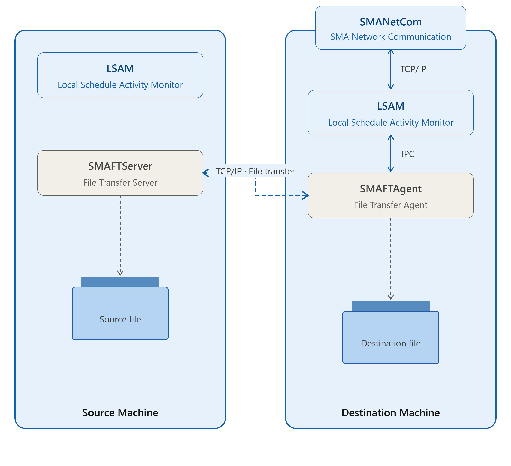

# File Transfer Jobs

**Theme:** Configure  
**Who Is It For?** Automation Engineer, Business Analyst

## What Is It?

The SMA File Transfer (SMAFT) system transfers files across multiple platforms via an OpCon job. The SMAFTAgent and SMAFTServer components are installed with FT-enabled agents on Microsoft, IBM i, MCP, OS 2200 and BIS, UNIX, and z/OS. Both source and destination machines must have these components installed.

:::note
SMAFT for Windows requires a .NET version to be installed.
:::

File Transfer Job

After receiving instructions from the resident agent, the SMAFT Component negotiates transfer settings with the SMAFT Component on the other machine, then transfers the file.

:::note
The file transfer port for the initiating machine must be open on the firewall. For more information, refer to [File Transfer Settings](../objects/machines.md#file).
:::

## When Would You Use It?

- The SMA File Transfer (SMAFT) system transfers files across multiple platforms via an OpCon job

## Why Would You Use It?

- **File Transfer**: The SMA File Transfer (SMAFT) system transfers files across multiple platforms via an OpCon job

## Configuration

Before attempting a transfer, configure the machine definitions in OpCon and the agents on both source and destination machines.

In each agent configuration file, define the file transfer parameters. These settings are typically co-located with the agent's JORS parameters.

- **IBM i**: Refer to [The SMA File Transfer Process](https://help.smatechnologies.com/opcon/agents/ibmi/latest/Files/Agents/IBM-i/SMA-File-Transfer.md#The) in the **IBM i LSAM** online help
- **MCP**: Refer to [Optional Modules (OPT)](https://help.smatechnologies.com/opcon/agents/mcp/latest/Files/Agents/MCP/Optional-Modules-(OPT).md#MCP_LSAM_Configuration_Settings:_Optional_Modules:_File_Transfer) in the **MCP LSAM** online help
- **Microsoft**: Refer to [JORS Settings](https://help.smatechnologies.com/opcon/agents/windows/latest/Files/Agents/Microsoft/JORS-Settings.md) in the **Microsoft agent** online help
- **UNIX**: Refer to [JORS and SMAFT Parameters](https://help.smatechnologies.com/opcon/agents/unix/latest/Files/Agents/UNIX/JORS-and-SMAFT-Parameters.md) in the **UNIX LSAM** online help
- **OS 2200 and BIS**: Refer to [JORS and File Transfer Configuration](https://help.smatechnologies.com/opcon/agents/os2200/latest/Files/Agents/OS-2200/Configuration.md#JORS_and_File_Transfer_Configuration) in the **OS 2200 LSAM** online help
- **z/OS**: Refer to [Standalone File Transfer](https://help.smatechnologies.com/opcon/agents/zos/latest/Files/Agents/zOS/Standalone-File-Transfer.md) in the **z/OS LSAM** online help

In the job definition, configure the destination machine's File Transfer Settings to match the source machine's agent file transfer settings (or vice versa). Set the "File Transfer" type and "File Transfer Port Number" under File Transfer Settings. For additional information, refer to [File Transfer Job Details](../job-types/file-transfer.md).

## Logging

Each agent logs file transfer information differently.

- **IBM i**: The SMAFT Agent logs to the SMAFT Agent logging system; the SMAFT Server logs to the SMAFT Server logging system. Logging is configured in the SMA File Transfer Menu. Refer to [SMA File Transfer Menu](https://help.smatechnologies.com/opcon/agents/ibmi/latest/Files/Agents/IBM-i/SMA-File-Transfer.md#SMA6) in the **IBM i LSAM** online help
- **MCP**: The SMAFTAgent logs general messages to the PRT_FTAGENT print file when SW2 is set for the agent. Refer to [Problem Resolution and Debugging](https://help.smatechnologies.com/opcon/agents/mcp/latest/Files/Agents/MCP/Problem-Resolution-and-Debugging.md) in the **MCP LSAM** online help
- **Microsoft**: The SMAFTAgent writes processing information to the SMAFTAgent.log file in the `<Output Directory>\MSLSAM\Log\` directory. Logging is controlled by the agent's Debug Settings. Refer to [Debug Options](https://help.smatechnologies.com/opcon/agents/windows/latest/Files/Agents/Microsoft/Debug-Options.md) in the **Microsoft agent** online help
- **UNIX**: The SMAFTAgent logs general messages to the UNIX LSAM logfile and errors to the UNIX LSAM errfile. Refer to [JORS and SMAFT Parameters](https://help.smatechnologies.com/opcon/agents/unix/latest/Files/Agents/UNIX/JORS-and-SMAFT-Parameters.md) in the **UNIX LSAM** online help
- **OS 2200**: The SMAFT Agent logs to the SMAFT log file; the SMAFT Server (JORS) logs to the SMAJOR log file. Logging is configured under Debug Mode in the LSAM's Advanced Options. Refer to [Configuration Settings -- Advanced Options](https://help.smatechnologies.com/opcon/agents/os2200/latest/Files/Agents/OS-2200/Configuration.md#Advanced_Options) in the **OS 2200 LSAM** online help
- **z/OS**: File transfer runs as a job; the job log contains all logging information

## Configuration Options

| Setting | What It Does | Default | Notes |
|---|---|---|---|
| IBM i | Refer to The SMA File Transfer Process in the **IBM i LSAM** online help | — | — |
| MCP | Refer to Optional Modules (OPT).md#MCP_LSAM_Configuration_Settings:_Optional_Modules:_File_Transfer) in the **MCP LSAM** online help | — | — |
| Microsoft | Refer to JORS Settings in the **Microsoft agent** online help | — | — |
| UNIX | Refer to JORS and SMAFT Parameters in the **UNIX LSAM** online help | — | — |
| OS 2200 and BIS | Refer to JORS and File Transfer Configuration in the **OS 2200 LSAM** online help | — | — |
| z/OS | Refer to Standalone File Transfer in the **z/OS LSAM** online help | — | — |
| OS 2200 | The SMAFT Agent logs to the SMAFT log file; the SMAFT Server (JORS) logs to the SMAJOR log file. | — | — |
## Operations

### Common Tasks
- Before defining a file transfer job, configure machine definitions in OpCon and the file transfer parameters in each agent's configuration file; the file transfer port and JORS parameters are co-located in the agent's configuration.
- Ensure the file transfer port for the initiating machine is open on the firewall; both source and destination machines must have SMAFTAgent and SMAFTServer installed.
- For large file transfers, set the 'Wait Verify' value high enough to ensure the file has fully arrived and is no longer in use before the action group is triggered.

### Alerts and Log Files
- **Microsoft**: SMAFTAgent writes processing information to `SMAFTAgent.log` in `<Output Directory>\MSLSAM\Log\`; logging is controlled by the agent's Debug Settings.
- **UNIX**: SMAFTAgent logs general messages to the UNIX LSAM logfile and errors to the UNIX LSAM errfile.
- **OS 2200**: SMAFT Agent logs to the SMAFT log file; SMAFT Server (JORS) logs to the SMAJOR log file.
- **z/OS**: File transfer runs as a job; the job log contains all logging information.
- **IBM i**: SMAFT Agent and SMAFT Server each use their own logging systems, configured in the SMA File Transfer Menu.

## FAQs

**Q: What components are required on both machines for an SMAFT file transfer?**

Both the source and destination machines must have the SMAFTAgent and SMAFTServer components installed. These components are included with FT-enabled agents on supported platforms.

**Q: Does SMAFT for Windows have any special requirements?**

Yes. SMAFT for Windows requires a supported version of .NET to be installed on the machine.

**Q: What firewall requirement exists for file transfer jobs?**

The file transfer port for the initiating (source) machine must be open on the firewall to allow the SMAFT components on both machines to negotiate and complete the transfer.

## Glossary

**JORS (Job Output Retrieval System)**: The system used to retrieve and display job output — logs and reports — from agent machines directly within the OpCon graphical interfaces.

**LSAM (Local Schedule Activity Monitor)**: An agent installed on a target platform that runs jobs in the native language of that platform and communicates results back to SAM via SMANetCom over TCP/IP.

**Resource**: A numeric variable in OpCon representing a finite pool. Jobs can be configured to require a set number of resource units to run, limiting concurrent executions and preventing resource contention.

**Machine**: A platform defined in the OpCon database that has an agent installed. OpCon routes job execution requests to machines via SMANetCom, and machines report job completion status back to SAM.

**Job**: The fundamental unit of work in OpCon. A job defines what to run, on which machine, when to start, and what conditions must be met. Job results are tracked and can trigger events and notifications.

**OpCon**: Continuous' workflow automation platform. The OpCon server includes the database, SAM and Supporting Services (SAM-SS), and graphical user interfaces. agents installed on target platforms run jobs and report results.
