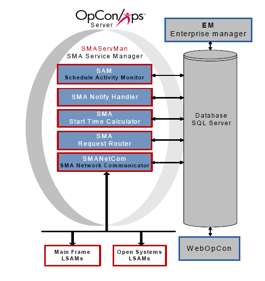
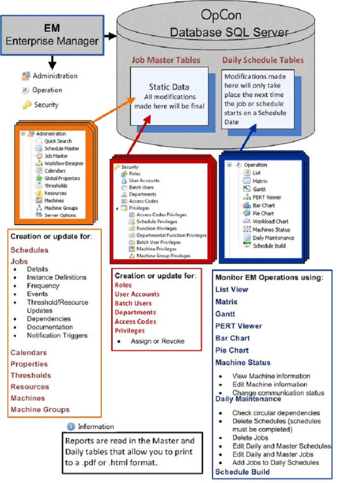

# Getting Started with OpCon

**Theme:** Overview  
**Who Is It For?** System Administrator, Automation Engineer

## What Is It?

OpCon Server components include the database, Schedule Activity Monitor (SAM), and supporting services. Desktop clients on user workstations connect to the database, while web-based interfaces connect to web services to manage automation data. Agents that run jobs are called Local Schedule Activity Monitors (LSAMs).

## OpCon Architecture Overview

## OpCon Components

### Graphical User Interfaces

OpCon provides two primary graphical user interfaces:

- **Enterprise Manager (EM)** – a rich client for Windows and Linux
- **Solution Manager** – a browser-based interface

Both interfaces access the OpCon database to manage automation data and operations. For more information, refer to the **Enterprise Manager** and **Solution Manager** online help.

### Database

The OpCon database runs on Microsoft SQL Server on Windows Server. It stores all automation requirements, operational processing, and historical information. For more information, refer to **Database Information** online help.

#### Auditing

All changes to OpCon objects are audited. The following information is recorded for every change:

- **Date**: Timestamp of the change
- **User**: The user or application that made the change
  - OpCon user accounts are recorded by account name
  - OpCon applications appear with an asterisk prefix (e.g., SAM entries use **\*SMASAM**)
  - Changes by unregistered applications are recorded under **Unknown**
- **Data Changed**: The name of the changed item
- **Original Value**: The value before the change
- **Final Value**: The value after the change
- **Category**: The OpCon object category affected
- **Name**: The exact item affected (e.g., when Data Changed shows "Job Record," Name shows the job name such as ScheduleABC:Job299)

:::info
For viewing audit records, refer to [Viewing and Exporting Audit Records](./Files/UI/Enterprise-Manager/Viewing-and-Exporting-Audit-Records.md) in the **Enterprise Manager** online help.

For cleaning up old audit records, refer to [Audit History Cleanup](./utilities/Command-line-Utilities/Audit-History-Cleanup.md) in the **Utilities** online help.
:::

### SAM and Supporting Services (SAM-SS)

SAM-SS manages all automation processing. For more information, refer to the [Server Programs](./server-programs/introduction.md) online help.

#### Schedule Activity Monitor (SAM)

SAM is the logical processor for OpCon workflow automation. It monitors schedule and job start times, dependencies, and user commands to determine job execution timing. SAM also processes OpCon events and communicates job and event information with agents via SMANetCom. For more information, refer to [Schedule Activity Monitor (SAM)](./server-programs/schedule-activity-monitor.md).

#### SMA Network Communications Module (SMANetCom)

SMANetCom handles communication of platform-specific automation information between SAM and all agents via TCP/IP. SAM and SMANetCom use database tables to maintain reliable communication and data integrity. For more information, refer to [SMA Network Communications Module (SMANetCom)](./server-programs/network-communications.md).

#### SMA Notify Handler

SMA Notify Handler processes notifications triggered by Machine, Schedule, and Job status changes. It can send emails, text messages, Windows Event Log entries, SNMP traps, and other notifications. For more information, refer to [SMA Notify Handler](./server-programs/notify-handler.md).

#### SMA Request Router

SMA Request Router sends requests to designated Request Handlers and writes completion information back to the OpCon database. Request Handlers manage tasks such as schedule maintenance and job output retrieval. For more information, refer to [SMA Request Router](./server-programs/request-router.md).

#### SMA Start Time Calculator

SMA Start Time Calculator periodically recalculates estimated start times for all jobs in the OpCon daily tables and updates the database. For more information, refer to [SMA Start Time Calculator](./server-programs/start-time-calculator.md).

### Local Schedule Activity Monitors (LSAMs)

agents are agents installed on the platforms where jobs run. Written in the native language of their platforms, they communicate with SMANetCom via TCP/IP. OpCon supports the following job types:

- [BIS](./job-types/bis.md)
- [Container](./job-types/container.md)
- [File Transfer](./job-types/file-transfer.md)
- [IBM i](./job-types/ibm-i.md)
- [MCP](./job-types/mcp.md)
- [Null](./job-types/null.md)
- [OS2200](./job-types/os-2200.md)
- [SAP BW](./job-types/sap-bw.md)
- [SAP R/3 and CRM](./job-types/sap.md)
- [SQL](./job-types/sql.md)
- [Tuxedo ART](./job-types/tuxedo-art.md)
- [UNIX](./job-types/unix.md)
- [Windows](./job-types/windows.md)
- [z/OS](./job-types/zos.md)

## FAQs

**Q: What are the core components of OpCon?**

OpCon consists of the database (Microsoft SQL Server), the SAM and Supporting Services (SAM-SS), graphical user interfaces (Enterprise Manager and Solution Manager), and Local Schedule Activity Monitors (LSAMs) installed on each platform where jobs run.

**Q: What is the difference between SAM and SMANetCom?**

SAM (Schedule Activity Monitor) is the logical processor that determines when jobs qualify to run and processes OpCon events. SMANetCom handles the actual TCP/IP communication between SAM and the agents on target machines.

**Q: Are all changes to OpCon objects audited?**

Yes. All changes to OpCon objects are automatically audited, recording the timestamp, the user or application that made the change, the item changed, and both the original and final values.

## Glossary

**SMANetCom (SMA Network Communications Module)**: Handles TCP/IP communication of platform-specific automation information between SAM and all agents. Uses database tables to maintain reliable communication and data integrity.

**SMA Notify Handler**: Processes notifications triggered by Machine, Schedule, and Job status changes. Can send emails, text messages, Windows Event Log entries, SNMP traps, and SPO notifications.

**SMA Request Router**: Sends requests to designated Request Handlers and writes completion information back to the OpCon database. Manages tasks such as schedule maintenance and job output retrieval.

**SMA Start Time Calculator**: Periodically recalculates estimated start times for all jobs in the OpCon daily tables and updates the database to keep start time estimates current.

**SAM-SS (SAM and Supporting Services)**: The collective term for the OpCon server-side processing programs: SAM, SMANetCom, SMA Notify Handler, SMA Request Router, and SMA Start Time Calculator.

**SAM (Schedule Activity Monitor)**: The logical processor for OpCon workflow automation. SAM monitors schedule and job start times, dependencies, and user commands to determine job execution timing, and processes OpCon events.

**Enterprise Manager (EM)**: OpCon's rich client graphical user interface for Windows and Linux, used to define schedules and jobs, manage automation data, and perform operational tasks.

**Solution Manager**: OpCon's browser-based graphical user interface for managing automation data, performing operational actions, and administering the system.
