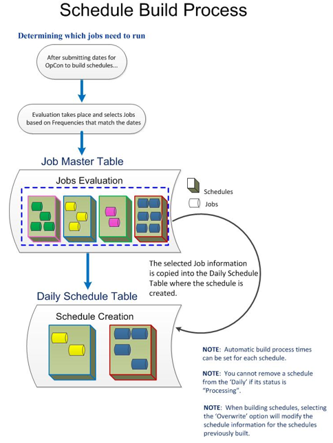

# Building Daily Schedules

**Theme:** Build  
**Who Is It For?** Operations Staff, System Administrator

## What Is It?

Building Daily schedules copies qualifying Master schedules and jobs for specified dates into the active Daily processing tables for SAM. Build schedules before their start times to allow dependencies to resolve.

:::note
If building a schedule for a past date or a date range starting in the past, OpCon automatically places the schedule On Hold for those dates.
:::

When defining schedules to build, you can:

- Set a date range
- Choose whether to overwrite schedules already in the Daily tables
  - Schedules currently processing cannot be overwritten
  - *Multi-Instance* schedules are never overwritten; each build creates a new instance
- Set specific property definitions for each schedule instance. If not supplied, OpCon builds all defined instances automatically
- For schedules with no defined instances, enter property definitions in the format:

  ```shell
  PName1=PValue1;PName2=PValue2…
  ```

  For more information, refer to [Properties](../objects/properties.md).
- In the graphical interface, for schedules configured to build an instance per machine in a machine group, select a specific machine
- In the graphical interface, for schedules with predefined user property instances or named instances, select the instance and enter property definitions in the same format



All schedule build processing is managed by SMASchedMan on the OpCon server. Refer to [SMASchedMan](../server-programs/request-router.md#smasched) in the **Server Programs** online help.

Daily schedules can be built using the following methods:

- **Automatic**: When automatic schedule maintenance is configured, SAM builds Daily schedules automatically. Refer to [Schedule Maintenance](../objects/schedules.md#schedule-maintenance)
- **Automated via events or utilities**: Use [Schedule-Related Events](../events/types.md#schedule) or the [DoBatch](../utilities/Command-line-Utilities/DoBatch.md) utility
- **Failure handling**: If an automatic build fails, SAM processes events on the SMA_SKD_BUILD job. Refer to [SMA_SKD Jobs on the AdHoc Schedule](../objects/schedules.md#adhoc-schedule)
- **Manual**: Request builds through the graphical interfaces

## Configuration Options

| Setting | What It Does | Default | Notes |
|---|---|---|---|
| Automatic | When automatic schedule maintenance is configured, SAM builds Daily schedules automatically. | — | — |
| Automated via events or utilities | Use Schedule-Related Events or the DoBatch utility | — | — |
| Failure handling | If an automatic build fails, SAM processes events on the SMA_SKD_BUILD job. | — | — |
| Manual | Request builds through the graphical interfaces | — | — |
## Operations

### Common Tasks
- Build schedules before their start times to allow dependencies to resolve before jobs become eligible to run.
- If building for a past date or a date range starting in the past, OpCon automatically places those schedule instances On Hold; they must be manually released before they will process.
- Use automatic schedule maintenance to have SAM build Daily schedules automatically; if an automatic build fails, SAM processes events on the `SMA_SKD_BUILD` job on the AdHoc schedule.
- Schedules currently In Process cannot be overwritten during a build; Multi-Instance schedules are never overwritten — each new build creates a new instance.

### Alerts and Log Files
- Build processing is managed by SMASchedMan on the OpCon server; if an automatic build fails and was started by an OpCon Event, the SAM processes events on the `SMA_SKD_BUILD` job on the AdHoc schedule.

## FAQs

**Q: What does building a Daily Schedule do?**

Building a Daily Schedule copies qualifying Master schedules and jobs for specified dates into the active Daily processing tables, making them available for the SAM to process.

**Q: What happens if I build a schedule for a past date?**

OpCon automatically places the schedule On Hold for any past dates. The schedule will not run until it is manually released.

**Q: Can a schedule that is currently processing be overwritten during a build?**

No. Schedules currently In Process cannot be overwritten. Multi-Instance schedules are also never overwritten — each new build creates an additional instance.

**Q: Can schedule builds be automated?**

Yes. Builds can be triggered automatically through schedule maintenance settings, via Schedule-Related Events, using the DoBatch utility, or configured through automatic schedule maintenance on individual schedule definitions.

## Glossary

**SAM (Schedule Activity Monitor)**: The logical processor for OpCon workflow automation. SAM monitors schedule and job start times, dependencies, and user commands to determine job execution timing, and processes OpCon events.

**Daily Tables**: The OpCon database tables that hold the active, date-specific instances of schedules and jobs built for execution. Changes to daily tables affect only the current day's automation.

**Resource**: A numeric variable in OpCon representing a finite pool. Jobs can be configured to require a set number of resource units to run, limiting concurrent executions and preventing resource contention.

**Machine**: A platform defined in the OpCon database that has an agent installed. OpCon routes job execution requests to machines via SMANetCom, and machines report job completion status back to SAM.

**Schedule**: A named container for jobs in OpCon, built for a specific date to create that day's automation. Schedules define build settings, frequencies, and the jobs that run within them.

**Job**: The fundamental unit of work in OpCon. A job defines what to run, on which machine, when to start, and what conditions must be met. Job results are tracked and can trigger events and notifications.

**OpCon**: Continuous' workflow automation platform. The OpCon server includes the database, SAM and Supporting Services (SAM-SS), and graphical user interfaces. agents installed on target platforms run jobs and report results.
