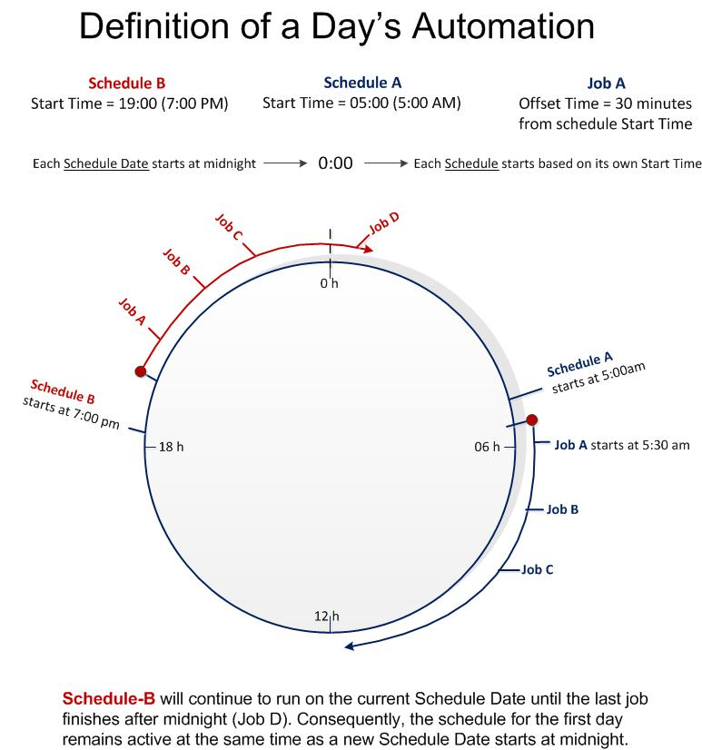

# Schedule Dates and Automation

**Theme:** Configure  
**Who Is It For?** Operations Staff, System Administrator

## What Is It?

When schedules are built for a schedule date, all schedule and job information is analyzed together to create a day's automation.

## Configuration Options

| Setting | What It Does | Default | Notes |
|---|---|---|---|
## FAQs

**Q: What happens when a schedule is built for a schedule date?**

When schedules are built for a schedule date, all schedule and job information is analyzed together to create that day's complete automation. The result is a fully resolved set of jobs and dependencies for that date.

## Glossary

**Resource**: A numeric variable in OpCon representing a finite pool. Jobs can be configured to require a set number of resource units to run, limiting concurrent executions and preventing resource contention.

**Schedule**: A named container for jobs in OpCon, built for a specific date to create that day's automation. Schedules define build settings, frequencies, and the jobs that run within them.

**Job**: The fundamental unit of work in OpCon. A job defines what to run, on which machine, when to start, and what conditions must be met. Job results are tracked and can trigger events and notifications.
