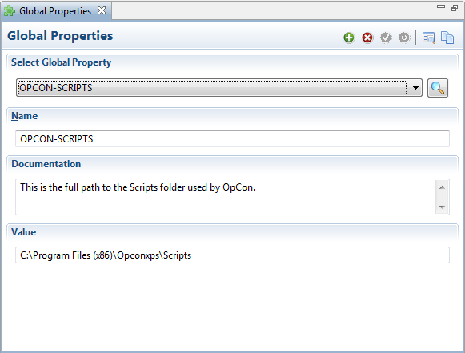

# Best Practices

**Theme:** Configure  
**Who Is It For?** Automation Engineer, Business Analyst

## What Is It?

OpCon best practices are proven patterns for building reliable, maintainable automation — from documenting thresholds and properties to setting up automated maintenance schedules, configuring alerts, and structuring job dependencies effectively.

- [Add Documentation to Thresholds and Properties](#Add)
- [Automate the Daily Failed Jobs Report](#Automate)
- [Automate the SMAUtility Schedule to maintain the OpCon Server](#Automate2)
- [Avoid updating all Jobs with a new path to a file or program](#Avoid)
- [Check Job Dependencies that cannot be resolved](#Check)
- [Receive an alert when Machines stop working](#Receive)
- [Receive an alert when SAM is not running](#Receive2)
- [Run a Windows Job under a different User Account](#Run)
- [Set Up Notification for SubSchedules](#Set)
- [Shut Down a Machine with an agent](#Shut)
- [Use Threshold Dependencies for Late to Start Notifications on a Job-dependent External Event](#Use)

## Add Documentation to Thresholds and Properties

#### Use Case

Thresholds and Global Properties are accumulating in OpCon, and there is a risk of forgetting their purpose. What should be done?

#### Answer

In the definition for each Threshold and Global Property, enter the purpose in the **Documentation** field to track usage.

## Automate the Daily Failed Jobs Report

#### Use Case

How can failed job reports be automated on a daily, weekly, or monthly basis?

#### Answer

Continuous provides **SMAReports.mdb**, a database file importable into OpCon. It includes a **Report Generator** schedule with all reports found under **Report Functions**. Each job represents a report that can be automated.

##### Procedure

1. Open **Schedule Import Export**: **Start > Programs > OpConxps Utilities > Schedule Import Export**. For more information, refer to [Schedule Import/Export](../utilities/Graphical-Utilities/Schedule-Import_Export.md)
2. Log into your **OpCon database**
3. Create a **DSN** for an Access Database to **SMAReports.mdb** at `\\Program Files\\OpConxps\\Utilities\\SMAReports.mdb`
4. Select the **Import from Transport Database** button on the toolbar
5. Select the **Machine** or **User** tab
6. In the left frame, select a **machine** or **user account**
7. In the right frame, select a **machine** or **user name**
8. Select the **Import** button
9. Select **OK** on the warning message

10. Select one of the following options in the **Conflict Resolution** dialog:
    - **Yes** to clear the existing object and receive new information
    - **No** to merge new information into the existing object
    - **Cancel** to terminate the transfer and roll back all changes
11. Select **OK** on the termination message
12. Log into the Enterprise Manager and go to **Job Master > Report Generator Schedule > Failed Jobs by date**

:::note
By default, all of these jobs are disabled.
:::

13. This job runs a report against OpCon's today's date **(\[\[$SCHEDULE DATEMS\]\])** for the schedule it resides in **(\[\[$SCHEDULE ID\]\])**

14. Copy the **Failed Jobs by Date** job to any schedule where the report is needed
15. Add a **frequency** to the job (e.g., Daily)

:::note
Ensure the job is included in built schedules already existing for the future.
:::

By default, reports are saved in: `<Output Directory>\SAM\Log\Reports`. This directory can be changed in the **FailedJobsbyDate.cmd** file.

:::note
Ensure the job has write access to the target directory. The Output Directory was configured during installation. For more information, refer to [File Locations](../file-locations.md).
:::

## Automate the SMAUtility Schedule to maintain the OpCon Server

#### Use Case

History records are building up on the OpCon server and database. What should be done?

#### Answer

Use the SMAUtility schedule for maintenance jobs, including managing history records. Configure as many **SMAUtility Schedule** jobs as possible. The schedule is imported during installation. For more information, refer to [SMAUtility Schedule](../objects/schedules.md#smautility-schedule).

## Avoid updating all Jobs with a new path to a file or program

#### Use Case

When the company reorganizes its file structure, programs move to different directories. How can jobs be defined to easily update program locations?

#### Answer

Use OpCon Properties to store program paths. Use a token as a variable to replace the path at run time. For more information, refer to [Properties](../objects/properties.md).

1. Create a Global Property for the full path to your programs. For more information, refer to [Adding Global Properties](../Files/UI/Enterprise-Manager/Adding-Global-Properties.md)
2. Use a token to access the Global Property in job definitions. For more information, refer to [Using Properties for Automation](../objects/using-properties.md). In the example below, `[[OPCON-SCRIPTS]]` replaces the path to the `FileRename.cmd` file

Global Properties

OpCon Job Master (Details)

")

#### Result

When the job runs, SAM resolves `[[OPCON-SCRIPTS]]` to the Global Property value:

`"C:\Program Files (x86)\OpConxps\Scripts\MyScript.cmd"`

To update all jobs when the file structure changes, update the Global Property value.

## Check Job Dependencies that cannot be resolved

#### Use Case

Circular dependencies or missing required jobs can cause resolution failures. How are these identified?

#### Answer

Run the DoBatch function with the CHECK parameter to identify these dependency types, limiting checks to 5 schedules per job at a time. Refer to [DoBatch](../utilities/Command-line-Utilities/DoBatch.md#DoBatch) and [Checking](../utilities/Command-line-Utilities/DoBatch.md#Checking) in the Utilities online help.

## Receive an alert when Machines stop working

#### Use Case

How will I know when machines are no longer working?

#### Answer

Use the Event Notification system in OpCon. Machine status change events can trigger notifications. Refer to [Monitored Events](../job-types/zos.md#monitored-events).

## Receive an alert when SAM is not running

#### Use Case

How will I know when SAM is not running?

#### Answer

Configure the "Hung" scripts in the SAM folder. For more information, refer to [Hung Script Configuration](../server-programs/service-manager.md#Hung_Script_Configuration).

## Run a Windows Job under a different User Account

#### Use Case

How do I run a job under a different Windows User account when **Use Service Account** is the only option in the list?

#### Answer

Define a Batch User Account for the Windows User Account. The new Batch User will appear in the list in the job definition screen. Refer to [Adding Batch Users](../Files/UI/Enterprise-Manager/Adding-Batch-Users.md).

## Set Up Notification for SubSchedules

#### Use Case

How do I ensure a subschedule started on time?

#### Answer

Jobs within a subschedule do not qualify until the Container job starts. Set up a "Flag As Late to Start" notification on the Container job to confirm the subschedule starts on time.

##### Procedure

1. Set a Late to Start value for the Container job. Refer to the **Late to Start** value under [Job Automation Components](../job-components/frequency.md)
2. Set up ENS to include the Container job in a group that sends Late to Start notifications. Refer to [Event Notification](../notifications/Components.md)
3. Set a Late to Start value for jobs in the subschedule. Refer to the **Late to Start** value under [Job Automation Components](../job-components/frequency.md)
4. Set up ENS to include subschedule jobs in a group that sends Late to Start notifications. Refer to [Event Notification](../notifications/Components.md)

## Shut Down a Machine with an agent

#### Use Case

A machine with an agent needs to be shut down for maintenance. What steps are required in OpCon?

#### Answer

Plan the shutdown during a period of low processing.

1. In OpCon, disable Job Starts for the machine from any interface that controls Machine Status

2. In an Operations Machine view, monitor the running job count (e.g., 3/10). Wait until the count reaches zero (e.g., 0/10)
3. On the agent machine, check for running jobs:
   a. IBM i: refer to [IBM i Procedures to shut down a Machine](#IBM_i_Procedures_to_shut_down_a_Machine).
   b. MCP: the Enterprise Manager count should be accurate. To confirm from the agent, refer to [Interactive agent Window](https://help.smatechnologies.com/opcon/agents/mcp/latest/Files/Agents/MCP/Interactive-agent-Window.md).
   c. MSLSAM: refer to [Check for Running Jobs](https://help.smatechnologies.com/opcon/agents/windows/latest/Files/Agents/Microsoft/Upgrading-from-a-Release-Prior-to-15.0.md#Check_for_Running_Jobs).
   d. OpenVMS: use the method in Step 2.
   e. OS 2200 and BIS: use the method in Step 2.
   f. SAP BW: refer to [Check for Running Jobs](https://help.smatechnologies.com/opcon/agents/sapbw/latest/Files/Agents/SAP-BW/Upgrade-Installation.md#Check_for_Running_Jobs).
   g. SAP R3 and CRM: refer to [Check for Running Jobs](https://help.smatechnologies.com/opcon/agents/sap/latest/Files/Agents/SAP/Upgrade-Installation.md#Check_for_Running_Jobs).
   h. UNIX: use the method in Step 2.
   i. zOS: enter `F lsamname,DISP=JOBQ`.
4. Shut down the agent and perform maintenance:
   a. IBM i: refer to [IBM i Procedures to shut down a Machine](#IBM_i_Procedures_to_shut_down_a_Machine).
   b. MCP: refer to [Stop the agent and Resource Monitor](https://help.smatechnologies.com/opcon/agents/mcp/latest/Files/Agents/MCP/Automated-Installation-Upgrade.md#Stop_the_LSAM_and_Resource_Monitor).
   c. MSLSAM: refer to [Stop the Service](https://help.smatechnologies.com/opcon/agents/windows/latest/Files/Agents/Microsoft/Upgrading-from-a-Release-Prior-to-15.0.md#Stop_the_Service).
   d. OpenVMS: refer to [Stopping the agent](https://help.smatechnologies.com/opcon/agents/openvms/latest/Files/Agents/OpenVMS/Starting-and-Stopping-the-agent.md#Stopping_the_LSAM).
   e. OS 2200 and BIS: refer to [Stopping the agent/LMAM](https://help.smatechnologies.com/opcon/agents/os2200/latest/Files/Agents/OS-2200/Components-and-Operation.md#Stopping_the_LSAM/LMAM).
   f. SAP BW: refer to [Stop the Service](https://help.smatechnologies.com/opcon/agents/sapbw/latest/Files/Agents/SAP-BW/Upgrade-Installation.md#Stop_the_Service).
   g. SAP R3 and CRM: refer to [Stop the Service](https://help.smatechnologies.com/opcon/agents/sap/latest/Files/Agents/SAP/Upgrade-Installation.md#Stop_the_Service).
   h. UNIX: refer to [Stop the agent](https://help.smatechnologies.com/opcon/agents/unix/latest/Files/Agents/UNIX/Operating-the-agent.md#Stop_the_LSAM).
   i. zOS: enter `F lsamname,SHUTDOWN`.
5. Restart the machine and check agent status:
   a. IBM i: refer to [IBM i Procedures to shut down a Machine](#IBM_i_Procedures_to_shut_down_a_Machine).
   b. MCP: from the MARC Main Menu action line, enter `AA NAME=SMA=` and transmit. Refer to [Check agent Status](https://help.smatechnologies.com/opcon/agents/mcp/latest/Files/Agents/MCP/agent-Operation.md#Checking_LSAM_Status).
   c. MSLSAM: refer to [Procedures to Check agent Status on Windows](#Procedures_to_Check_LSAM_Status_on_Windows).
   d. OpenVMS: refer to [Checking agent Status](https://help.smatechnologies.com/opcon/agents/openvms/latest/Files/Agents/OpenVMS/Starting-and-Stopping-the-agent.md#Checking_LSAM_Status).
   e. OS 2200 and BIS: refer to [Checking agent/LMAM Status](https://help.smatechnologies.com/opcon/agents/os2200/latest/Files/Agents/OS-2200/Components-and-Operation.md#Checking_LSAM/LMAM_Status).
   f. SAP BW: refer to [Procedures to Check agent Status on Windows](#Procedures_to_Check_LSAM_Status_on_Windows).
   g. SAP R3 and CRM: refer to [Procedures to Check agent Status on Windows](#Procedures_to_Check_LSAM_Status_on_Windows).
   h. UNIX: refer to [Check the agent Status](https://help.smatechnologies.com/opcon/agents/unix/latest/Files/Agents/UNIX/Operating-the-agent.md#Check_the_LSAM_Status).
   i. zOS: enter `D A,job` (where `job` is the agent job name, not the lsamname identifier; include a comma between `D A` and `job`).
6. In OpCon, enable Job Starts for the machine from any interface that controls Machine Status

IBM i Procedures to shut down a Machine

On the IBM i LSAM machine, check for running jobs using one of these methods:

Using an OpCon job, specify the following command in the CALL field:

`SMAGPL/CHKIBMLSAM ENV(env_name) STATUS(*ACTIVE)` **- or -**

`SMAGPL/CHKIBMLSAM ENV(env_name) STATUS(*INACTIVE)`

The job reports failure if the agent server status does not match the STATUS parameter, or ends normally if it does. The agent environment name is required for the ENV keyword.

From an IBM i workstation, enter the agent main menu:

i. Select option 6: agent Management menu.
ii. Select option 3: Check agent subsystem status.
iii. The display shows active jobs or confirms no jobs are active.

To shut down the agent and perform maintenance:

From an IBM i command entry line or IBM System i Navigator, stop agent server jobs with: `SMAGPL/ENDSMASYS ENV(env_name)`

From an IBM i workstation, enter the agent main menu:

i. Select option 6: agent Management menu.
ii. Select option 2: End agent.

To restart the IBM i LSAM machine:

From an IBM i command entry line or IBM System i Navigator, start agent server jobs with: `SMAGPL/STRSMASYS ENV(env_name)`

From an IBM i workstation, enter the agent main menu:

i. Select option 6: agent Management menu.
ii. Select option 1: Start agent.

Check the IBM i LSAM status using the same procedures as the check steps above.

##### Procedures to Check agent Status on Windows

Use this procedure for SAP BW, SAP R/3 and CRM, and Windows LSAMs:

1. Go to **Start > Control Panel**
2. Select **Administrative Tools**
3. Select **Server Manager**
4. Expand **Configuration**
5. Select **Services**
6. Scroll to the SMA **LSAM service** in the **Services** list
7. Confirm the **LSAM Status** is **Started**

## Use Threshold Dependencies for Late to Start Notifications on a Job-dependent External Event

#### Use Case

A job depends on a file arriving. It is built 'On Hold', and SMA Resource Monitor sends a `$JOB:RELEASE` when the file arrives. How can a Late to Start notification be configured?

#### Answer

A job set to 'On Hold' is not in a "Qualifying" status, so the "Flag Job As Late" setting is ignored. Use a **threshold dependency** instead to release the job when the file arrives.

##### Procedure Explanation

A threshold acts as an "On/Off" switch for the job. [SMA Resource Monitor](../utilities/SMA-Resource-Monitor/Introduction.md) watches for the file and sends a `$THRESHOLD:SET` event to update the threshold. The job has a threshold dependency equal to the value set when the file arrives, keeping the job in "Waiting Threshold Dependency" status until then.

A "Flag Job As Late to Start" value causes ENS to send a notification if the file has not arrived by the set time. Once the job completes, it resets the threshold to zero for the next day.

##### Procedure

1. Create a **threshold** with a default value of zero (0). Refer to [Adding Thresholds](../Files/UI/Enterprise-Manager/Adding-Thresholds.md)
2. Create the **File Monitor** and **action group** to update the threshold. Refer to [Summary Information](../utilities/SMA-Resource-Monitor/Summary-Information.md)
   a. In the File Monitor, configure parameters to watch for the target file.
   b. In the action group, use the `$THRESHOLD:SET` event to set the threshold value to one (1).
3. Create a **threshold dependency** requiring the threshold to equal one (1). Refer to [Adding Threshold/Resource Dependencies](../Files/UI/Enterprise-Manager/Adding-Threshold-and-Resource-Dependencies.md)
4. Set a **Late to Start** value for the job. Refer to [Late to Start/Late to Finish](../job-components/frequency.md#Late)
5. Set up a notification event on the job for the Late to Start status trigger, or configure an ENS group to send notifications for the Late to Start status. Refer to [Job Automation Components](../job-components/events.md) or [Using Notification Manager](../Files/UI/Enterprise-Manager/Using-Notification-Manager.md)
6. Configure a threshold update to reset the threshold to zero (0) when the job finishes. Refer to [Adding Threshold/Resource Updates](../Files/UI/Enterprise-Manager/Adding-Threshold-and-Resource-Updates.md)

## Configuration Options

| Setting | What It Does | Default | Notes |
|---|---|---|---|
## FAQs

**Q: How should you handle jobs that need to avoid being affected by path changes?**

Use OpCon Global Properties to store program paths and reference them via tokens in job definitions. When the path changes, update the Global Property value and all jobs using that token will automatically pick up the new path.

**Q: How do you safely shut down a machine running an agent?**

Disable Job Starts for the machine in OpCon, wait for the running job count to reach zero, verify no jobs are running on the agent itself, then shut down the agent. After maintenance, restart the agent and re-enable Job Starts in OpCon.

**Q: Why does "Late to Start" not work on a job built On Hold?**

A job in On Hold status is not in a Qualifying status, so the "Flag Job As Late" setting is ignored. Use a threshold dependency instead — the job waits in "Waiting Threshold Dependency" status, and the Late to Start value triggers a notification if the threshold is not set by the configured time.

## Glossary

**DSN (Data Source Name)**: An ODBC connection identifier that stores database connection parameters. OpCon utilities use system DSNs to connect to the OpCon SQL Server database.

**SMA Resource Monitor (SMARM)**: A Windows service that monitors files, counters, services, and processes on Windows machines. When a monitored condition is met, it sends OpCon events to trigger automation actions.

**SMAUtility Schedule**: A pre-built OpCon schedule installed during setup that contains standard maintenance jobs for audit history cleanup, job history cleanup, and BIRT report generation.

**SAM (Schedule Activity Monitor)**: The logical processor for OpCon workflow automation. SAM monitors schedule and job start times, dependencies, and user commands to determine job execution timing, and processes OpCon events.

**LSAM (Local Schedule Activity Monitor)**: An agent installed on a target platform that runs jobs in the native language of that platform and communicates results back to SAM via SMANetCom over TCP/IP.

**Enterprise Manager (EM)**: OpCon's rich client graphical user interface for Windows and Linux, used to define schedules and jobs, manage automation data, and perform operational tasks.

**Subschedule**: A schedule that runs as a child process within a Container job, allowing hierarchical, nested workflow automation where a parent schedule can trigger and monitor an entire child schedule.

**Container Job**: A job type that runs a subschedule. Container jobs enable hierarchical schedule structures and support properties and events just like standard jobs.
