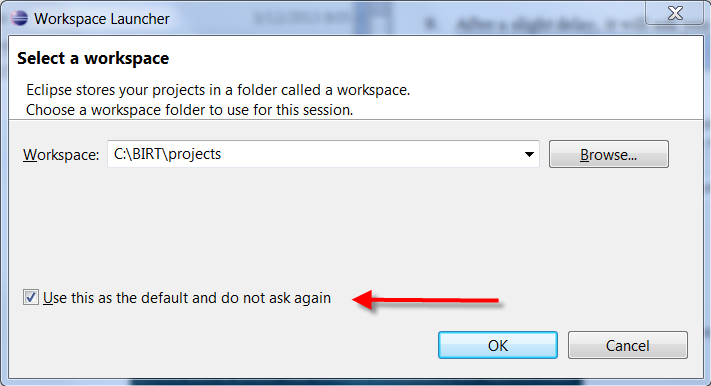
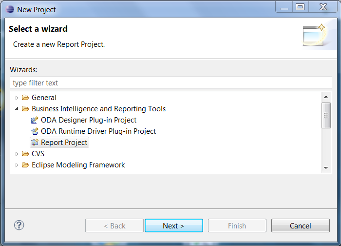
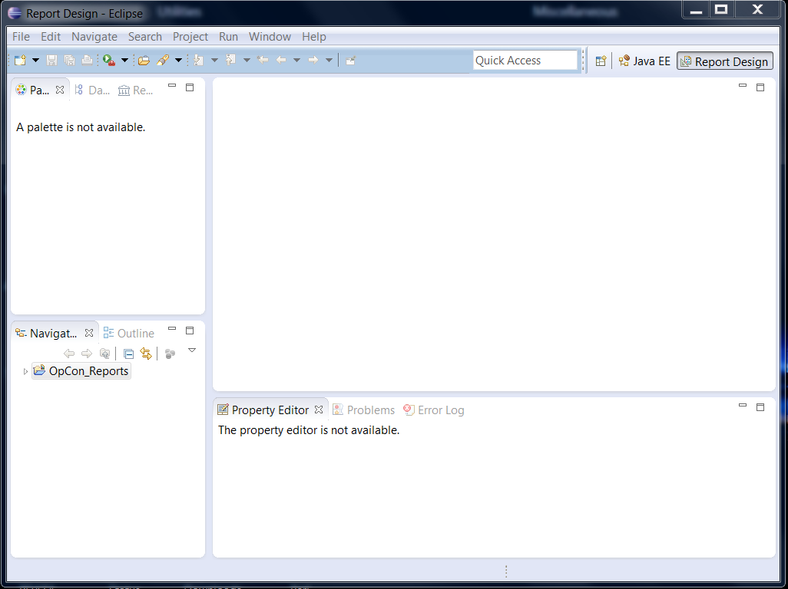
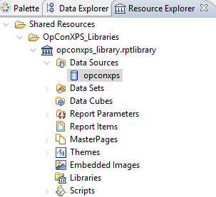
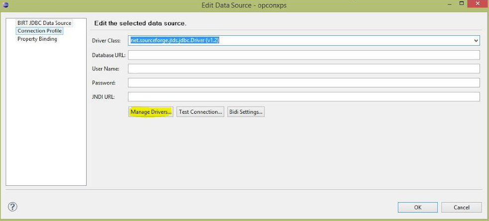
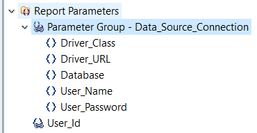

# Custom Reports

**Theme:** Configure  
**Who Is It For?** Business Analyst, Operations Staff

## What Is It?

Custom reports in OpCon are built using the BIRT (Business Intelligence and Reporting Tools) framework. Administrators can edit the Continuous-supplied BIRT reports or create entirely new ones to meet specific reporting requirements.

## Introduction

This guide explains how to set up an environment for editing Continuous-supplied BIRT reports or creating custom ones.

## Install the Environment

1. Create a *BIRT directory* to hold the environment. This should be a
    complete, standalone directory structure containing everything
    needed for report modification.

2. Create a *projects directory* under the *BIRT directory*

3. Locate the **jtds-1.2.5.jar** file and copy it to the *BIRT
    directory*.

4. Download **BIRT** for the correct environment from [http://archive.eclipse.org/birt/downloads/build.php?build=R-R1-3_7_1-201109131734](http://archive.eclipse.org/birt/downloads/build.php?build=R-R1-3_7_1-201109131734).

5. Move the *downloaded file* to the *BIRT directory*

6. Extract the *zip file* to the *BIRT directory*. The directory
    structure should look similar to the following:

7. Go to the **eclipse** sub-directory and select the
    **eclipse.exe** file to run the program.

8. Browse to the *projects directory* created earlier

9. Select the **Use this as the default and do not ask again**
    option.

    

To install the Environment, complete the following steps:

10. Open after setting the workspace

11. Use menu path **File\> New \> Project** to create the
    **OpCon_Reports** project. A wizard will display allowing you to
    select the project type.

12. Expand the **Business Intelligence and Reporting Tools** folder

13. Select **Report Project**

    


14. Select **Next**

15. Enter **OpCon_Reports** in the **Project name** field. Leave **Use
    default location** selected.


16. Select **Finish**

17. Select **Remember my decision** when asked if you want to open the
    **Report Designer perspective**.

18. Select **Yes**

19. Select on the **x** to the right of the **Welcome** tab to close the
    Welcome screen (if displayed).

20. The resulting screen should look similar to the following:

    

## Install the SMA Reports

1. Use menu path: **File \> Import\...**. The **Import** wizard will
    start.
To install the SMA Reports, complete the following steps:

2. Expand the **General** folder
3. Select **File System**
4. Select **Next**
5. Browse to the *reports sub-directory* under the Enterprise Manager
    directory.
6. Select the **reports** folder to include all of the sub-directories
7. Select **OK**
8. Select the **reports** folder option
9. Enter **OpCon_Reports** in the **Into folder** field (if empty)
10. Select **Finish**

Now you can edit SMA Reports or create your own.

## Create a New Report

To create a New Report, complete the following steps:

1. Right-click on **OpConXPS_Reports**

2. Use menu path: **New \> Report**

3. Enter a *file name*

4. Select **Finish**

5. Go to the **OpConXPS_Libraries** folder

6. Use path: **opconxps_library.rptlibrary \> data sources \>
    opconxps**.

    Resource Explorer

    


7. Right-click on **opconxps** and add it to the report

8. Go to the **Data Explorer** tab

9. Select on **opconxps** under **Data Sources**

10. Enter **net.sourceforge.jtds.jdbs.Driver(v1.2)** in the **Driver
    Class** field to connect to BIRT.

    Edit Data Source

    

11. Select **Manage Drivers**

12. Select the **Add\...** button

13. Go to the *BIRT directory* to add the **jtds-1.2.5.jar** file

14. Select **OK**

## Import the Database Connection Parameters

To connect to the database, import these two parameters:

- **Parameter Group -- Data_Source_Connection**: Database connection
- **User_Id**: Grants and filters privilege access in the report query

1. Use path: **Shared Resources \> OpConXPS_Libraries \>
    opconxps_library.rptlibrary \> Report Parameters**.
To import the Database Connection Parameters, complete the following steps:

2. Expand the **Report Parameters** folder
3. Right-click on **Parameter Group - Data_Source_Connection** and
    select **Add to report**.
4. Right-click on **User-Id** and select **Add to report**

In the workplace section, you should see the following:

Report Parameters



Modify the parameters to connect the report to your database:

**Driver_Class**: Always `net.sourceforge.jtds.jdbc.Driver`.

**Driver_URL**: Database URL in the format required by the driver.

:::tip Example
The format for a MySQL database is the following:

```shell
jdbc:mysql://<host>:<port>/<database>
```

:::

- Replace the server name and port in the URL to match your environment (e.g., `jdbc:jtds:sqlserver://servername/databasename`)
- For a SQL instance, append `;instance=<instance name>` to the URL

**Database**: Database name; default is `opconxps`.

**User_Name** and **User_Password**: Database login credentials.

After editing the report, copy the report from the OpConXPS_Reports
folder, e.g., C:\\BIRT\\projects\\OpCon_Reports\\OpConXPS_Reports, to
the reports sub-directory under the Enterprise Manager directory, e.g.,
C:\\Program Files\\OpConxps\\EnterpriseManager
x64\\reports\\OpConXPS_Reports.

## Schedule the New Reports

To schedule the New Reports, complete the following steps:

1. Add the *report(s)* to the path: **<OpCon Install
    Folder\>\\SAM\\BIRT\\ReportEngine\\OpConXPS_Reports**.
2. Create or use an existing **Schedule** in the Enterprise Manager
3. Create a **Windows** job with the *report name* as the *job name*
4. Select the Windows **Primary Machine**
5. Select **Run Program** in the **Job Action** menu
6. Select **Use Service Account** in the **User Id** menu

7. Enter **\[\[SMAOpConPath\]\]\\Utilities\\BIRTRptGen.exe** followed     by the *report name* as **-rReportName** in the **Command Line**
    field.
8. *(Optional)* Add parameters after the report name
    using the following format: **-pParameterName=ParameterValue**.
9. Enter **\[\[SMAOpConPath\]\]\\Utilities\\** in the **Working     Directory** field

10. Enter a *frequency*
11. Build the **job**

## Configuration Options

| Setting | What It Does | Default | Notes |
|---|---|---|---|
| Parameter Group -- Data_Source_Connection | Database connection | — | — |
| User_Id | Grants and filters privilege access in the report query | — | — |
| Driver_Class | Always `net.sourceforge.jtds.jdbc.Driver` | — | — |
| Driver_URL | Database URL in the format required by the driver | — | — |
| Database | Database name; default is `opconxps` | `opconxps` | — |
## FAQs

**Q: What tool is used to create or edit OpCon custom reports?**

Custom reports are created or edited using the BIRT Report Designer (Eclipse BIRT). Download the appropriate version from the Eclipse BIRT archive and set up a standalone BIRT directory as described in the installation steps.

**Q: Where must the report file reside to run it in OpCon?**

The report (.rptdesign) file must reside on the SAM application server. After editing, copy the report to the reports sub-directory under the Enterprise Manager directory and to the SAM BIRT ReportEngine folder.

**Q: How do you schedule a custom report to run automatically?**

Create a Windows job in the Enterprise Manager that calls `BIRTRptGen.exe` with the report name as the `-r` argument. Add the job to a schedule and build it to run on the desired frequency.

## Glossary

**BIRT (Business Intelligence and Reporting Tools)**: The open-source reporting engine used by OpCon to generate predefined and custom reports. Reports are run using the BIRTRptgen.exe utility.

**SAM (Schedule Activity Monitor)**: The logical processor for OpCon workflow automation. SAM monitors schedule and job start times, dependencies, and user commands to determine job execution timing, and processes OpCon events.

**Enterprise Manager (EM)**: OpCon's rich client graphical user interface for Windows and Linux, used to define schedules and jobs, manage automation data, and perform operational tasks.

**Frequency**: A set of rules that defines when a job or schedule is eligible to run, based on calendar rules, day-of-week settings, period offsets, and other timing criteria.

**OpConxps**: The standard installation directory name for OpCon program files, configuration files, and output data on Windows machines.

**Resource**: A numeric variable in OpCon representing a finite pool. Jobs can be configured to require a set number of resource units to run, limiting concurrent executions and preventing resource contention.

**Privilege**: A specific permission granted through an OpCon role that controls access to a feature, function, or object type. Privileges are organized into categories such as Function Privileges, Machine Privileges, Schedule Privileges, and Access Codes.

**Machine**: A platform defined in the OpCon database that has an agent installed. OpCon routes job execution requests to machines via SMANetCom, and machines report job completion status back to SAM.
