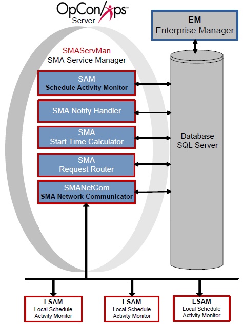

# Basic OpCon Server Configuration

**Theme:** Configure  
**Who Is It For?** System Administrator

## What Is It?

The basic OpCon Server configuration includes a single machine, a single database, and a StandAlone SMAServMan.

Basic SMA Service Manager Configuration

## When Would You Use It?

- The basic OpCon Server configuration includes a single machine, a single database, and a StandAlone SMAServMan

## Why Would You Use It?

- **Basic OpCon**: The basic OpCon Server configuration includes a single machine, a single database, and a StandAlone SMAServMan

## Configuration

The StandAlone SMAServMan manages the SAM and all supporting services. This configuration uses scripts invoking the SMALogEvent utility for notification. Refer to [SMALogEvent](../utilities/Command-line-Utilities/SMALogEvent.md) in the **Utilities** online help.

|SMAServMan.ini Setting|Value|
|--- |--- |
|Mode|StandAlone|
|InitializationScript|*Initialization Script*|
|TerminationScript|*Termination Event Script*|

|SMA Connection Configuration Setting|Value|
|--- |--- |
|Server\Instance Name|Name of the Server|
|Database Name|OpConxps|
|Database Login ID|Opconsam|
|Password|OpConxps|

## Process Flows

The following process flows indicate SMAServMan's expected behavior.

### Good Startup

|Step|Description|
|--- |--- |
|1|Primary SMAServMan starts Primary SAM-SS|
|2|Primary SAM-SS connects to Primary Database|
|3|Normal process flow|

### Critical Application Failure during Processing

|Step|Description|
|--- |--- |
|1|Normal Process Flow on StandAlone SMAServMan|
|2|Critical application fails on StandAlone Machine one time more than the RestartApplicationLimit|
|3|StandAlone SMAServMan shuts down SAM-SS|
|4|StandAlone SMAServMan runs the TerminationScript. In this example, the script writes an event to the Windows Event Log notifying the administrator that the SAM-SS is shutting down.|
|5|StandAlone SMAServMan shuts itself down.|

## Configuration Options

| Setting | What It Does | Default | Notes |
|---|---|---|---|
## Operations

### Monitoring

- In a StandAlone configuration, SMAServMan manages SAM and all supporting services without failover. If a critical application fails more than `RestartApplicationLimit` times, SMAServMan shuts down the entire SAM-SS, runs the `TerminationScript`, and then shuts itself down.
- Review the process flow for normal startup: (1) SMAServMan starts SAM-SS, (2) SAM-SS connects to the database, (3) normal processing begins. Any failure at step 2 indicates a database connectivity issue.

### Common Tasks

- Configure the `SMAServMan.ini` `Mode` setting to `StandAlone` for a single-machine, single-database deployment with no failover.
- Configure the `SMA Connection Configuration` tool with the database server name, database name (`OpConxps`), and credentials (`Opconsam` / `OpConxps` by default) before starting the SMA Service Manager.
- Use `InitializationScript` and `TerminationScript` settings in `SMAServMan.ini` to run notification scripts (e.g., via `SMALogEvent`) at startup and shutdown.

### Alerts and Log Files

- When a critical application on the StandAlone machine fails beyond `RestartApplicationLimit`, the `TerminationScript` runs; in the basic configuration this script writes an event to the Windows Event Log to notify the administrator.
- All SAM-SS logs are written to `<Output Directory>\SAM\Log\`. After startup, verify database connectivity by reviewing `SMAServMan.log`, `SAM.log`, `Critical.log`, and `SMANetCom.log`.

## FAQs

**Q: What does the basic OpCon server configuration consist of?**

The basic configuration includes a single machine, a single database, and a StandAlone SMAServMan. In this setup, SMAServMan manages SAM and all supporting services without any failover configuration.

**Q: What is the SMAServMan mode setting for a basic (non-failover) configuration?**

For a basic configuration, the Mode setting in SMAServMan.ini is set to `StandAlone`, which means no failover is configured.

**Q: What happens if a critical application fails more than the RestartApplicationLimit in a StandAlone configuration?**

SMAServMan shuts down the entire SAM-SS, runs the TerminationScript (such as writing a Windows Event Log notification), and then shuts itself down.

## Glossary

**SMAServMan (SMA Service Manager)**: Manages the starting, stopping, and restarting of all OpCon server programs. Monitors configured applications and restarts them automatically if they fail unexpectedly.

**SAM-SS (SAM and Supporting Services)**: The collective term for the OpCon server-side processing programs: SAM, SMANetCom, SMA Notify Handler, SMA Request Router, and SMA Start Time Calculator.

**SMA Connection Configuration**: A utility that generates the database connection file (.dat) used by OpCon server programs and utilities to connect to the OpCon SQL Server database.

**SAM (Schedule Activity Monitor)**: The logical processor for OpCon workflow automation. SAM monitors schedule and job start times, dependencies, and user commands to determine job execution timing, and processes OpCon events.

**OpConxps**: The standard installation directory name for OpCon program files, configuration files, and output data on Windows machines.

**Notification**: A message sent by the SMA Notify Handler when a Machine, Schedule, or Job changes to a specific status. Notifications can be delivered as emails, text messages, Windows Event Log entries, SNMP traps, or other formats.

**Resource**: A numeric variable in OpCon representing a finite pool. Jobs can be configured to require a set number of resource units to run, limiting concurrent executions and preventing resource contention.

**Machine**: A platform defined in the OpCon database that has an agent installed. OpCon routes job execution requests to machines via SMANetCom, and machines report job completion status back to SAM.
