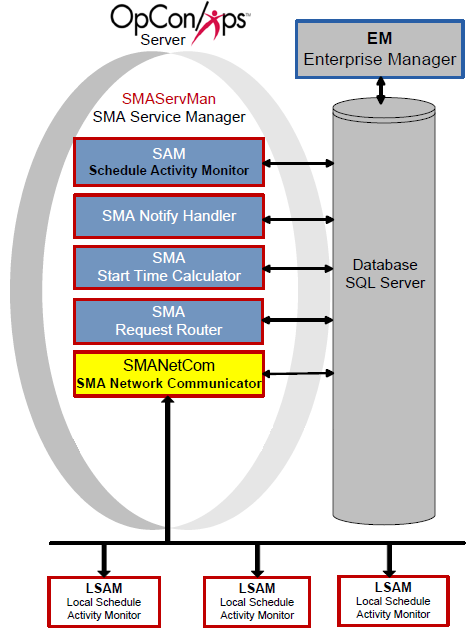

# SMA Network Communications Module (SMANetCom)

**Theme:** Configure
**Who Is It For?** System Administrator

:::note
To view NetComs in Solution Manager, see [Relays overview](../Files/UI/Solution-Manager/Library/Relays/Relays-Overview.md).
:::

## What Is It?

The SMANetCom component is responsible for all communication between the SAM and all agents. In OpCon, SMANetCom is the communication bridge between Central Components and agents. SMANetCom is a multi-threaded application, allowing the dedication of one thread per agent.

SMANetCom sends job start information to each agent and then requests job status updates, writing the feedback from the agents into the database. When a job completes, the agents respond with the completion status. Continually reading SMANetCom messages in the database, the SAM uses this information to report statuses and resolve dependencies.

## TLS Security

The OpCon server supports TLS 1.2 for securing communication between itself and any agents that are upgraded and configured to use TLS. Before communication starts, the OpCon server verifies the identity of the agent by exchanging digital certificates with it. Certificates may be either from a Certificate Authority or they may be self-signed certificates.

There must always be a TLS Server Certificate representing the agent's server role in the communications connection (that is, the OpCon central application server acts as a customer when requesting a connection with each agent). There may optionally also be a TLS Customer Certificate that represents the OpCon application server (where the OpCon application server always takes the role of a Customer in TCP/IP communications and in TLS certificate exchanges).

To make it possible for the OpCon application server to enable TLS security, SMANetCom needs to have either (1) a copy of a self-signed certificate from the agent certificate or (2) a copy of the Certificate Authority (or other root) certificate representing the agency that issued the agent digital certificate(s). It may be typical for a site to use a single Certificate Authority (CA) to issue certificates for all the agents, so only one CA would be required within the OpCon application server machine. For self-signed certificates published by the agent machines themselves, there is no separate CA, so the certificate itself is required.

The certificates for authenticating each agent must be installed in the standard certificate store of the local Windows machine. Refer to the Microsoft documentation for instructions about installing certificates in the Windows certificate store where the OpCon server application is installed.

If TLS customer authentication is used, the agent must similarly be able toauthenticate the SMANetCom certificate. The matching certificate or the root certificate must be stored as documented for the agent's host platform.

Continuous documentation for each agent will provide guidelines for configuring the agent options that control TLS Security. Those documents identify the certificate store resource that is appropriate for each operating system, and they describe how the agent communication programs are connected to locally stored certificates.

Once the TLS server and customer identities are established, the encrypted communication can begin. If there is a problem in establishing the identity, the communication fails immediately. There are settings in the OpCon machine records and also in the agent local configuration file that must be set on to start using TLS security. These control values can be used to assure that no communication will occur without valid certificates. The same control values can be used to disable TLS security, for example, in case some administrative problem is preventing data communication, and the site wishes to continue OpCon communication without using TLS security.

Refer to [General](../administration/server-options.md#general) and [Communication Settings](../administration/server-options.md#communication-settings) in the **Concepts** online help for options to configure TLS correctly.

:::note
Keep in mind that Continuous is only providing a means by which its software can use TLS Security tools. Continuous does not provide or support certificate publication, and it also does not attempt to duplicate the instructions for managing certificate stores in each operating system. The OpCon user is responsible for understanding and implementing those resources. Support for digital certificate publication is available from certificate publishing agencies. Instructions for generating digital certificate requests and for installing certificates in local certificate stores should be available from either the operating system vendor or from a third-party source that provided the digital certificate management tools.
:::

### Validation of the Digital Certificate Distinguished Name

TLS Security best practices indicate that the Distinguished Name (DN) that was assigned to a digital certificate should always be validated. Although the possession of the certificate's private key is supposed to verify the identity of the TLS Server (and of a TLS Customer), validating the Distinguished Name helps to prevent some common forms of man-in-the-middle security attacks.

To implement this type of certificate validation, update the "TLS Certificate Distinguished Name" field in the OpCon machine record, under the Communications Settings tab of the Advanced Machine Properties. The value typed into this field must match exactly the value that was entered during the digital certificate request process.

SMANetcom will use this value, when it is not blank, to validate the digital certificates presented by each agent. When this field is blank or not present, the value chosen for validating the agent's DN will be chosen according to the following decision logic:

The FQDN (Fully Qualified Domain Name) from the machine record, if not blank.

If the FQDN is blank, the IP address will be used to request a FQDN from:

- The local Host Name table; otherwise,
- The DNS (Domain Name Services) from the TCP/IP network

If no FQDN can be determined, the OpCon Machine name will be used.

According to these rules, it becomes critical to correctly specify the Distinguished Name whenever a digital certificate request is being generated.

:::note
There is no option at this time for the OpCon user to indicate that no DN validation should be processed. If DN validation is unsuccessful, the only remedy (until the DN validation value is fixed) would be to disable TLS Security and allow communication to run unsecured. However, using the local system's certificate store, it should be relatively easy to view the details of a certificate, record the actual Distinguished Name that was assigned to that certificate, and then register this name correctly in the OpCon machine record. A similar process may also be used by individual agents when validation of the TLS Customer certificate (from the OpCon application server) will be required.
:::

### User Control of TLS Security Operation

Continuous has provided parallel controls over TLS Security, especially for the SMA File Transfer feature, which support turning on or off the TLS Security operations. Either the OpCon Machine Record -- Advanced Machine Options or the local agent configuration options can be configured to (1) always require TLS Security or (2) temporarily disable TLS Security.

TLS Security activation can be controlled separately for the SMA File Transfer feature, without directly impacting the OpCon Job Scheduling and JORS services (which share and are controlled by the OpCon Machine Record -- Advanced Machine Options -- Communications Settings). To control TLS Security for only the SMA File Transfer functions, use either the local agent controls, or modify the OpCon Machine record via the Advanced Machine Options, under the File Transfer tab.

## Security Considerations

### Authentication

The OpCon server supports TLS 1.2 for securing communication between itself and any agents configured to use TLS. Before communication starts, the OpCon server verifies the identity of the agent by exchanging digital certificates. Certificates may be from a Certificate Authority or self-signed. The certificates for authenticating each agent must be installed in the standard certificate store of the local Windows machine. If TLS customer authentication is used, the agent must similarly be able to authenticate the SMANetCom certificate.

### Data Security

TLS Security best practices require that the Distinguished Name (DN) assigned to a digital certificate be validated. SMANetCom validates the DN presented by each agent against the "TLS Certificate Distinguished Name" field in the OpCon machine record (Communications Settings tab of Advanced Machine Properties). This validation helps prevent man-in-the-middle security attacks. When the DN field is blank, SMANetCom falls back to the machine's FQDN, IP-resolved FQDN, or OpCon Machine name for validation.

If DN validation fails, the only remedy is to disable TLS Security until the DN validation value is corrected. TLS Security activation can be controlled separately for the SMA File Transfer feature without impacting OpCon Job Scheduling and JORS services.

## Configuration

SMANetCom configuration determines basic service and communication settings, logging behavior, and the actions taken when failover occurs. The SMANetCom.exe file and SMANetCom.ini files reside in the <Configuration Directory\>\\SAM\\ folder.

:::note
The Configuration Directory location is based on where you installed your programs. For more information, refer to [File Locations](../file-locations.md) in the **Concepts** online help.
:::

The tables contain the definitions of each configuration parameter. If a value of "Y" is in the Dynamic column, any changes take effect immediately upon saving the file. All other configuration settings require the service to be restarted before the change takes effect.

### SMANetCom.ini

All settings in the configuration file apply to the machine on which the file resides. 

#### Service Settings

Service Settings contain basic information for SMANetCom processing.

|Service Settings|Default|Dynamic (Y/N)|Description|
|--- |--- |--- |--- |
|ShortServiceName|SMA_NetCom|N|Defines the internal name of the service stored in the registry. The name must be unique.|
|DisplayServiceName|SMA NetCom|N|Defines the service name shown in the Services Applet.|
|SMANetComName|<Default\>|N|Defines the name of this instance of SMANetCom if RunMode=Service. If RunMode=Managed, the SMA Service Manager controls the SMANetCom Name. For more information, refer to Set up Multiple SMANetCom Instances. # (hash symbol) and ' (single quotation/apostrophe sign) are NOT allowed in a SMANetComName. The reasons are the # sign is treated as a comment in SMAServMan.ini file, and the '(apostrophe) is not allowed from EM and it might cause potential database issues.|
|RunMode|Managed|N|Determines how the application is started and managed. Valid values are Managed and Service. When the value is Managed, the SMA Service Manager starts and manages this application and names NETCOM according to the SMASERVMAN.INI file. The Service setting allows the user to run SMANetCom as a Service. From a Command Prompt, '-install' or '-remove' is used to install/uninstall the SMANetCom service. The users can start/stop/restart the SMANetCom Service from Services Applet.|
|LocalIPv4Address (optional)|<Default\>|N|Defines the IPv4 Address associated with the socket used in SMANetCom with a local endpoint to connect with agents.  Some machines may have multiple IP addresses. The user can designate one specific IP address used to talk with agents.|
|LocalIPv6Address (optional)|<Default\>|N|It is the same as LocalIPv4Address, except it is used on IPv6 machines.|

##### Service Setting Details

- The SMANetComName setting is available to set if multiple instances of SMANetCom must support the volume of agents. Each agent can be assigned to its own SMANetCom in the agent machine definition's Advanced Settings in the database
- One SMANetCom instance (based on its name) can support maximum 2048 agents; however, administrators should determine the maximum number for an environment based on performance.The recommended maximum number of agents per NetCom is 500. If exceeded, clients should consider adding another NetCom instance
- When multiple SMANetCom instances are needed due to the volume of agents, only one SMANetCom.exe is needed. The SMANetCom.exe can have multiple copies in different locations, but Continuous does not recommend this configuration
- To run multiple instances of SMANetCom from the same SMA Service Manager, configure an additional application to call SMANetCom with a unique name
  - SMANetCom must have its Run Mode set to **Managed**
  - The SMANetCom instance will use the first argument in the **CommandLineArguments** from the SMAServMan.ini file to set the value for the SMANetComName
  - Each defined instance of SMANetCom must have a unique name
  - Each instance of SMANetCom will create its own SMANetCom\*.log files. For example, if SMANetCom123 is the first argument in CommandLineArguments, SMANetcom123 will write its log messages to SMANetCom_SMANetCom123.log and SMANetCom_SMANetCom123Trace.log

##### Set up Multiple SMANetCom Instances

1. Log in as a *local administrative user*
2. Right-click **Start** and select **Explore**
3. Go to the **Folders** frame
4. Browse to the <Configuration Directory\>\\SAM\\ directory
5. Right-click the **SMAServMan.ini** file and select **Edit**
6. Scroll down to the **\[Application List\]** section
7. Add another line at the end of the list and name the new
    application.
8. Scroll down to the **\[SMANetCom\]** section
9. Select in front of the \[SMANetCom\] heading and drag the mouse to
    the end of the settings for the application to select all of the
    section.
10. Press **Ctrl + C** to copy the settings
11. Scroll down to the bottom of the application settings
12. Make sure there is at least one blank line below the last setting
    and place the cursor in the blank line.
13. Press **Ctrl + V** to paste the settings
14. Rename \[SMANetCom\] to the *new application name* (e.g., \[SMANetCom2\])
15. For the CommandLineArguments setting, set the value to the *new
    application name* (e.g., SMANetCom2).
16. Use menu path: **File \> Save**
17. **Close ☒** the **SMAServMan.ini** file

#### General Settings

General Settings provide InitializationScript path and TerminationScript path.

|General Settings|Default|Dynamic (Y/N)|Description|
|--- |--- |--- |--- |
|Mode|StandAlone|N|Determines SMANetCom's role in the failover process. Valid values are Primary, Secondary, or StandAlone. StandAlone indicates SMANetCom is not configured for failover. Note: When SMAServMan manages SMANetCom, the mode must be set to StandAlone. The Primary and Secondary settings are reserved for future use.|
|InitializationScript|<Blank\>|N|Provides the path and filename of the script SMANetCom runs upon startup. Always enclose the path and file name in two sets of double quotes (""<Path\>"").|
|TerminationScript|<Blank\>|N|Provides the path and filename of the script SMANetCom runs upon shutdown. Always enclose the path and file name in two sets of double quotes (""<Path\>"").|

#### SAM Database Communication Parameters

|SAM Database Communication Parameters|Default|Dynamic (Y/N)|Description|
|--- |--- |--- |--- |
|SAMDBLoginTimeoutInSeconds|5|N|Determines the length of time in seconds to allow for a login. If this time is exceeded, SMANetCom signals an error condition.|
|SAMCheckMsgsFromSAMInMilliseconds|500|N|Determines how often SMANetCom polls the database for SAM messages. The frequency is in milliseconds.|
|SAMCheckLSAMConfigurationInMilliseconds|1000|N|Determines how often SMANetCom checks each agent's configuration parameters for an update. The frequency is in milliseconds.|

#### Primary Mode Settings

The Primary Mode Settings are reserved for future use.

#### Secondary Mode Settings

The Secondary Mode Settings are reserved for future use.

#### Debug Options

The Debug Options configure the SMANetCom logging behavior.

+|Debug Options|Default|Dynamic (Y/N)|Description|
|--- |--- |--- |--- |
|MaximumLogFileSize|150000|Y|Defines the maximum size in bytes for each log file. Determines when the current log file is closed and a new file is started. When the file reaches this maximum size, it is "rolled over." This setting creates small, manageable log files. SMANetCom.log resides in the <Output Directory\>\SAM\Log directory. When the log file reaches the maximum size, SMANetCom archives the log file. When SMANetCom is installed with the SAM, the SAM maintains the archive folders. Note: Each SMANetCom instance based on its SMANetComName has its SMANetCom log file as mentioned in the Details of Service Settings.|
|TraceSAMMessages|ON|Y|Enables/Disables SMANetCom to create the SMANetComTrace log file. If OFF, SMANetCom creates only the SMANetCom log file. If ON, SMANetCom creates both the SMANetCom log and SMANetComTrace log files. The SMANetComTrace log contains all records regarding TX messages. Continuous strongly recommends leaving this value set to ON. Note: Each SMANetCom instance based on its SMANetComName has its own SMANetComTrace log file as mentioned in the Details of Service Settings.|
|DumpInputBuffer (optional)|OFF|Y|Determines the Enable/Disable SMANetCom to write the messages from agents into the SMANetComTrace log file. This setting should not be enabled unless the user receives an indication from Continuous.|
|DumpOutputBuffer (optional)|OFF|Y|Determines the Enable/Disable SMANetCom to write the messages to agents into the SMANetComTrace log file. This setting should not be enabled unless the user receives an indication from Continuous.|
|TraceLevel (optional)|0|Y|Determines the debug setting by developer ONLY. This setting should not be enabled unless the user receives an indication from Continuous. The valid setting is 0 to 3.|
|DebugMachineNameWithTraceLevel2 (optional)|NONE|Y|Determines the debug setting by developer ONLY. This setting should not be enabled unless the user receives an indication from Continuous. The valid setting is NONE, ALL, or the machine's name.|

#### Event Log Settings

The following sections provide settings to customize logging in the
Application Log of the Windows Event Viewer.

|Service Start|Default|Dynamic (Y/N)|Description|
|--- |--- |--- |--- |
|Msg|$SERVICENAME started.|Y|Defines the log message indicating SMANetCom has started. Modify the text for a different message. Set to NULL to disable this setting. $SERVICENAME is a supported token for this message type.|
|Type|4|Y|Defines the message type: 1 equals Error, 2 equals Warning, 4 equals Information|

|Service Stop|Default|Dynamic (Y/N)|Description|
|--- |--- |--- |--- |
|Msg|$SERVICENAME stopped.|Y|Defines the log message indicating SMANetCom has stopped. Modify the text for a different message. Set to NULL to disable this setting. $SERVICENAME is a supported token for this message type.|
|Type|4|Y|Defines the message type: 1 equals Error, 2 equals Warning, 4 equals Information|

## Configuration Options

| Setting | What It Does | Default | Notes |
|---|---|---|---|
## Operations

### Monitoring

- SMANetCom writes configuration parameters, basic communication information, and each agent's configuration to `SMANetCom.log` in `<Output Directory>\SAM\Log\`. The trace log `SMANetComTrace.log` captures all TX messages and socket connection errors.
- A single SMANetCom instance supports a maximum of 2048 agents; the recommended maximum is 500 agents per instance. If the agent count exceeds this threshold, add additional SMANetCom instances via SMAServMan.
- SMANetCom polls the database for SAM messages every `SAMCheckMsgsFromSAMInMilliseconds` milliseconds (default: 500 ms) and checks each agent's configuration for updates every `SAMCheckLSAMConfigurationInMilliseconds` milliseconds (default: 1000 ms).

### Common Tasks

- To set up multiple SMANetCom instances, copy the `[SMANetCom]` section in `SMAServMan.ini`, give it a unique name (e.g., `[SMANetCom2]`), and set `CommandLineArguments` to the new instance name. Each instance writes its own `SMANetCom_<name>.log` and `SMANetCom_<name>Trace.log`.
- To control TLS Security separately for the SMA File Transfer feature, use either the local agent configuration options or the File Transfer tab in the OpCon Machine Record Advanced Machine Options.
- Update the "TLS Certificate Distinguished Name" field in the OpCon machine record (Communications Settings tab) to match the DN assigned during the digital certificate request process.

### Alerts and Log Files

- `SMANetCom.log` and `SMANetComTrace.log` reside in `<Output Directory>\SAM\Log\` and roll over when they reach `MaximumLogFileSize` (default: 150,000 bytes).
- Keep `TraceSAMMessages=ON` (default) to generate the `SMANetComTrace.log`; Continuous strongly recommends leaving this enabled.
- A login timeout error is signaled when SMANetCom cannot connect to the database within `SAMDBLoginTimeoutInSeconds` (default: 5 seconds). If TLS DN validation fails, communication with the agent fails immediately; disable TLS temporarily and correct the DN value in the machine record.

## Exception Handling

**TLS communication fails immediately at connection time** — If there is a problem establishing TLS identity between SMANetCom and an agent, communication fails immediately — Verify that the correct certificate (or the CA root certificate) is installed in the Windows certificate store on the OpCon server machine; if the Distinguished Name validation fails, update the "TLS Certificate Distinguished Name" field in the OpCon machine record to exactly match the value assigned during the certificate request process.

**TLS Distinguished Name validation failure blocks all communication** — When DN validation is unsuccessful, there is no option to skip validation while TLS is enabled — The only remedy until the DN value is corrected is to temporarily disable TLS Security to allow unsecured communication to continue; view the certificate details in the local certificate store to retrieve the exact Distinguished Name and register it correctly in the OpCon machine record.

**SMANetCom instance name conflicts with SMAServMan configuration** — If the SMANetComName contains a `#` (hash) or `'` (apostrophe) character, the hash is treated as a comment in SMAServMan.ini and the apostrophe may cause database issues — Use only characters that do not include `#` or `'` in the SMANetComName setting.

**Login timeout error on database connection** — If SMANetCom cannot log in to the database within the `SAMDBLoginTimeoutInSeconds` limit (default 5 seconds), it signals an error condition — Check database connectivity and increase the timeout value in SMANetCom.ini if the database server is under heavy load or network latency is high.

## FAQs

**Q: What is SMANetCom's role in OpCon?**

SMANetCom is the communication bridge between the SAM and all agents. It sends job start information to each agent, requests job status updates, and writes agent feedback into the database. SAM then uses this information to report statuses and resolve dependencies.

**Q: How does SMANetCom support TLS security?**

SMANetCom supports TLS 1.2 for securing communication with agents. Before communication starts, the OpCon server verifies agent identity by exchanging digital certificates. Certificates may be from a Certificate Authority or self-signed.

**Q: How many agents can a single SMANetCom instance support?**

A single SMANetCom instance can support a maximum of 2048 agents, but the recommended maximum is 500 agents per instance. If the volume of agents exceeds this, additional SMANetCom instances can be configured through SMAServMan.

## Glossary

**JORS (Job Output Retrieval System)**: The system used to retrieve and display job output — logs and reports — from agent machines directly within the OpCon graphical interfaces.

**TLS (Transport Layer Security)**: An encryption protocol used to secure TCP/IP communications between SMANetCom and agents, ensuring that job start and status data is transmitted safely.

**SMANetCom (SMA Network Communications Module)**: Handles TCP/IP communication of platform-specific automation information between SAM and all agents. Uses database tables to maintain reliable communication and data integrity.

**SMAServMan (SMA Service Manager)**: Manages the starting, stopping, and restarting of all OpCon server programs. Monitors configured applications and restarts them automatically if they fail unexpectedly.

**SAM (Schedule Activity Monitor)**: The logical processor for OpCon workflow automation. SAM monitors schedule and job start times, dependencies, and user commands to determine job execution timing, and processes OpCon events.

**LSAM (Local Schedule Activity Monitor)**: An agent installed on a target platform that runs jobs in the native language of that platform and communicates results back to SAM via SMANetCom over TCP/IP.

**Frequency**: A set of rules that defines when a job or schedule is eligible to run, based on calendar rules, day-of-week settings, period offsets, and other timing criteria.

**Token (Global Property)**: A named value stored in the OpCon database, referenced in job definitions and events using [[PropertyName]] syntax. Tokens pass dynamic values — such as dates, file paths, or counts — into automation workflows.
