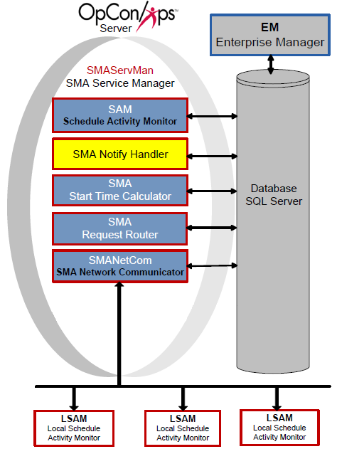

# SMA Notify Handler

**Theme:** Configure  
**Who Is It For?** System Administrator

## What Is It?

The SMA Notify Handler component is responsible for reading the NOTIFY table in the OpCon database and writing the message to the appropriate location. For more information, refer to [Using Notification Manager](../Files/UI/Enterprise-Manager/Using-Notification-Manager.md) in the **Enterprise Manager** online help.

The SMA Notify Handler can send the following basic notifications after reading the NOTIFY table:

- Windows Event Log
- Email (SMTP Basic and OAuth) (For more on configuring notifications for SMTP, refer to [Configuring SMTP Notifications](../notifications/Notification-Configuration.md#Configur3) in the **Concepts** online help.)
- SNMP Trap (For more on configuring notifications for SMTP, refer to [Configuring SNMP Notifications](../notifications/Notification-Configuration.md#Configur) in the **Concepts** online help.)
- Unisys Single Point of Operations (SPO) AL and CO Reports (For more on configuring notifications for SMTP, refer to [Configuring SPO Notifications](../notifications/Notification-Configuration.md#Configur2) in the **Concepts** online help.)
- Text Messages (SMS)
- OpCon Events
- Command

## When Would You Use It?

- The SMA Notify Handler component is responsible for reading the NOTIFY table in the OpCon database and writing the message to the appropriate location

## Why Would You Use It?

- **SMA Notify**: The SMA Notify Handler component is responsible for reading the NOTIFY table in the OpCon database and writing the message to the appropriate location

## Configuration

SMA Notify Handler configuration determines basic application and logging behavior.

All of the SMA Notify Handler's configuration settings exist in the Solution Manager's SMTP Options. For more information, refer to [Managing SMTP Options](../Files/UI/Solution-Manager/Library/ServerOptions/Managing-SMTP-Settings.md) in the **Solution Manager** online help.

### Processing

When processing notifications:

- The SMA Notify Handler resolves tokens before sending any notifications. Tokens can resolve to any valid property in OpCon
- For all Schedules, SMA Notify Handler looks up the Schedule Name for the notification from the Daily tables to ensure that all notifications containing a Schedule Name will contain the unique schedule name instance for the customer to follow up on if necessary
- Any OpCon Events are passed in the SAM's MSGIN directory for processing. SMA Notify Handler automatically supplies the user name and password
- For all notification types with message or text fields, SMA Notify Handler inserts a Notification ID as the first few characters of the message. This ID provides a way for users to look up the source of a notification
- Email and Text Messaging SMTP server usage:
  - SMTPSERVER and SMTPSERVER2 will be used for email notifications and only used for SMS if SMTPSERVER3 and SMTPSERVER4 are not configured
  - SMTPSERVER3 and SMTPSERVER4 will only be used for SMS notification if they are configured
  - SMTPSERVER2 is used as the alternative to SMTPSERVER if it is configured and a notification fails on the primary
  - SMTPSERVER4 is used as the alternative to SMTPSERVER3 if it is configured and a notification fails on the primary
- Network Message Processing:
  - SMA Notify Handler uses Msg.exe to send network messages. If that message fails, SMA Notify Handler logs an error and cannot successfully send the message
  - When using MSG.exe, SMA Notify Handler always uses asterisk (\*) for the user name and assumes the "Recipients" defined are either Host Names or IP Addresses
  - For a successful message, the Authentication User (UNC Access) and Authentication Password (UNC Access) must be defined in the Server Options. The user must be an Administrator on the SAM application server and on every machine to which it will send messages. For more information, refer to [Authentication User (UNC Access)](../administration/server-options.md#Authentication_User_(UNC_Access)) and [Authentication Encrypted Password (UNC Access)](../administration/server-options.md#Authentication_Encrypted_Password_(UNC_Access)) in the **Concepts** online help

## Security Considerations

### Authentication

SMA Notify Handler supports both SMTP Basic authentication and OAuth for email notifications. For OAuth configurations, the handler authenticates to Microsoft EntraID rather than using a username and password. All SMTP configuration options are managed in Solution Manager's SMTP Server Options.

For Network Message notifications, the Authentication User (UNC Access) and Authentication Encrypted Password (UNC Access) must be configured in Server Options. The configured user must be an Administrator on the SAM application server and on every machine to which network messages will be sent.

For OpCon Events submitted by SMA Notify Handler, the handler automatically supplies the user name and password when passing events to the SAM's MSGIN directory for processing.

### Data Security

SMA Notify Handler inserts a Notification ID as the first few characters of every notification message. This ID allows users to look up the source notification in OpCon for troubleshooting and audit purposes.

## Configuration Options

| Setting | What It Does | Default | Notes |
|---|---|---|---|
## Operations

### Monitoring

- SMA Notify Handler reads the NOTIFY table in the OpCon database and routes notifications to the appropriate delivery channel (Windows Event Log, Email, SNMP Trap, SPO, SMS, OpCon Events, or Command).
- All notifications include a Notification ID as the first few characters of the message. Use this ID to look up the source notification in OpCon for troubleshooting.
- If a notification fails on the primary SMTP server (SMTPSERVER), the Notify Handler automatically retries using the secondary server (SMTPSERVER2) if configured. SMTPSERVER3/SMTPSERVER4 are used exclusively for SMS if configured.

### Common Tasks

- All SMA Notify Handler configuration (SMTP options, OAuth settings) is managed in Solution Manager's SMTP Server Options; refer to [Managing SMTP Options](../Files/UI/Solution-Manager/Library/ServerOptions/Managing-SMTP-Settings.md).
- For network message notifications, configure Authentication User (UNC Access) and Authentication Encrypted Password (UNC Access) in Server Options; the configured user must be an Administrator on the SAM server and on every target machine.
- OpCon Events submitted by SMA Notify Handler are placed in the SAM's MSGIN directory for processing; the handler automatically supplies the user name and password.

### Alerts and Log Files

- Processing information is written to `SMANotifyHandler.log` in `<Output Directory>\SAM\Log\`.
- If network message delivery via `Msg.exe` fails, SMA Notify Handler logs an error and cannot deliver the message; check the log for these errors when network messages are not received.
- Tokens in notification messages are resolved before sending. If a token cannot be resolved, the notification may contain unexpected content; verify token definitions if notification content is incorrect.

## Exception Handling

**Network message fails to send** — If the network message send using Msg.exe fails, SMA Notify Handler logs an error and cannot successfully deliver the message — For network messages to succeed, the Authentication User (UNC Access) and Authentication Password (UNC Access) must be configured in Server Options; the configured user must be an Administrator on the SAM application server and on every machine to which messages will be sent.

**Email or SMS notification fails on primary SMTP server** — If a notification cannot be delivered through the primary SMTP server (SMTPSERVER), the Notify Handler will attempt delivery via the configured secondary server (SMTPSERVER2) — If no secondary server is configured and the primary fails, no email notification is delivered; configure SMTPSERVER2 as a fallback to ensure continuity of email notifications.

## FAQs

**Q: What notification types can SMA Notify Handler send?**

SMA Notify Handler can send notifications to the Windows Event Log, via Email (SMTP Basic and OAuth), SNMP Trap, Unisys SPO AL and CO Reports, Text Messages (SMS), OpCon Events, and Command.

**Q: How does SMA Notify Handler handle email and SMS server failover?**

SMTPSERVER2 is used as the alternative to SMTPSERVER if it is configured and a notification fails on the primary. SMTPSERVER3 and SMTPSERVER4 are used exclusively for SMS if configured; otherwise, SMS falls back to SMTPSERVER and SMTPSERVER2.

**Q: What is the Notification ID inserted into messages?**

For all notification types with message or text fields, SMA Notify Handler inserts a Notification ID as the first few characters of the message. This ID allows users to look up the source notification in OpCon for troubleshooting.

## Glossary

**MSGIN**: A directory monitored by an agent for incoming OpCon event files. Placing a properly formatted event file in MSGIN causes the agent to forward it to SAM for processing.

**SMA Notify Handler**: Processes notifications triggered by Machine, Schedule, and Job status changes. Can send emails, text messages, Windows Event Log entries, SNMP traps, and SPO notifications.

**SAM (Schedule Activity Monitor)**: The logical processor for OpCon workflow automation. SAM monitors schedule and job start times, dependencies, and user commands to determine job execution timing, and processes OpCon events.

**Enterprise Manager (EM)**: OpCon's rich client graphical user interface for Windows and Linux, used to define schedules and jobs, manage automation data, and perform operational tasks.

**Solution Manager**: OpCon's browser-based graphical user interface for managing automation data, performing operational actions, and administering the system.

**Daily Tables**: The OpCon database tables that hold the active, date-specific instances of schedules and jobs built for execution. Changes to daily tables affect only the current day's automation.

**OpCon Event**: A command sent to OpCon that triggers an automated action, such as adding a job to a schedule, updating a property value, sending a notification, or changing a job or schedule status.

**Notification**: A message sent by the SMA Notify Handler when a Machine, Schedule, or Job changes to a specific status. Notifications can be delivered as emails, text messages, Windows Event Log entries, SNMP traps, or other formats.
