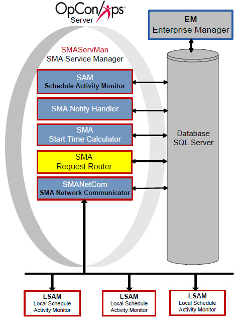

# SMA Request Router

**Theme:** Configure  
**Who Is It For?** System Administrator

## What Is It?

The SMA Request Router reads the OpCon database to process requests from the SAM and the Enterprise Manager. It retrieves records, sends them to the designated handler, and writes completion information back to the OpCon database.

## When Would You Use It?

- The SMA Request Router reads the OpCon database to process requests from the SAM and the Enterprise Manager

## Why Would You Use It?

- **SMA Request**: The SMA Request Router reads the OpCon database to process requests from the SAM and the Enterprise Manager

## Request Handlers

The following Request Handlers run OpCon requests:

- [SMASchedMan](#SMASched)
- [LSAMDATARETRIEVER](#LSAMDATA)
- [BIRTPROCESSOR](#BIRTPROC)
- [SAPQUERYPROCESSOR](#SAPQUERY)
- [SAPBWQUERYPROCESSOR](#SAPBWQUE)

### SMASchedMan

SMASchedMan builds, checks, and deletes schedules. For configuration details, refer to [Request Handler 01](#Request2).

#### Processing Schedule Builds

SMASchedMan builds schedules into the Daily tables for selected dates:

- Evaluates all Multi-instance and SubSchedule settings to build required schedule instances
  - For each named instance, creates an InstanceName property (format: `InstanceName=xxxxx`) usable in job events at runtime
- Includes only jobs that qualify for the selected date(s) based on frequency settings
  - If a job has the "Disable Build" flag set, SMASchedMan excludes it
  - When building a subschedule with no qualifying jobs, SMASchedMan creates a Null job called SubScheduleNullJob so the subschedule builds and the Container job can Finish OK

#### Processing Schedule Checks

When processing CHECK, CHECK+, or CHECK- commands:

- If a schedule contains a Container job, SMASchedMan inserts a check request for the SubSchedule
- If the Schedule Name matches a Schedule Instance Name in the Daily tables, only that instance is checked
- If the Schedule Name is found in Administration, SMASchedMan checks all instances for the specified date(s)

#### Processing Schedule Deletes

When processing a DELETE command:

- If a schedule contains a Container job, SMASchedMan inserts a delete request for the subschedule
- If the Schedule Name matches a Schedule Instance Name in the Daily tables, only that instance is deleted
- If the Schedule Name is found in Administration, SMASchedMan deletes all instances for the specified date(s)

#### Logging

- Log files are written to `<Output Directory>\SAM\Log\SMASchedMan`. SMASchedMan creates the folder if it does not exist
- Log file naming convention: `ScheduleName_Command_YYYYMMDD`
  - Command is Build, Check, Delete, or Forecast
  - YYYYMMDD is the target schedule date

### LSAMDATARETRIEVER

LSAMDATARETRIEVER processes requests from the Job Output Retrieval System (JORS), enabling users to view job output in graphical interfaces. For configuration details, refer to [Request Handler 02](#Request3).

### BIRTPROCESSOR

BIRTPROCESSOR processes report generation requests. It retrieves requests from the database, calls the BIRT generator, and writes report and log files to `<Output Directory>\SAM\Log\Reports`. For configuration details, refer to [Request Handler 06](#Request4).

:::note
The Output Directory was configured during installation. For more information, refer to [File Locations](../file-locations.md) in the **Concepts** online help.
:::

### SAPQUERYPROCESSOR

SAPQUERYPROCESSOR retrieves information from SAP systems for the graphical interfaces and is required for creating SAP jobs. For configuration details, refer to [Request Handler 03](#Request5).

### SAPBWQUERYPROCESSOR

SAPBWQUERYPROCESSOR retrieves information from SAP BW systems for the graphical interfaces and is required for creating SAP BW jobs. For configuration details, refer to [Request Handler 04](#Request6).

## Configuration

SMA Request Router configuration controls basic service behavior, logging, and Request Handler definitions. The `SMARequestRouter.ini` file resides in `<Configuration Directory>\SAM\`. Changes marked Dynamic (Y) take effect immediately upon saving. All other changes require a service restart.

:::note
The Configuration Directory location depends on your installation path. For more information, refer to [File Locations](../file-locations.md) in the **Concepts** online help.
:::

### SMARequestRouter.ini

#### General Settings

|General Settings|Default|Dynamic (Y/N)|Definition|
|--- |--- |--- |--- |
|RefreshInterval|5|Y|Interval (in seconds) at which the service checks for unprocessed requests in the OPCONREQ table. Valid values: 1–300|
|MaximumParallelReqHandlers|50|Y|Maximum number of concurrent request handlers. Lower for smaller environments; raise for larger environments with multiple processors. Valid values: 10–1024|
|IntervalBetReqHandlers|50|Y|Milliseconds to sleep between launching concurrent handlers. Raise for smaller environments; lower for larger environments. Valid values: 10–3000|
|ReqHandlerLaunchPriority|NORMAL|Y|Base priority on Windows for each handler. SMA recommends BELOWNORMAL for large environments to increase throughput while allowing SAM and SMANetCom to process jobs. Valid values: NORMAL, ABOVENORMAL, BELOWNORMAL, REALTIME, HIGH, IDLE|

#### Debug Options

|Debug Options|Default|Dynamic (Y/N)|Definition|
|--- |--- |--- |--- |
|MaximumLogFileSize|150000|Y|Maximum size in bytes for each log file before rollover. `SMARequestRouter.log` resides in `<Output Directory>\SAM\Log`. Min: 4096, Max: 1000000|
|TraceLevel|0|Y|Debug trace detail level. Valid values: 0 = Basic, 1 = Detailed, 2 = Very detailed|

#### Request Handler

|RequestHandler01|Dynamic (Y/N)|Description|
|--- |--- |--- |--- |
|RequestHandler|N|Name of the Request Handler.|
|RequestExecutable|N|Path and name of the SMASchedMan executable.|
|RequestExecutionPath|N|Working directory for the Request Handler.|
|RequestArguments|N|Command-line arguments for the Request Handler executable.|

### SMALSAMDataRetriever.ini

#### General Settings

Reserved for future use.

#### Debug Options

`SMALSAMDataRetriever.log` resides in `<Output Directory>\SAM\Log\`.

:::note
The Output Directory was configured during installation. For more information, refer to [File Locations](../file-locations.md) in the **Concepts** online help.
:::

|Debug Options|Default|Dynamic (Y/N)|Definition|
|--- |--- |--- |--- |
|ArchiveDaysToKeep|15|N|Number of days of log history to retain. Automatic cleanup reduces disk storage.|
|TraceLevel|0|N|Debug trace detail level. Valid values: 0 = Basic, 1 = Detailed, 2 = Very detailed|

### SMABIRTPROCESSOR.ini

#### General Settings

|General Settings|Default|Dynamic (Y/N)|Definition|
|--- |--- |--- |--- |
|BIRT_HOME|.\BIRT\birt-runtime-2_5_2|N|Path of the BIRT_HOME environment variable containing the BIRT runtime files.|

#### Debug Options

`SMABirtProcessor.log` resides in `<Output Directory>\SAM\Log\`.

:::note
The Output Directory was configured during installation. For more information, refer to [File Locations](../file-locations.md) in the **Concepts** online help.
:::

|Debug Options|Default|Dynamic (Y/N)|Definition|
|--- |--- |--- |--- |
|MaximumLogFileSize|150000|N|Maximum size in bytes for the SMABirtProcessor.log file.|

### SAPQueryProcessor.ini

#### General Settings

Reserved for future use.

#### TCP/IP Parameters

|TCP/IP Parameters|Default|Dynamic (Y/N)|Definition|
|--- |--- |--- |--- |
|SocketNumber|1305|N|Socket number for connection to the SAP R/3 machine.|
|BWSocketNumber|13056|N|Socket number for connection to the SAP BW machine.|

#### Debug Options

`SAPQueryProcessor.log` contains information for both SAP and SAP BW Query Processors and resides in `<Output Directory>\SAM\Log\`.

:::note
The Output Directory was configured during installation. For more information, refer to [File Locations](../file-locations.md) in the **Concepts** online help.
:::

|Debug Options|Default|Dynamic (Y/N)|Definition|
|--- |--- |--- |--- |
|MaximumLogFileSize|150000|N|Maximum size in bytes for each log file before rollover. Min: 4096, Max: 1000000|
|TraceLevel|0|N|Debug trace detail level. Valid values: 0 = Basic, 1 = Detailed, 2 = Very detailed|

## Configuration Options

| Setting | What It Does | Default | Notes |
|---|---|---|---|
## Operations

### Monitoring

- `SMARequestRouter.log` resides in `<Output Directory>\SAM\Log\` and rolls over when it reaches `MaximumLogFileSize` (default: 150,000 bytes, min: 4,096, max: 1,000,000).
- SMASchedMan log files are written to `<Output Directory>\SAM\Log\SMASchedMan\` using the naming convention `ScheduleName_Command_YYYYMMDD` (Command is Build, Check, Delete, or Forecast).
- BIRTPROCESSOR writes report and log files to `<Output Directory>\SAM\Log\Reports\`.

### Common Tasks

- Adjust `MaximumParallelReqHandlers` (default: 50, range: 10–1024) and `IntervalBetReqHandlers` (default: 50 ms, range: 10–3000 ms) to tune throughput for the environment size.
- Set `ReqHandlerLaunchPriority` to `BELOWNORMAL` for large environments to increase overall throughput while allowing SAM and SMANetCom to process jobs with higher priority.
- The `RefreshInterval` setting (default: 5 seconds, range: 1–300) controls how often SMARequestRouter checks the OPCONREQ table for new requests; reduce it for faster response times in high-volume environments.

### Alerts and Log Files

- `SMALSAMDataRetriever.log`, `SMABirtProcessor.log`, and `SAPQueryProcessor.log` all reside in `<Output Directory>\SAM\Log\`.
- `SMALSAMDataRetriever` retains 15 days of log history by default (`ArchiveDaysToKeep=15`); adjust as needed to manage disk storage.
- Set `TraceLevel` to `1` (Detailed) or `2` (Very detailed) in the relevant `.ini` file for additional diagnostic output when troubleshooting request handler issues.

## FAQs

**Q: What does SMA Request Router do?**

SMA Request Router reads the OpCon database to process requests from the SAM and the Enterprise Manager. It retrieves records, sends them to the designated handler, and writes completion information back to the OpCon database.

**Q: What request handlers does SMA Request Router use?**

SMA Request Router uses SMASchedMan (builds, checks, and deletes schedules), LSAMDATARETRIEVER (job output retrieval), BIRTPROCESSOR (report generation), SAPQUERYPROCESSOR (SAP R/3 queries), and SAPBWQUERYPROCESSOR (SAP BW queries).

**Q: What happens when a subschedule has no qualifying jobs during a build?**

SMASchedMan creates a Null job called SubScheduleNullJob so the subschedule builds successfully and the Container job can Finish OK.

## Glossary

**JORS (Job Output Retrieval System)**: The system used to retrieve and display job output — logs and reports — from agent machines directly within the OpCon graphical interfaces.

**BIRT (Business Intelligence and Reporting Tools)**: The open-source reporting engine used by OpCon to generate predefined and custom reports. Reports are run using the BIRTRptgen.exe utility.

**SMANetCom (SMA Network Communications Module)**: Handles TCP/IP communication of platform-specific automation information between SAM and all agents. Uses database tables to maintain reliable communication and data integrity.

**SMA Request Router**: Sends requests to designated Request Handlers and writes completion information back to the OpCon database. Manages tasks such as schedule maintenance and job output retrieval.

**SAM (Schedule Activity Monitor)**: The logical processor for OpCon workflow automation. SAM monitors schedule and job start times, dependencies, and user commands to determine job execution timing, and processes OpCon events.

**Enterprise Manager (EM)**: OpCon's rich client graphical user interface for Windows and Linux, used to define schedules and jobs, manage automation data, and perform operational tasks.

**Subschedule**: A schedule that runs as a child process within a Container job, allowing hierarchical, nested workflow automation where a parent schedule can trigger and monitor an entire child schedule.

**Container Job**: A job type that runs a subschedule. Container jobs enable hierarchical schedule structures and support properties and events just like standard jobs.
