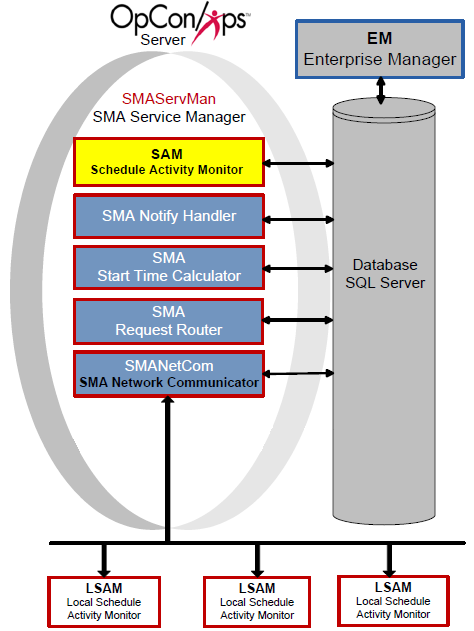

# Schedule Activity Monitor (SAM)

**Theme:** Configure  
**Who Is It For?** System Administrator

## What Is It?

The Schedule Activity Monitor (SAM) determines when jobs in the Daily tables qualify for submission to an agent and processes OpCon events. SAM places messages for agents in the database, monitors for responses, updates job statuses, and re-qualifies jobs for processing. It also processes events from the database and external sources. Refer to [OpCon Events](../events/introduction.md) for more information.

## When Would You Use It?

- Use this feature when jobs in the Daily tables qualify for submission to an agent and processes OpCon events

## Why Would You Use It?

- **Schedule Activity**: The Schedule Activity Monitor (SAM) determines when jobs in the Daily tables qualify for submission to an agent and processes OpCon events

## Job Qualification Process

SAM analyzes database information to determine when to submit jobs.

### Factors of Analysis

SAM's analysis includes:

- Start time
- Job dependencies and current job statuses
- Threshold/resource dependencies and current threshold/resource values
- Machine availability

### Order of Analysis

SAM checks a job for processing in this order:

1. Job Qualifications for Start
2. Latest Allowable Start Time
3. Start Time
4. Job Dependencies
5. Threshold/Resources

6. Expression Dependencies
7. Machine Availability

## SAM Processing Options

SAM processing options are configured through the Enterprise Manager (EM). Refer to [OpCon Server Options](../administration/server-options.md) in the **Concepts** online help.

## SMA Connection Configuration Tool

The SMA Connection Configuration program contains connection information to the SQL Server database. SQL connection configuration can only be changed from the SAM application server. The SAM-SS must be stopped and restarted to detect new SQL connection configuration information.

## Request a New License File from Continuous

After paying maintenance to Continuous, complete the following steps to request a new license file.

1. Log in to the **Enterprise Manager**
2. Go to **Help > About OpCon Enterprise Manager**
3. Select the **License Information** tab

    :::note
    Only users with granted privileges can view the **License Information** tab.
    :::

4. At the end of the first line, select the System ID (e.g., SMAServer_1234)
5. Right-click and select **Copy**
6. Send an email to <license@smatechnologies.com> with the subject line "License File Request". Include:

    - Environment for the SAM and database (e.g., Production)
    - The System ID copied from the Help tab (press Ctrl+V to paste)
    - Your company's name

### Place the License File in the SAM Directory

After Continuous responds, save the license file to the SAM directory.

:::caution
If the license file is encrypted after receipt (e.g., saved to a Windows folder with "Encrypt contents to secure data" enabled), SAM cannot read the file.
:::

1. Open your email program and open the **email message** containing the license file
2. Right-click the **license file** and select **Save As**
3. Browse to the SAM Installation directory
    :::tip Example
    C:\Program Files\OpConxps\SAM\
    :::
4. Select the **Save** button

## Security Considerations

### Authorization

Viewing the License Information tab in the Enterprise Manager's About dialog requires a user with granted privileges. Not all user accounts have access to this tab.

SQL connection configuration for the SMA Connection Configuration program can only be changed from the SAM application server. The SAM-SS must be stopped and restarted to detect new SQL connection configuration information.

### Data Security

The license file must not be encrypted after receipt. Saving the license file to a Windows folder with "Encrypt contents to secure data" enabled prevents SAM from reading the file. The license file must be saved to the SAM directory without file-system encryption applied.

## Configuration Options

| Setting | What It Does | Default | Notes |
|---|---|---|---|
## Operations

### Monitoring

- SAM evaluates job qualification in this order: Job Qualifications for Start, Latest Allowable Start Time, Start Time, Job Dependencies, Threshold/Resources, Expression Dependencies, and Machine Availability. Use this sequence to diagnose why a job is not starting.
- SAM writes successful processing information (schedule/job starts and completions, event processing, configuration on start or regeneration) to `SAM.log`, and all processing errors to `Critical.log`. Both files reside in `<Output Directory>\SAM\Log\`.
- License expiration notifications are logged to `Critical.log`. View the System ID via **Help > About OpCon Enterprise Manager > License Information** tab to request a new license.

### Common Tasks

- After modifying SQL connection configuration using the SMA Connection Configuration tool, the SAM-SS must be stopped and restarted for the changes to take effect.
- To request a new license: log in to the Enterprise Manager, go to **Help > About OpCon Enterprise Manager > License Information**, copy the System ID, and email <license@smatechnologies.com> with the environment type, System ID, and company name.
- Save the license file to the SAM directory (e.g., `C:\Program Files\OpConxps\SAM\`) without file-system encryption enabled.

### Alerts and Log Files

- If the `SAM.log` is locked when SAM starts up, SAM writes to `Critical.log` and the Windows Application Event Log, then terminates immediately.
- Processing errors logged to `Critical.log` include machine communication failures, database connection problems, event processing failures, and license expiration notifications.
- SAM processing options (logging level, time settings, job average calculations) are configured through **Enterprise Manager > Server Options**.

## FAQs

**Q: What does SAM do?**

SAM (Schedule Activity Monitor) determines when jobs in the Daily tables qualify for submission to an agent and processes OpCon events. It places messages for agents in the database, monitors for responses, updates job statuses, and re-qualifies jobs for processing.

**Q: In what order does SAM evaluate job qualification?**

SAM checks jobs in this order: Job Qualifications for Start, Latest Allowable Start Time, Start Time, Job Dependencies, Threshold/Resources, Expression Dependencies, and Machine Availability.

**Q: What must you do after saving a new SQL connection configuration?**

The SAM-SS must be stopped and restarted to detect new SQL connection configuration information. Changes to the SMA Connection Configuration tool do not take effect until the service is restarted.

## Glossary

**SAM-SS (SAM and Supporting Services)**: The collective term for the OpCon server-side processing programs: SAM, SMANetCom, SMA Notify Handler, SMA Request Router, and SMA Start Time Calculator.

**SMA Connection Configuration**: A utility that generates the database connection file (.dat) used by OpCon server programs and utilities to connect to the OpCon SQL Server database.

**SAM (Schedule Activity Monitor)**: The logical processor for OpCon workflow automation. SAM monitors schedule and job start times, dependencies, and user commands to determine job execution timing, and processes OpCon events.

**LSAM (Local Schedule Activity Monitor)**: An agent installed on a target platform that runs jobs in the native language of that platform and communicates results back to SAM via SMANetCom over TCP/IP.

**Enterprise Manager (EM)**: OpCon's rich client graphical user interface for Windows and Linux, used to define schedules and jobs, manage automation data, and perform operational tasks.

**Daily Tables**: The OpCon database tables that hold the active, date-specific instances of schedules and jobs built for execution. Changes to daily tables affect only the current day's automation.

**Threshold**: A numeric variable stored in the OpCon database used to control job execution. Jobs can be made dependent on threshold values, and OpCon events can update threshold values at runtime.

**OpCon Event**: A command sent to OpCon that triggers an automated action, such as adding a job to a schedule, updating a property value, sending a notification, or changing a job or schedule status.
