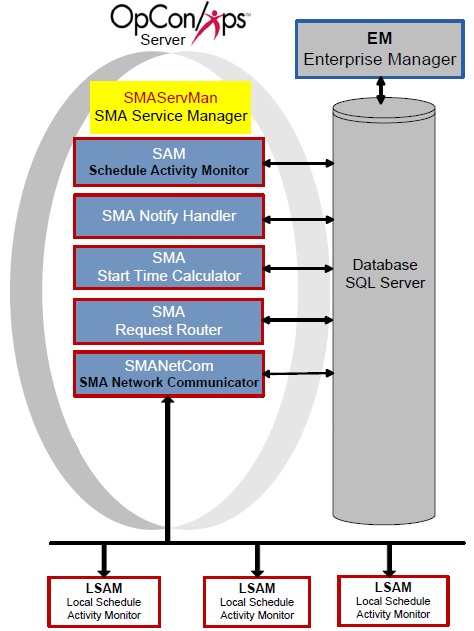

# SMA Service Manager (SMAServMan)

**Theme:** Configure  
**Who Is It For?** System Administrator

## What Is It?

SMAServMan manages the SAM-SS application group, handling startup, shutdown, and failover. In failover scenarios, two SMAServMans communicate to coordinate a smooth transition from the primary to the secondary machine (and optionally to the secondary database).

## Configuration Options

## Configuration

SMAServMan configuration controls basic service settings, logging behavior, the application group, and failure actions. The SMAServMan.ini file resides in the <Configuration Directory\>\\SAM\\ folder. Parameters marked Dynamic (Y) take effect immediately upon saving; all others require a service restart.

:::note
The Configuration Directory location depends on your installation path. For more information, refer to [File Locations](../file-locations.md) in the **Concepts** online help.
:::

### SMAServMan.ini

All settings apply to the machine on which the file resides.

#### General Settings

General Settings define the service registration with Windows.

|General Settings|Default|Dynamic (Y/N)|Description|
|--- |--- |--- |--- |
|ShortServiceName|SMA_Servman|N|Internal service name stored in the registry. Must be unique.|
|DisplayServiceName|SMA Service Manager|N|Service name shown in the Services Applet.|
|Mode|StandAlone|N|Sets the SMAServMan role. Valid values: Primary, Secondary, or StandAlone. StandAlone = no failover. Primary = manages the primary application group in failover. Secondary = manages the secondary application group in failover.|
|InitializationScript|<Blank\>|Y|Path and filename of the script run at startup.|
|TerminationScript|<Blank\>|Y|Path and filename of the script run at shutdown.|
#### Primary Mode Settings

Primary Mode Settings control SMAServMan behavior as manager of the *primary* application group.

|Primary Mode Settings|Default|Dynamic|Description|
|--- |--- |--- |--- |
|FailOverSocketNumber|<Blank\>|N|Socket number for communication between primary and secondary services. Must match in both configuration files.|
|TimeOutInSecondsForSync|60|N|Maximum time allowed for synchronization with a remote SMAServMan. Does not apply to StandAlone.|
|SyncInitFailureScript|<Blank\>|Y|Script run if initial synchronization with the Secondary SMAServMan fails within the TimeOutInSecondsForSync limit.|
|SyncLostScript|<Blank\>|Y|Script run if the Secondary SMAServMan fails to contact the Primary after initial synchronization.|
|NormalShutdownScript|<Blank\>|Y|Script run during an orderly shutdown (e.g., via Service Control Manager or NET STOP).|
|AbnormalShutdownScript|<Blank\>|Y|Script run on a critical failure in the primary application group or an unrecoverable SMAServMan error.|

Secondary Mode Settings control SMAServMan behavior as manager of the *secondary* application group.

|Secondary Mode Settings|Default|Dynamic|Description|
|--- |--- |--- |--- |
|FailOverSocketNumber|<Blank\>|N|Socket number for communication between primary and secondary SMAServMans. Must match in both configuration files.|
|PrimaryMachine|<Blank\>|N|Machine name or TCP/IP address of the primary machine. Applies to the secondary machine only.|
|SecondsBetweenPings|15|N|Frequency of pings from secondary to primary. Does not apply to StandAlone.|
|PingRetryCount|0|N|Number of consecutive ping failures before initiating failover. Does not apply to StandAlone.|
|PingTimeOutInMilliseconds|1000|N|Ping timeout in milliseconds. No response within this period increments PingRetryCount. When PingRetryCount reaches its maximum, SMAServMan behaves per the SyncLostFailover setting. Does not apply to StandAlone.|
|SyncInitFailureScript|<Blank\>|Y|Script run if initial synchronization with the Primary SMAServMan fails within the SecondsBetweenPings limit.|
|PrimaryNormalShutdownFailover|N|N|If Y, starts the secondary application group when the Primary shuts down normally. If N, the secondary group is not started.|
|PrimaryNormalShutdownScript|<Blank\>|Y|Script run when the Primary SMAServMan shuts down normally (e.g., via Service Control Manager or NET STOP).|
|PrimaryAbnormalShutdownFailover|N|N|If Y, starts the secondary application group when the Primary shuts down abnormally (critical failure or unrecoverable error). If N, the secondary group is not started.|
|PrimaryAbnormalShutdownScript|<Blank\>|Y|Script run when the Primary SMAServMan shuts down abnormally. Continuous provides StopRepl.cmd for database failover customers and strongly recommends configuring it for this setting. Refer to Modifying the Stop Replication Command File in the Database Information online help.|
|SyncLostFailover|N|N|If Y, starts the secondary application group when synchronization with the Primary is lost. If N, the secondary group is not started.|
|SyncLostScript|<Blank\>|Y|Script run when communication with the Primary SMAServMan is lost (e.g., network failure or primary machine crash).|
|ShutdownScript|<Blank\>|Y|Script run during an orderly shutdown (e.g., via Service Control Manager or NET STOP).|
|AbnormalShutdownScript|<Blank\>|Y|Script run on a critical failure in the secondary application group or an unrecoverable Secondary SMAServMan error.|

#### Debug Options

Debug Options configure SMAServMan logging behavior.

|Debug Options|Default|Dynamic (Y/N)|Description|
|--- |--- |--- |--- |
|ArchiveDaysToKeep|100|Y|Number of days of archive folders to keep. Must be greater than the "Maximum number of days archived SAM logs should be kept" setting in Global Options. Refer to Logging in the Concepts online help.|
|MaximumLogFileSize|15000|Y|Maximum log file size in bytes before the file rolls over. SMAServMan.log resides in the <Output Directory\>\SAM\Log directory. When the file reaches this size, SMAServMan archives it and the SAM maintains the archive folders.|
|Trace|OFF|Y|Enables or disables additional messages written to the SMAServMan log file.|

#### Application List

The Application List names each application managed by SMAServMan.

|Application List|Default|Dynamic (Y/N)|Description|
|--- |--- |--- |--- |
|Application1|SAM|N|Required. Lists SAM as a managed application.|
|Application2|SMANetCom|N|Required. Lists SMANetCom as a managed application.|
|Application3|SMANotifyHandler|N|Lists SMANotifyHandler as a managed application.|
|Application4|SMARequestRouter|N|Lists SMARequestRouter as a managed application.|
|Application5|SMAStartTimeCalculator|N|Lists SMAStartTimeCalculator as a managed application.|
|Application9|SMALDAPMon|N|Lists SMALDAPMon as a managed application.|
|Application10-Application50|None|N|Reserved for Continuous use only.|
|Application51+|None|N|Available for user customization. Maximum total applications: 100.|

#### Application Parameters

Each application in the Application List has a corresponding section in the configuration file with the following parameters.

|Parameter|Dynamic (Y/N)|Description|
|--- |--- |--- |
|ApplicationPath|N|Full path to the executable.|
|StartInDirectory|N|Working directory where the application starts.|
|CommandLineArguments|N|Command-line arguments for the application.|
|InitialTimeOutInSeconds|Y|Maximum startup time before the application is considered hung and terminated. Increase this value for applications with heavy startup load.|
|ApplicationTimeOutInSeconds|Y|Maximum seconds between DLL function calls before the application is considered hung and terminated. Increase this value for applications with heavy processing load.|
|DependsOnApplication|Y|If the specified application fails and cannot be restarted, the dependent application is also terminated.|
|RestartApplicationLimit|Y|Maximum restart attempts for a hung application. If zero, no restart is attempted. Once the application communicates with SMAServMan successfully, the internal restart count resets to 0.|
|SecondsBetweenRestartAttempts|Y|Seconds to wait between restart attempts.|
|ApplicationHungScript|Y|Optional script run when SMAServMan terminates a hung application (e.g., a command file to notify SMA Notify Handler).|
|RestartFailedScript|Y|Optional script run when SMAServMan cannot restart an application.|
|AutoRestartInMinutes|Y|If greater than zero, shuts down and restarts the application after this many minutes.|
|SecondsBetweenAutoRestartAttempts|Y|Seconds to wait between the application shutdown and the restart attempt.|
|CriticalApplication|Y|If TRUE and the application cannot be restarted, all applications shut down and the service stops. If FALSE, SMAServMan continues monitoring other applications. SAM and SMANetCom must be TRUE. On the primary machine, failover occurs.|

### Application Hung Scripts

Continuous supplies command files for default application hung scripts. These scripts must be configured for proper execution when an application hangs. They are installed to the <Configuration Directory\>\\SAM folder. By default, SMAServMan.ini contains paths to the SQL Authentication script names.

:::note
The Configuration Directory location depends on your installation path. For more information, refer to [File Locations](../file-locations.md) in the **Concepts** online help.
:::

|SQL Authentication Script Names|Windows Authentication Script Names|
|--- |--- |
|SAMHung.cmd|SAMHung_WinAuth.cmd|
|SMANetComHung.cmd|SMANetComHung_WinAuth.cmd|
|SMANotifyHandlerHung.cmd|SMANotifyHandlerHung_WinAuth.cmd|
|SMARequestRouterHung.cmd|SMARequestRouterHung_WinAuth.cmd|
|SMAStartTimeCalculatorHung.cmd|SMAStartTimeCalculatorHung_WinAuth.cmd|

Each hung script calls a supplemental script (e.g., SAMHung.cmd calls SAM.cmd) that runs database queries relevant to the hung application and outputs results to a text file for troubleshooting.

|SQL Authentication Script Names|Windows Authentication Script Names|
|--- |--- |
|SAM.cmd|SAM_WinAuth.cmd|
|SMANetCom.cmd|SMANetCom_WinAuth.cmd|
|SMANotifyHandler.cmd|SMANotifyHandler_WinAuth.cmd|
|SMARequestRouter.cmd|SMARequestRouter_WinAuth.cmd|
|SMAStartTimeCalculator.cmd|SMAStartTimeCalculator_WinAuth.cmd|

#### Hung Script Configuration

Complete the following procedures to configure each hung script and supplemental script.

##### Configure a Hung Script

1. Log in as a *local administrative user*
2. Right-click **Start** and select **Explore**
3. Go to the **Folders** frame
4. Browse to the <Configuration Directory\>**\\SAM\\** directory
5. Right-click the desired **hung command file** (e.g., SAMHung.cmd) and select **Edit**
6. Replace **\<insert SMTP server name here\>** with the *SMTP server name*
7. Replace **\<insert email recipient here\>** with the *recipient email address*
8. Replace **\<insert domain name here\>** with the *email domain name*
9. Replace **\<insert drive letter\>** with the *drive letter containing the SAM installation* and verify the path to the SAM folder is correct
10. Select **File \> Save**
11. Repeat steps 6–10 for each hung command file

**Result:** The hung script is saved with the correct SMTP and path settings and will send an email notification when the corresponding application hangs.

##### Configure a Supplemental Hung Script

1. Log in as a *local administrative user*

2. Right-click **Start** and select **Explore**
3. Go to the **Folders** frame
4. Browse to the <Configuration Directory\>**\\SAM\\** directory
5. Right-click the desired **supplemental hung command file** (e.g., SAMHung.cmd) and select **Edit**
6. Replace all occurrences of **\<DB server name\>** with the *OpCon database server name*
7. Replace all occurrences of **\<path to output file\>** with the *path to the desired output file location*
8. Replace all occurrences of **\<DSN\>** with the *DSN to the OpCon database*
9. If editing a SQL Authentication script, replace all occurrences of **\<sa password\>** with the *OpCon database sa password*
10. Select **File \> Save**
11. Repeat steps 6–10 for each supplemental hung command file

**Result:** The supplemental hung script is saved with the correct database server, output path, DSN, and password values and will run diagnostic queries when called by its parent hung script.

## Operating the SMA Service Manager

Use the Windows Service Control Manager to start and stop SMAServMan.

### Start the SMA Service Manager

To start the SMA Service Manager, complete the following steps:

1. Go to **Start \> Control Panel**
2. Select the **Administrative Tools** icon
3. Select the **Services** icon
4. Scroll down to **SMA OpCon Service Manager**
5. Set the **Startup Type** to **Automatic (Delayed Start)**:
   1. Select **SMA OpCon Service Manager**
   2. Select **Automatic (Delayed Start)** from the **Startup type** list and select **OK**
   :::warning
   Continuous recommends leaving the SMA OpCon Service Manager set to Automatic (Delayed Start) to avoid startup issues while other services initialize.
   :::
6. Select **SMA OpCon Service Manager** and select **Start**
7. Review the SMAServMan, SAM, Critical, SMANetCom, and SMANetComTrace logs to verify the SAM and SMANetCom connected to the database. Go to **Start \> Programs \> OpConxps \> Log Monitors \>** *Log File Name*

**Result:** The SMA Service Manager is started and begins managing the SAM-SS application group; the SAM and SMANetCom connect to the database and begin processing schedules and jobs.

### Stop the SMA Service Manager

To stop the SMA Service Manager, complete the following steps:

1. Go to **Start \> Control Panel**
2. Select the **Administrative Tools** icon
3. Select the **Services** icon
4. Scroll down to **SMA OpCon Service Manager**
5. Select **SMA OpCon Service Manager** and select **Stop**

**Result:** The SMA Service Manager is stopped, which shuts down the SAM and all supporting services in the SAM-SS application group.

## Operations

### Monitoring

- SMAServMan writes all management information to `SMAServMan.log` in `<Output Directory>\SAM\Log\`. After starting, verify the SAM and SMANetCom connected to the database by reviewing `SMAServMan.log`, `SAM.log`, `Critical.log`, `SMANetCom.log`, and `SMANetComTrace.log`.
- In failover configurations, the secondary SMAServMan pings the primary every `SecondsBetweenPings` seconds (default: 15). A failure to respond within `PingTimeOutInMilliseconds` (default: 1000 ms) increments `PingRetryCount`; when the count is reached, the `SyncLostScript` executes.
- If `CriticalApplication=TRUE` for SAM or SMANetCom and the application cannot be restarted within `RestartApplicationLimit` attempts, all applications shut down and SMAServMan stops. On primary machines, failover is triggered.

### Common Tasks

- **Start SMAServMan**: Go to **Start > Control Panel > Administrative Tools > Services**, scroll to **SMA OpCon Service Manager**, set Startup Type to **Automatic (Delayed Start)**, and select **Start**.
- **Stop SMAServMan**: Go to **Start > Control Panel > Administrative Tools > Services**, scroll to **SMA OpCon Service Manager**, and select **Stop**.
- Configure hung scripts in `<Configuration Directory>\SAM\` (e.g., `SAMHung.cmd`, `SMANetComHung.cmd`) by replacing placeholders for SMTP server, recipient email, domain, and drive letter.

### Alerts and Log Files

- `SMAServMan.log` resides in `<Output Directory>\SAM\Log\` and rolls over when it reaches `MaximumLogFileSize` (default: 15,000 bytes); archive folders are maintained by SAM.
- The `AbnormalShutdownScript` runs on a critical failure in the application group; `SyncLostScript` runs when the secondary loses contact with the primary; `NormalShutdownScript` runs during an orderly shutdown.
- Enable `Trace=ON` in SMAServMan.ini to write additional diagnostic messages to `SMAServMan.log`. Changes to `Trace` are dynamic and take effect immediately.

## Exception Handling

**SMAServMan set to a startup type other than Automatic (Delayed Start) causes startup conflicts** — Starting SMAServMan before other required services and programs have initialized can cause issues — Continuous recommends setting the SMA OpCon Service Manager startup type to Automatic (Delayed Start) in the Services applet to avoid these startup-time conflicts.

**Application hangs and cannot be restarted triggers full shutdown and failover** — When a critical application such as SAM or SMANetCom exceeds the configured `InitialTimeOutInSeconds` or `ApplicationTimeOutInSeconds` and cannot be restarted within the `RestartApplicationLimit`, all applications shut down, the SMAServMan service stops, and on the primary machine failover is triggered — Review and increase timeout and restart-limit settings in SMAServMan.ini if the application has heavy startup or processing load; configure `ApplicationHungScript` and `RestartFailedScript` to notify operations when this occurs.

**Initial synchronization with Secondary SMAServMan fails** — If the primary and secondary SMAServMan cannot synchronize within the `TimeOutInSecondsForSync` limit, the `SyncInitFailureScript` is executed — Verify the `FailOverSocketNumber` matches in both configuration files and that network connectivity between the primary and secondary machines is available.

**Secondary SMAServMan loses communication with Primary** — If the secondary fails to contact the primary after initial synchronization (based on `PingRetryCount` and `PingTimeOutInMilliseconds`), the `SyncLostScript` is executed and, if `SyncLostFailover=Y`, the secondary application group starts — Check network connectivity between the machines; if the intent is not to fail over on network interruptions, set `SyncLostFailover=N`.

## FAQs

**Q: What is SMAServMan responsible for?**

SMAServMan (SMA Service Manager) manages the SAM-SS application group, handling startup, shutdown, and failover. In failover scenarios, two SMAServMan instances communicate to coordinate a smooth transition from the primary to the secondary machine.

**Q: What is the difference between StandAlone, Primary, and Secondary modes?**

StandAlone means no failover is configured. Primary manages the primary application group in a failover pair. Secondary manages the secondary application group and monitors the primary with periodic pings to detect failure.

**Q: What happens when a critical application cannot be restarted?**

If a critical application (such as SAM or SMANetCom) cannot be restarted, all applications shut down and the SMAServMan service stops. On the primary machine, failover is triggered. Non-critical applications allow SMAServMan to continue monitoring other components.

## Glossary

**DSN (Data Source Name)**: An ODBC connection identifier that stores database connection parameters. OpCon utilities use system DSNs to connect to the OpCon SQL Server database.

**SMANetCom (SMA Network Communications Module)**: Handles TCP/IP communication of platform-specific automation information between SAM and all agents. Uses database tables to maintain reliable communication and data integrity.

**SMAServMan (SMA Service Manager)**: Manages the starting, stopping, and restarting of all OpCon server programs. Monitors configured applications and restarts them automatically if they fail unexpectedly.

**SMA Notify Handler**: Processes notifications triggered by Machine, Schedule, and Job status changes. Can send emails, text messages, Windows Event Log entries, SNMP traps, and SPO notifications.

**SAM-SS (SAM and Supporting Services)**: The collective term for the OpCon server-side processing programs: SAM, SMANetCom, SMA Notify Handler, SMA Request Router, and SMA Start Time Calculator.

**SAM (Schedule Activity Monitor)**: The logical processor for OpCon workflow automation. SAM monitors schedule and job start times, dependencies, and user commands to determine job execution timing, and processes OpCon events.

**Frequency**: A set of rules that defines when a job or schedule is eligible to run, based on calendar rules, day-of-week settings, period offsets, and other timing criteria.

**OpConxps**: The standard installation directory name for OpCon program files, configuration files, and output data on Windows machines.
