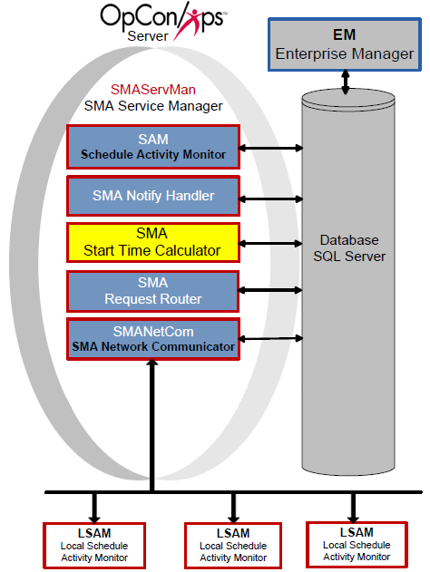

# SMA Start Time Calculator

**Theme:** Configure  
**Who Is It For?** System Administrator

## What Is It?

The SMA Start Time Calculator periodically recalculates estimated start times for all active jobs in the OpCon Daily tables, then updates the database. Schedule Operations views display the current Estimated Start Time for each job.

SMA Start Time Calculator performs calculations as follows:

- Initially calculates estimated start times for all schedules in the Daily tables
- Continues calculating for:
  - "Waiting" schedules in the past and current day
  - "In Process" schedules throughout the Daily tables
- When it detects a change to a job or schedule on a future date in "Waiting" status, it recalculates all jobs in that schedule and all schedules with cross-schedule dependencies (including subschedules)

:::caution
Start times change continuously based on many factors (offsets, absolute/relative factors, dependent job start times, job run times, etc.). The Start Time Calculator is process intensive and must be configured for your data center's requirements. To set the refresh interval, refer to the General Settings for the SMAStartTimeCalculator.ini file below.
:::

## When Would You Use It?

- The SMA Start Time Calculator periodically recalculates estimated start times for all active jobs in the OpCon Daily tables, then updates the database

## Why Would You Use It?

- **SMA Start**: The SMA Start Time Calculator periodically recalculates estimated start times for all active jobs in the OpCon Daily tables, then updates the database

## Configuration

The SMAStartTimeCalculator.ini file resides in the \<Configuration Directory\>\\SAM\\ folder and controls basic service and logging behavior.

:::note
The Configuration Directory location depends on where you installed your programs. For more information, refer to [File Locations](../file-locations.md) in the **Concepts** online help.
:::

Parameters marked "Y" in the Dynamic column take effect immediately upon saving the file. All other settings require a service restart.

### SMAStartTimeCalculator.ini

The SMAStartTimeCalculator.ini file contains the following major sections:

- [General Settings](#General)
- [Debug Options](#Debug)

#### General Settings

|General Settings|Default|Dynamic (Y/N)|Definition|
|--- |--- |--- |--- |
|RefreshInterval|300|Y|Sets the interval (in seconds) at which the service recalculates estimated start times for all jobs in the OpCon database. 300 seconds is appropriate for smaller environments. Continuous strongly recommends increasing this value for larger, more complex environments. Valid values: 1–65535 seconds|

:::caution
If the SMAStartTimeCalculator takes longer than the refresh interval to process all jobs, it will run continuously and negatively impact the SAM. Increase the refresh interval in 15-minute increments (900 seconds) until performance is acceptable.
:::

#### Debug Options

|Debug Options|Default|Dynamic (Y/N)|Definition|
|--- |--- |--- |--- |
|MaximumLogFileSize|150000 (bytes)|Y|The maximum size in bytes for each log file. When the file reaches this size, it is rolled over and archived. SMAStartTimeCalculator.log resides in the *Output Directory*\SAM\Log directory. The SAM maintains the archive folders. Minimum: 4096 bytes, Maximum: 65536 bytes|
|TraceLevel|0|Y|The level of logging detail. Valid values: 0 = Standard logging, 1 = Basic trace, 2 = Detailed trace, 3 = Very detailed trace|

## Configuration Options

| Setting | What It Does | Default | Notes |
|---|---|---|---|
## FAQs

**Q: What does the SMA Start Time Calculator do?**

The SMA Start Time Calculator periodically recalculates estimated start times for all active jobs in the OpCon Daily tables and updates the database. Schedule Operations views then display the current Estimated Start Time for each job.

**Q: What is the default refresh interval and when should it be increased?**

The default refresh interval is 300 seconds (5 minutes), which is appropriate for smaller environments. For larger or more complex environments, Continuous strongly recommends increasing this value in 15-minute increments (900 seconds) until performance is acceptable.

**Q: What happens if the Start Time Calculator takes longer than the refresh interval to complete?**

If the SMAStartTimeCalculator takes longer than the refresh interval to process all jobs, it will run continuously and negatively impact the SAM. Increase the refresh interval until the calculator finishes before the next cycle begins.

## Glossary

**SMA Start Time Calculator**: Periodically recalculates estimated start times for all jobs in the OpCon daily tables and updates the database to keep start time estimates current.

**SAM (Schedule Activity Monitor)**: The logical processor for OpCon workflow automation. SAM monitors schedule and job start times, dependencies, and user commands to determine job execution timing, and processes OpCon events.

**Daily Tables**: The OpCon database tables that hold the active, date-specific instances of schedules and jobs built for execution. Changes to daily tables affect only the current day's automation.

**Resource**: A numeric variable in OpCon representing a finite pool. Jobs can be configured to require a set number of resource units to run, limiting concurrent executions and preventing resource contention.

**Schedule**: A named container for jobs in OpCon, built for a specific date to create that day's automation. Schedules define build settings, frequencies, and the jobs that run within them.

**Job**: The fundamental unit of work in OpCon. A job defines what to run, on which machine, when to start, and what conditions must be met. Job results are tracked and can trigger events and notifications.

**OpCon**: Continuous' workflow automation platform. The OpCon server includes the database, SAM and Supporting Services (SAM-SS), and graphical user interfaces. agents installed on target platforms run jobs and report results.
