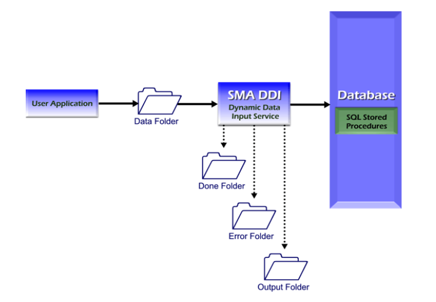

# SMA Dynamic Data Input Introduction

**Theme:** Configure  
**Who Is It For?** System Administrator, Automation Engineer

## What Is It?

SMA Dynamic Data Input (SMADDI) is an optional OpCon component that dynamically adds data to OpCon using text files. SMADDI consists of a service that monitors for files and stored procedures that update the database. Both installation packages — **SMA OpCon DDI Install** and **SMA OpCon Database Scripts Install** — are in the `<Target Directory>\Install\_Exe` directory. For installation instructions, refer to the **OpCon Installation** online help.

## When Would You Use It?

- You need to work with SMA Dynamic Data Input (SMADDI), an optional OpCon component that dynamically adds data to OpCon using text files, in OpCon

## Why Would You Use It?

- **SMA Dynamic**: SMA Dynamic Data Input (SMADDI) is an optional OpCon component that dynamically adds data to OpCon using text files

## SMA Dynamic Data Input Service

The SMADDI service monitors up to 20 input directories for files containing OpCon database update information. When a file is placed in a monitored directory, the Windows operating system notifies the service, which processes the file and moves it to a subdirectory. The service uses minimal processing resources.

### Network Input Directories

Network directories may be defined using drive letters or UNC path names. The following rules apply:

- The service must run as a Domain User with the correct privileges. See [First Option: Running the Service as a Windows Domain User](Configuration.md#First)
- If the network connection is lost, the service continues monitoring other accessible directories. The lost directory is not monitored again until the service is restarted
- If a network directory is unavailable when the service starts, SMADDI does not monitor it until the service is restarted

:::caution
Do not use a mapped drive as the directory to monitor for SMADDI.
:::

#### Input Directories

For each input directory, the SMADDI service creates three subdirectories:

- **Done**: Files are moved here after processing
- **Error**: If a parsing or transactional error is detected, the service writes a file here named `<InputFileName> - Error.txt`
- **Output**: If configured to write output, the service writes stored procedure results here named `<InputFileName> - Out.txt`. This directory contains success and failure messages, including transaction error details

After detecting a file, the service parses it and passes the data to the stored procedures for database input.

## SMA Dynamic Data Input Stored Procedures

The SMADDI stored procedures update the OpCon database with information received from the SMADDI service. They validate the data first, then commit the changes.

## Input Files

Input files must use an XML-type data structure with Continuous-supported tags and must be under two megabytes (MB). Each file describes both the type of data and the data itself. A file may contain a single transaction or multiple transactions of different types. SMADDI processes all files detected in identified input directories.

## Security

The SMADDI service connects to the OpCon database using the Database Login ID and password stored by the SMA ODBC Configuration Tool. Windows security handles all other access controls. Assign appropriate permissions to input directories and subdirectories to prevent unauthorized file placement.

## Architecture

This diagram shows the relationships of all components in SMADDI.

SMA Dynamic Data Input Architecture

## Security Considerations

### Authentication

The SMADDI service connects to the OpCon database using the Database Login ID and password stored by the SMA ODBC Configuration Tool.

### Data Security

Windows security handles all access controls beyond the database connection. Appropriate permissions must be assigned to the input directories and their subdirectories (Done, Error, Output) to prevent unauthorized file placement. Any file placed in a monitored directory is processed by the service and committed to the OpCon database, so directory access must be limited to authorized sources.

Mapped drives must not be used as SMADDI input directories. If a network directory is unavailable at service startup, SMADDI does not monitor it until the service is restarted. If the network connection is lost while running, the lost directory is not monitored again until restart.

## Configuration Options

| Setting | What It Does | Default | Notes |
|---|---|---|---|
| Error | If a parsing or transactional error is detected, the service writes a file here named ` - Error.txt` | — | — |
| Output | If configured to write output, the service writes stored procedure results here named ` - Out.txt`. | — | — |
## FAQs

**Q: What does the SMADDI service do?**

The SMADDI service monitors up to 20 input directories for files containing OpCon database update information. When a file is placed in a monitored directory, the service processes it and moves it to a subdirectory (Done, Error, or Output).

**Q: What happens if a network input directory is unavailable when SMADDI starts?**

If a network directory is unavailable at service startup, SMADDI does not monitor it until the service is restarted. If the connection is lost while running, the service continues monitoring other accessible directories but does not resume the lost directory until restarted.

**Q: Should mapped drives be used as SMADDI input directories?**

No. Continuous explicitly cautions against using mapped drives as monitored directories for SMADDI. Use UNC path names or local directories instead.

## Glossary

**SMADDI (SMA Dynamic Data Input)**: An optional OpCon component that dynamically updates the OpCon database using XML text files placed in monitored input directories. SMADDI uses a Windows service and stored procedures to validate and commit the data.

**Resource**: A numeric variable in OpCon representing a finite pool. Jobs can be configured to require a set number of resource units to run, limiting concurrent executions and preventing resource contention.

**Privilege**: A specific permission granted through an OpCon role that controls access to a feature, function, or object type. Privileges are organized into categories such as Function Privileges, Machine Privileges, Schedule Privileges, and Access Codes.

**OpCon**: Continuous' workflow automation platform. The OpCon server includes the database, SAM and Supporting Services (SAM-SS), and graphical user interfaces. agents installed on target platforms run jobs and report results.
