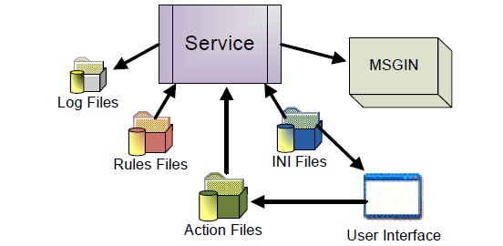

# SMA Resource Monitor Introduction

**Theme:** Configure  
**Who Is It For?** System Administrator, Automation Engineer

## What Is It?

The SMA Resource Monitor for Windows monitors files and Windows counters. When triggered, it sends OpCon events for processing.

Both the GUI and the Service use the INI file for configuration. The GUI reads and updates the Rules and Action files. The Service uses those files to monitor entities and send OpCon events through an MSGIN directory.

## Configuration Options

| Setting | What It Does | Default | Notes |
|---|---|---|---|
## FAQs

**Q: What does the SMA Resource Monitor for Windows monitor?**

The SMA Resource Monitor monitors files and Windows counters. When a monitored condition is triggered, it sends OpCon events for processing through an MSGIN directory.

**Q: How do the GUI and Service components interact in SMA Resource Monitor?**

Both the GUI and the Service use the INI file for configuration. The GUI reads and updates the Rules and Action files. The Service uses those files to determine what to monitor and how to respond when rules are met.

## Glossary

**MSGIN**: A directory monitored by an agent for incoming OpCon event files. Placing a properly formatted event file in MSGIN causes the agent to forward it to SAM for processing.

**SMA Resource Monitor (SMARM)**: A Windows service that monitors files, counters, services, and processes on Windows machines. When a monitored condition is met, it sends OpCon events to trigger automation actions.

**OpCon Event**: A command sent to OpCon that triggers an automated action, such as adding a job to a schedule, updating a property value, sending a notification, or changing a job or schedule status.

**Resource**: A numeric variable in OpCon representing a finite pool. Jobs can be configured to require a set number of resource units to run, limiting concurrent executions and preventing resource contention.

**OpCon**: Continuous' workflow automation platform. The OpCon server includes the database, SAM and Supporting Services (SAM-SS), and graphical user interfaces. agents installed on target platforms run jobs and report results.
