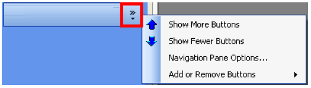

# Summary Information

**Theme:** Overview  
**Who Is It For?** System Administrator, Automation Engineer

## What Is It?

The SMA Resource Monitor User Interface creates and manages File Monitors, Counter Monitors, Service Monitors, Process Monitors, and Action Groups.

- The **Active** option appears on every monitor type tab and the Action Groups tab. Select it to activate a Monitor or Action Group; clear it to deactivate
- Select any column header to sort records ascending or descending
- Select a **Monitor Name** to open the Monitor Information screen, which shows *Monitor Details* and *Action Details* for that monitor
- The Action Groups tab shows actions triggered when an Action Group fires. Action groups can associate with any monitor type, and changes apply to all associated monitors

## Menu

The menu on the left is a panel of buttons:

| Icon | Action | Definition |
| --- | --- | --- |
|  | **Add** | Add a new monitor or action group. Refer to [Start an Add Wizard](Wizards.md#Start_an_Add_Wizard). |
|  | **Edit** | Edit a selected monitor or action group. Refer to [Start an Edit Wizard](Wizards.md#Start_an_Edit_Wizard). |
|  | **Copy** | Copy a selected monitor or action group. Refer to [Copy](Tools.md#Copy). |
|  | **Delete** | Delete a selected monitor or action group. Refer to [Delete](Tools.md#Delete). |
|  | **Find** | Find a monitor. Refer to [Find](Tools.md#Find). |
|  | **Filter** | Filter records to a subset of monitors. Refer to [Filter](Tools.md#Filter6). |
|  | **Activate All** | Activate all monitors on the selected Monitor tab. |
|  | **DeActivate All** | Deactivate all monitors on the selected Monitor tab. |

### Configure Menu Options

The menu supports up to seven placeholders for menu item graphics and names. Select **Configure buttons** to access:

- **Show More Buttons**: Displays the graphic and name for each menu item
- **Show Fewer Buttons**: Displays only the graphic (tooltip provided)
- **Navigation Pane Options**: Reorder menu items using **Move Up** and **Move Down**, or remove items by clearing their options
- **Add or Remove Buttons**: Select a menu item to remove or replace it

## Status Bar

A gray bar at the bottom of the screen displays data entry error messages.

## Configuration Options

| Setting | What It Does | Default | Notes |
|---|---|---|---|
| Show More Buttons | Displays the graphic and name for each menu item | — | — |
| Show Fewer Buttons | Displays only the graphic (tooltip provided) | — | — |
| Navigation Pane Options | Reorder menu items using **Move Up** and **Move Down**, or remove items by clearing their options | — | — |
| Add or Remove Buttons | Select a menu item to remove or replace it | — | — |
## FAQs

**Q: How do you activate or deactivate a monitor in SMA Resource Monitor?**

Select or clear the Active option that appears on every monitor type tab and the Action Groups tab. Selecting it activates the monitor; clearing it deactivates it without deleting the configuration.

**Q: What does the Action Groups tab show?**

The Action Groups tab shows the actions triggered when an Action Group fires. Action groups can be associated with any monitor type, and any changes to an action group apply to all monitors associated with it.

**Q: How do you open the detailed Monitor Information screen for a specific monitor?**

Select the Monitor Name in the list. This opens the Monitor Information screen, which displays Monitor Details and Action Details for that monitor.

## Glossary

**SMA Resource Monitor (SMARM)**: A Windows service that monitors files, counters, services, and processes on Windows machines. When a monitored condition is met, it sends OpCon events to trigger automation actions.

**Resource**: A numeric variable in OpCon representing a finite pool. Jobs can be configured to require a set number of resource units to run, limiting concurrent executions and preventing resource contention.
