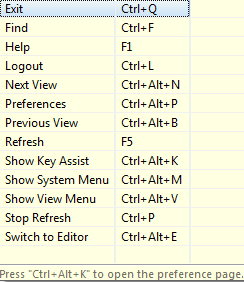

# Keyboard Shortcuts

## Enterprise Manager

In Enterprise Manager, the **F1** Keyboard shortcut will link to the conceptual information for the current location in Enterprise Manager. From the main screen, this option opens to the first page of the Enterprise Manager Guide user help.

The following are principal shortcuts from the tools on the Enterprise Manager banner page:

||||
|--- |--- |--- |
||Logout|Ctrl+L (confirm logout)|
||Logout|Ctrl+Q (automatic logout)|
||Refresh|F5|
||Pause Refresh|Ctrl+P|

In Enterprise Manager, **Ctrl+Alt+K** (Show Key Assist) will display the following shortcut menu:

The following **Ctrl+Alt+** character keyboard shortcuts access the *Preference* and *System* menus and switch between views.

|||
|--- |--- |
|Ctrl+Alt+B|Go to previous views when multiple views are open in Enterprise Manager|
|Ctrl+Alt+E|Switch between editors when multiple editors are open in Enterprise Manager|
|Ctrl+Alt+K|Display the list of shortcuts *- or -* within the Help menu, select Show Key Assist to display the list of shortcuts|
|Ctrl+Alt+M|Display the system menu for the current view/editor|
|Ctrl+Alt+N|Go to the next view when multiple views are open in Enterprise Manager|
|Ctrl+Alt+P|Go to the Preferences screen in Enterprise Manager|
|Ctrl+Alt+V|Display the View menu|

## Schedule Master and Job Master

The following **Alt +** and **Ctrl +** character keyboard shortcuts access required fields in editors within the *Schedule Master* and *Job Master*:

||||
|--- |--- |--- |
||Alt+N|Go to the Name field|
||Ctrl+N|Add|
||Ctrl+R|Cancel|
||Ctrl+Insert|Copy|
||Ctrl+F|Find|
||Ctrl+D|Remove|
||Ctrl+S|Save|

## Frequency

|||
|--- |--- |
|Alt+A|Add|
|Alt+R|Remove|
|Alt+E|Edit|
|Alt+F|Forecast|
|Alt+C|Forecast All|
|Alt+D|Advanced|

## Events

|||
|--- |--- |
|Alt+A|Add|
|Alt+R|Remove|
|Alt+E|Edit|
|Alt+J|Select Job Related Events|
|Alt+F|Select Frequency Related Events|

## Threshold/Resource Update

|||
|--- |--- |
|Alt+A|Add|
|Alt+R|Remove|
|Alt+E|Edit|
|Alt+J|Select Job Related T/R|
|Alt+F|Select Frequency Related T/R|

## Dependencies

|||
|--- |--- |
|Alt+A|Add|
|Alt+R|Remove|
|Alt+E|Edit|
|Alt+J|Select Job Related checkbox|
|Alt+F|Select Frequency Related checkbox|

## General Job Details

|||
|--- |--- |
|Alt+P|Go to Primary Machine field|
|Alt+G|Go to Machine Group Selection field|

## BIS Details

|||
|--- |--- |
|Alt+R|Go to Run ID field|

## Container Details

|||
|--- |--- |
|Alt+S|Go to SubSchedule selection field|

## File Transfer Details

|||
|--- |--- |
|Alt+S|Go to Source Machine field|
|Alt+D|Go to Destination Machine field|
|Alt+P|Select/clear Fail if preferred settings not satisfied checkbox|
|Alt+T|(Options tab) Go to the Source Data Type Field|

## IBM i Details

|||
|--- |--- |
|Alt+J|(Job Information tab) Go to Job Type field|
|Alt+C|(Call Information Tab) Go to Call field|
|Alt+A|(Messages Tab) Go to Add button|
|Alt+R|(Messages Tab) Go to Remove button|
|Alt+U|(Messages Tab) Go to Update button|
|Alt+A|(Spool Files Tab) Go to Add button|
|Alt+R|(Spool Files Tab) Go to Remove button|
|Alt+U|(Spool Files Tab) Go to Update button|

## MCP Details

|||
|--- |--- |
|Alt+F|Go to File Title in Job Details|
|Alt+T|Go to File Title in Pre-Run Details|
|Alt+C|Go to Fail Codes in Failure Criteria|

## OS 2200 Details

|||
|--- |--- |
|Alt+Q|Go to Qualifier field in Start Command|

## SAP BW Details

|||
|--- |--- |
|Alt+C|Go to Process Chain Name field|

## SAP R/3 Details

|||
|--- |--- |
|Alt+J|Go to Job Name field|
|Alt+W|Go to New button|
|Alt+E|Go to Edit button|

## UNIX Details

|||
|--- |--- |
|Alt+S|Go to Start Image field|

## Windows Details

|||
|--- |--- |
|Alt+U|Go to User ID field|

## z/OS Details

|||
|--- |--- |
|Alt+J|Go to z/OS Job Type field|

## Calendars

|||
|--- |--- |
|Alt+N|Go to Name field|

## Global Properties

|||
|--- |--- |
|Alt+N|Go to Name field|

## Thresholds

|||
|--- |--- |
|Alt+N|Go to Name field|

## Resources

|||
|--- |--- |
|Alt+N|Go to Name field|

## Machines

|||
|--- |--- |
|Alt+N|Go to Name field|
|Alt+S|Go to Socket Number field|

## Machine Groups

|||
|--- |--- |
|Alt+N|Go to Name field|
|Enter Key|Enable the Enter key to move a selected item from Unassigned to Assigned or Assigned to Unassigned|

## Server Options

|||
|--- |--- |
|Alt+U|Go to Update button|
|Alt+D|Go to Defaults button|

## Roles

|||
|--- |--- |
|Alt+N|Go to Name field|
|Enter Key|Enable the Enter key to move a selected item from Revoked to Granted or Granted to Revoked|

## User Accounts

|||
|--- |--- |
|Alt+N|Go to Name field|
|Enter Key|Enable the Enter key to move a selected item from Revoked to Granted or Granted to Revoked|

## Batch Users

|||
|--- |--- |
|Alt+S|Go to Select Target OS field|

## Departments

|||
|--- |--- |
|Alt+N|Go to Name field|

## Access Codes

|||
|--- |--- |
|Alt+N|Go to Name field|

## Access Code Privileges

|||
|--- |--- |
|Alt+U|Go to Allow Job Updates field|
|Enter Key|Enable the Enter key to move a selected item from Revoked to Granted or Granted to Revoked|

## Schedule Privileges

|||
|--- |--- |
|Enter Key|Enable the Enter key to move a selected item from Revoked to Granted or Granted to Revoked|

## Function Privileges

|||
|--- |--- |
|Enter Key|Enable the Enter key to move a selected item from Revoked to Granted or Granted to Revoked|

## Departmental Function Privileges

|||
|--- |--- |
|Enter Key|Enable the Enter key to move a selected item from Revoked to Granted or Granted to Revoked|

## Batch User Privileges

|||
|--- |--- |
|Enter Key|Enable the Enter key to move a selected item from Revoked to Granted or Granted to Revoked|

## Machine Privileges

|||
|--- |--- |
|Alt+U|Go to Allow Job Updates field|
|Enter Key|Enable the Enter key to move a selected item from Revoked to Granted or Granted to Revoked|

## Machine Group Privileges

|||
|--- |--- |
|Alt+U|Go to Allow Job Updates field|
|Enter Key|Enable the Enter key to move a selected item from Revoked to Granted or Granted to Revoked|
