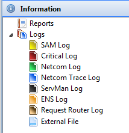

# Working with Enterprise Information

The **Information** topic in the Navigation Panel provides the views to manage the Reports and Log file information.

Click on any **Information** function item in the graphic to learn more about that item.

