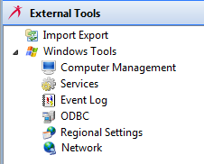

# Working with External Tools

Once the [OpCon installation directory has been configured](Configuring-the-Installation-Directory.md) in the Enterprise Manager, you can utilize the **External Tools** feature. This feature gives you the opportunity to open external tools easily without having to move focus away from the Enterprise Manager. You can also [add other relevant external tools](Adding-External-Tools.md) to the list of tools.

Click on any **External Tools** function item in the graphic to learn more about that item.

.png "More Info icon") Related Topics

- [Configuring the Installation Directory](Configuring-the-Installation-Directory.md)
- [Adding External Tools](Adding-External-Tools.md)
