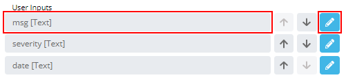
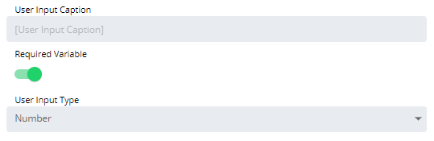

# Configuring Number User Inputs

When configured, the Number User Input will be displayed to users as an
input box with validation rules when they run the Service Request.

To configure the user input:

Double-click on the specific User Input in the **User Inputs** list on
the **Service Request definition** page or click the blue **Edit**
button next to the desired user input to edit.

The **Configure User Input** page will display.

Enter the *User Input Caption* to display when users run the Service
Request. By default, the Variable name is used.

Toggle the **Required Variable** switch if you want to require the user
to input a value for this field.

Select **Number** in the **User Input Type** drop-down list to define
that type of input to present when users run the Service Request.

Specify the validation rules for the User Input, using the following
options:

- **Minimum**: Allows you to specify the minimum value allowed.
- **Maximum**: Allows you to specify the maximum value allowed.

Click the **OK** button to confirm User Input configuration, or click
the **Cancel** button to discard changes. This will return you to the
**Service Request definition** page.
:::
