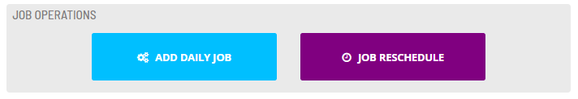

# Running Service Requests

To run the Service Request:

Click on the **Service Request** button.

Proceed based upon one of two prompts:

- If a confirmation message was configured with no user inputs, the Service Request will stop and prompt you to click the **Submit** button to continue, or the **Cancel** button to discard run request.

- If any user inputs were configured, the Service Request will stop so that you can configure the User Input field(s) for the Service Request.
