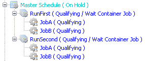

# Container Job Type

OpCon Container jobs are used to run a
subschedule. Some reasons for choosing to use a Container job and
subschedule include:

- Needing a job to be dependent on a schedule
- Needing one schedule to be dependent on another schedule
- Organizing very large schedules

Once built into a Daily schedule, Container jobs and subschedules have
different processing rules than other jobs in
OpCon. For additional information regarding
the Container job and subschedule relationship, refer to [Container Jobs and SubSchedules](../operations/containers.md#container-jobs-and-subschedules).

:::caution
If renaming a Container job, events referring to the \[JobName\] will become invalid. If the Container job is built in the Daily tables and it will be rebuilt on the same days with the new name, the Container jobs in the Daily tables with the old name should be deleted before renaming the Container job.
:::

OpCon creates subschedules and Container jobs
based on the instance definitions:

- A single-instance Container job causes a single-instance subschedule
    to build and run.
- A single-instance Container job causes a multi-instance subschedule
    to build and run for each subschedule instance.
    OpCon automatically creates a copy of the
    Container job for each instance of the subschedule.
- A multi-instance Container job causes a single-instance subschedule
    to build and run for each instance of the Container.
- A multi-instance Container job causes a multi-instance subschedule
    to build and run for every instance of the Container job that called
    it.

:::tip Example
A schedule named Inventory has a Container job named Process Stores. Process Stores is defined with two instances:

1. City=Houston
2. City=Miami

The Process Stores job calls a subschedule named Inventory Summary. Inventory Summary is defined with two instances:

1. Store#=Store1
2. Store#=Store2

When the Inventory schedule builds, the Process Stores Container job ends up with the following instances (each with a subschedule to process):

- Inventory
  - Process Stores_Houston_Store1
  - Process Stores_Houston_Store2
  - Process Stores_Miami_Store1
  - Process Stores_Miami_Store2

:::

## Container Details

The following information applies to defining a Container job.

**Schedule to Run as a SubSchedule**: Defines the subschedule for the
Container job to manage. Users can specify any subschedule they have
privileges to. For information on configuring a schedule as a
subschedule, refer to [Schedules](../objects/schedules.md).

**SubSchedule Name**: Contains the most basic subschedule name that
would appear in Schedule Operations. The graphical interfaces show this
name so users have an idea of what the full schedule name will be when
it builds. The syntax is:

Parent Schedule Name_Container Job Name\[Schedule to Run as a SubSchedule\]

:::tip Example
A Schedule named "Daily Process 1" has a Container job named "First Backup" that has set the schedule to run as a subschedule to "Backups". When the schedule builds into the Daily tables, the name would be:

SubSchedule Name: Daily Process 1_First Backup\[Backups\]
:::

When the schedule builds, there are several factors that can change the
name of the subschedule:

- SubSchedules inside other SubSchedules: Another Parent Schedule name
    and Container Job Name would precede the original subschedule name.
- Multi-Instance Schedules: The Parent schedule could be a
    multi-instance schedule and have multiple copies with no predefined
    properties **- or -**
- The Parent schedule could be a multi-instance schedule and have
    multiple copies with several instance definitions where the first
    predefined property name is the same across multiple definitions.
- Multi-Instance Jobs: The Container job could be a multi-instance
    job, and have multiple copies with no Job Instance properties **-
    or -**
- The Container job could be a multi-instance job and have multiple
    copies with Job Instance properties where the first predefined
    property name is the same across multiple definitions.
- Schedule Instance Properties: The parent multi-instance schedule
    could be built with Schedule Instance property definitions where the
    first property name is unique for each instance.
- Job Instance Properties: The Container job could be added to the
    Daily tables with Job Instance property definitions **- or -**
- The subschedule could be a multi-instance schedule and have multiple
    copies with several instance definitions where the first predefined
    property name is unique for each definition.

## Accessing a Container Job's Properties

When OpCon adds a Container job to a schedule
in Operations and it has Job Instance properties, those properties are
also passed on to the subschedule as Schedule Instance properties. This
is necessary because the jobs on its subschedule often need to access
those properties. You can predefine the Job Instance properties on the
Container job (refer to [Instance Definition](../job-components/instances)), in the
[$JOB:ADD event](../events/types.md#$JOB:ADD), or with
the [Adding Jobs to Daily Schedules](../operations/adding-jobs.md)
feature.

:::tip Example
Every day there are several files that arrive on a Windows machine, and each file must be processed exactly the same way with a schedule named "ProcessFiles" containing three (3) jobs. Because a copy of "ProcessFiles" must run each time a file arrives, the administrator makes "ProcessFiles" into a subschedule and uses a multi-instance Container job to run that subschedule. To make this possible, the administrator completes the following steps:

1. In OpCon, the administrator creates a schedule named ProcessFiles with the SubSchedule option turned on.
2. On the new subschedule, the administrator creates the 3 jobs.
   - Each job has a frequency that qualifies for every day.
   - Each of the jobs has a command line parameter for the actual file name to process.
   - Instead of typing the exact file name to process, the administrator uses the \[\[SI.FileName\]\] Token as the parameter (for more information, refer to Tokens). The following is a sample command line:

     ```shell
     "C:\Program Files\MyProgram\RunMe.exe" [[SI.FileName]]
     ```

3. On a schedule named MainProcess, the administrator creates a Container job named DailyFiles that runs the ProcessFiles subschedule. The Container job has multi-instance turned on and is given a frequency of "OnRequest" with a date in the past selected. This will prevent the Container job from being automatically built with the MainProcess schedule.Instead, the Container job will be added to the Daily schedule when the Windows SMA Resource Monitor (SMARM) detects a file to process. For more information on SMARM, refer to SMA Resource Monitor in the Utilities online help.
4. The administrator configures SMARM to watch for the files and send an event to OpCon each time one of these files arrive. The following event from SMARM will add the Container job to the Daily schedule:

   ```shell
   $JOB:ADD,[[$DATE]],MainProcess,DailyFiles,OnRequest,FileName=[[@FileName]]
   ```

   Before passing the event to SAM, SMARM replaces \[\[@FileName\]\] with the actual name of the file. For this example, the first file name detected is FileA.
5. When the SAM processes the event, it adds a copy of the DailyFiles multi-instance Container job to the current day's schedule with a Job Instance property defined as: FileName=FileA.
6. When the DailyFiles Container job qualifies to start, the SAM requests a Schedule Build for ProcessFiles with a Schedule Instance property defined as: FileName=FileA.
7. When the job(s) inside the ProcessFiles subschedule run, the \[\[SI.FileName\]\] tokens resolve to a value of FileA.
8. Each time new files arrive, the whole process repeats starting with step 4 and a new file name each time. For example, FileB, FileC, and FileD may all arrive at different times and each one would start the whole process again.

:::

## Container Job and SubSchedule Examples

The examples in this section provide ideas for using Container jobs in
OpCon.

### Setting up Schedule Dependencies

This example describes how to make one schedule dependent on another.

:::tip Example
Company ABC has two schedules, Schedule1 and Schedule2. Schedule2 cannot start until Schedule1 is completed with no failed jobs. To set this up, Company ABC has decided to call the two schedules as subschedules to make use of job dependencies in OpCon.

To set this up, the company:

1. Configures both Schedule 1 and Schedule 2 as subschedules in Administration.
2. On another schedule named MasterSchedule, they create two Container jobs.
   1. The first Container job is named "RunFirst" and has Schedule1 defined in Schedule to Run as a SubSchedule.
   2. The second Container job is named "RunSecond" and has Schedule2 defined in Schedule to Run as a SubSchedule.
3. Creates a job dependency for "RunSecond" to require "RunFirst".

As a result:

- When the schedule MasterSchedule is built, the List view in the Enterprise Manager Operations shows the following:

  

- If all jobs on RunFirst's subschedule (MasterSchedule_RunFirst[Schedule1]) Finish OK, then RunSecond will start the next subschedule (MasterSchedule_RunSecond[Schedule2]).
- If any job on MasterSchedule_RunFirst[Schedule1]fails, then the RunFirst Container job will also fail and prevent RunSecond from processing the next schedule.

:::

### Setting up Job Dependencies on a Schedule

This example describes how to make a job dependent on a schedule.

:::tip Example
Company ABC has a very large schedule named MasterProcess. The MasterProcess schedule contains three hundred jobs. In that schedule, a new job named ProcessRecords needs to depend on thirty jobs in the MasterProcess schedule. To simplify set up, Company ABC has decided to place the thirty jobs in a subschedule and use a Container job on the MasterProcess schedule to call the subschedule and make use of job dependencies in OpCon.

To set this up, the company:

1. Creates a subschedule named "ImportantJobs".
2. Moves the thirty jobs from the "MasterProcess" schedule to the "ImportantJobs" schedule.
3. Creates a Container job in the MasterProcess schedule named "30Jobs" and sets ImportantJobs as the Schedule to Run as a SubSchedule.
4. Creates a job dependency for "ProcessRecords" to require "30Jobs".

As a result:

- When the schedule MasterProcess is built, 30Jobs appears on that schedule as a container for the subschedule named MasterProcess_30Jobs\[ImportantJobs\].
- If the "30Jobs" Container job Finishes OK (because all jobs on its subschedule Finished OK), then the dependency is met for ProcessRecords to run.
- If the "30Jobs" Container job Fails (because one or more jobs failed on its subschedule), then the dependency will not be met for ProcessRecords to run.

:::
